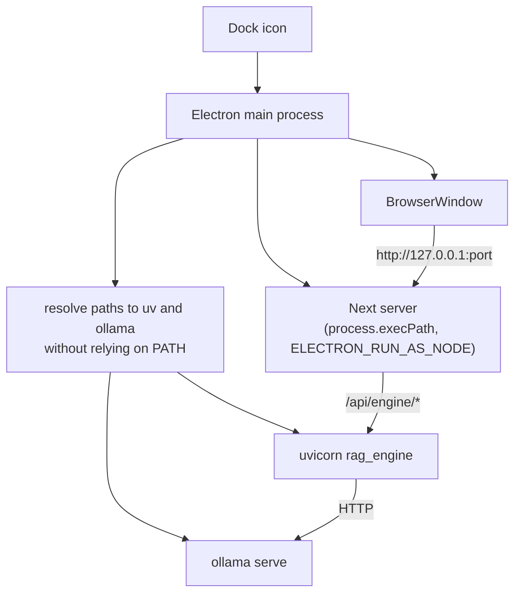

> **Archive copy.** English-only historical plans used to build BGA.
> **Stage:** 0B (implemented after Stage 0A, before Stage 1).
> **Origin:** Cursor plan for the Electron desktop shell.
> **Outcome:** implemented.

---

# Stage 0B — Electron desktop app next to the web app

The web app stays unchanged and still runs through `pnpm dev`. Electron is a
second way to start the same code, not a replacement.

### Why this, and not the other way

The Electron window loads `http://127.0.0.1:<port>`, the ordinary Next server
started inside the app. That means **not a single line** in
`apps/web/src/features` has to change — all client code already uses relative
addresses (`useAskStream.ts` calls `/api/engine/ask`, `RulesChat.tsx` calls
`/api/engine/games`). `src/proxy.ts`, the server components in
`[locale]/layout.tsx`, and the security headers from `next.config.ts` stay.

Rejected alternative: a static export of the page talking to the engine
straight from the window. That would require removing
`apps/web/src/app/api/engine/[...path]/route.ts`, bypassing
`assertMayReachEngine`, and adding CORS to Python. That breaks invariant 7 and
decision D2, so that path does not exist.



---

## Phase A — an icon for you (one day, we package nothing)

Goal: one click instead of a terminal. Assume the repo is on disk, and `uv`
and Ollama are installed. No signing, no installer, no `output: 'standalone'`.

### A0. Unlock Electron’s install

Without this `pnpm install` succeeds and still nothing starts. In
`pnpm-workspace.yaml`:

```yaml
# Native postinstall scripts are opt-in in pnpm 10+. Only allow what we need.
allowBuilds:
  sharp: false
  unrs-resolver: false
```

Electron downloads its binary in a `postinstall` script. Until it is on this
list, the download is skipped with no error. Add `electron: true`, and for
Phase B also `electron-builder`.

Also put `apps/desktop/release` (finished installers) in `.gitignore` and in
Biome’s ignore list. The compiled main process goes to `dist/`, which Biome
and Turborepo already ignore.

### A1. Resolving program paths — without PATH

This is what kills this kind of app in the first minute, and it is worth doing
at once.

When you start something from a terminal, the program inherits `PATH` from
your `.zshrc`. **An app started by clicking the Dock does not go through a
shell**, so its `PATH` is the system minimum. `uv` lives in `~/.local/bin` or
`/opt/homebrew/bin`, and `ollama` in `/opt/homebrew/bin` or in `Ollama.app` —
none of those directories is on that minimal `PATH`. Result: “command not
found” and an empty window, even though the terminal works.

Fix: a pure function that takes a candidate list and returns the first
existing absolute path, or a readable error saying what to install. Pure,
meaning it does not touch the system internally — so it has a Vitest test,
matching `AGENTS.md`: logic without side effects is where tests are cheapest.

### A2. New package `apps/desktop`

A separate workspace package so Next does not try to compile Electron code.
`apps/*` is already in `pnpm-workspace.yaml`, and tasks in `turbo.json` are
named not path-based, so **no `turbo.json` change is needed**.

An important split the first plan version did not have:

- `build` — compiles only the main process (TypeScript → `dist/`). Seconds.
  May sit in `verify`.
- `package` — builds installers through `electron-builder`. Minutes. **Is
  not** a `build` task and **does not** enter `pnpm verify`.

Without that split every `git push` starts building a `.dmg`, because the
`pre-push` hook calls `pnpm verify`, which is
`turbo run typecheck test lint build`. That was the “second build track as a
tax paid across seven stages” named in the premortem, which the first plan
version did not mitigate.

### A3. Starting and cleaning up processes

The Electron main process:

- takes a single-instance lock (`app.requestSingleInstanceLock()`) and on a
  second click only raises the existing window. Without this two clicks are
  two engines and two Next servers;
- picks free ports instead of fixed 3000 and 8000, so it does not collide with
  a parallel `pnpm dev`;
- starts the Next server **with Electron’s own binary**:
  `spawn(process.execPath, [...], { env: { ELECTRON_RUN_AS_NODE: '1' } })`.
  Electron has Node inside, so we do not require system Node — which, like
  `uv`, might also be missing when starting from the Dock;
- **does not run pnpm scripts from `apps/web`**, because
  `"start": "next start --hostname 127.0.0.1 --port 3000"` has the port
  hardcoded, and the CLI flag beats the `PORT` variable. Picking a free port
  through that script is therefore impossible;
- starts the engine through the resolved path to `uv`, passing
  `BGA_STORAGE_DIR`, `BGA_OLLAMA_URL` and the chosen port, without `--reload`;
- passes the Next server `RAG_ENGINE_URL` — the route handler reads that
  variable;
- **captures `stderr` of both child processes** into a log file. Without this
  a Python crash is invisible: `main.py` calls `create_app()` at module level,
  so a config error kills the process on import and you only see a window that
  never appears;
- waits until both answer before showing the window;
- kills both in `before-quit`, including after a crash.

Window hardening: `contextIsolation` on, `nodeIntegration` off. A `preload`
script is needed in Phase B (see B2) and must expose only a read of hardware
data.

### A4. `BGA_STORAGE_DIR` on the user data folder

Required from day one. Today
[`settings.py`](../services/rag-engine/rag_engine/settings.py) has:

```python
storage_dir: Path = SERVICE_ROOT / "storage"
```

i.e. a folder **next to the code**. In a packaged app that is read-only and
vanishes on every update, together with the index the user spent an hour
building. Electron sets `BGA_STORAGE_DIR` to `app.getPath('userData')`.

On the engine side, add a writability check with a readable message. Today
`main.py` does `settings.assets_dir.mkdir(parents=True, exist_ok=True)` with
no check, and because `main.py` is `app = create_app()` at module level, an
unwritable folder ends as `PermissionError` during import — where no handler
will catch it.

### A5. Developer mode

`pnpm --filter desktop dev` attaches to a running `next dev` with hot reload,
instead of building a production version. Interface work looks exactly as it
does today.

**When Phase A is done:** you click the icon **in Finder, not in a terminal**
(that is the point of the test — from a terminal it works even with broken
path resolution), after a few seconds you see the app, you ask a question, a
second click does not start a second engine, after close Activity Monitor has
no orphaned Python, and `pnpm verify` still passes and did not get slower.

---

## Phase B — a package for friends (unsigned)

**Prerequisite the first plan version did not state clearly:** Phase B only
makes sense after Stage 2. Without loading documents a friend downloads
dozens of gigabytes of models to see an app that knows no games and, by
design, answers “I don’t know”. That is not a test; it is disappointment.

### B1. Hardware check and profile choice

Split the module in two so the part with rules can be tested: **read** (how
much memory, which processor, free disk, on Windows which graphics card and
how much memory it has) separately from **mapping** that read onto a profile.

On a Mac, shared processor and graphics memory counts. On Windows, graphics
card memory counts, separate from RAM — twelve gigabytes on an RTX card will
run a model that a sixteen-gigabyte Mac will not run comfortably. Those are
two different rules, not one with a patch.

Add a profile below the current minimum, because the lowest today is
`starter-32gb` and a typical Mac has 16 GB:

- `minimal-16gb` — smaller language model, shorter context, no vision model
  and no arbiter,
- `starter-32gb` and `full-64gb` — unchanged.

Search models (`bge-m3`) and the reranker (`bge-reranker-v2-m3`) stay the same
in every profile, because they are small and they decide page relevance.

**Correction the first plan version did not have.** `retrieval_top_k` is
today a flat setting (default 6), independent of `context_tokens` on the
profile. With a short context, six fragments plus the system prompt plus the
question may not fit, and then the model gets a truncated context and starts
answering from nothing — exactly what `insufficient_evidence` is meant to
prevent. Required: derive `retrieval_top_k` from the profile, or add a test
that the budget fits. In `services/rag-engine/tests/` there is **not a
single** profile test today, so a new profile would be completely unguarded.

Confirm model names for the new profile via `scripts/pull-models.sh` before
use — `docs/ARCHITECTURE.md` (audit point 3) warns that Ollama registry tags
change between releases.

### B2. First-run screen as a Next route, not an Electron window

This correction matters, because the first plan version said “copy into
`common.json`” without saying **where** the screen lives. If it were a native
Electron window, it would have no access to i18next and would inevitably end
as a Polish string hardcoded in code — breaking invariant 10 and decision D8.

Fix: the screen is an ordinary route `/[locale]/setup` in `apps/web`. The
Next server does not need Python, so it can show it before the engine exists.
Hardware data lives in the main process, so it reaches the window through a
`preload` script and `contextBridge`, on a **read-only** channel with a
minimal surface.

That channel is a new trust boundary and therefore gets a row in threat table
Z8. It matters together with Stage 7: if model answers start being rendered
as Markdown without sanitising, the IPC surface becomes reachable from
document text.

### B3. What we actually tell the user

Cited-page accuracy is the same in every profile, because the search models
are identical. On weaker hardware Polish gets worse, the model quotes more
and explains less in its own words, teaches a new game less well, and says
“I don’t know” more often. That is a true message and not a scare: even the
smallest profile is fit for settling disputes at the table, because it will
show the right page.

All of that copy goes into
`apps/web/src/i18n/locales/pl/common.json` **and** `en/common.json` in the
same change — `i18n/locales.test.ts` will not pass a key present in only one
language.

### B4. First launch

- **Python environment:** a bundled `uv` binary (~40 MB) runs `uv sync` into
  the user data folder, **not** into the app bundle. That entirely avoids
  signing thousands of files of compiled code.
- **Ollama:** look for an installed copy under known paths, and when it is
  missing — show a download link. Bundling the Ollama binary (the MIT licence
  allows it) is postponed; for a handful of friends it is not worth it.
- **Ollama models** for the chosen profile, with progress and free-space
  checked **before** the download starts.
- **Reranker and Whisper downloaded explicitly, with progress.** This is a
  correction vs the first plan version. `scripts/pull-models.sh` says outright
  that the reranker (`BAAI/bge-reranker-v2-m3`), speech recognition and voice
  “are handled by Python libraries on first use”. Stage 3 also loads the
  reranker at engine start. Those two facts together give a first launch
  where the window sits still while Python silently pulls about three
  gigabytes from HuggingFace with not one pixel of information. The user
  will think the app froze, and close it.

### B5. Model download portable across systems

`scripts/pull-models.sh` is a bash script calling `brew` and `curl`, so it
will not work on Windows. The choose-and-download logic moves into Python or
the Electron main process; the script stays a convenience for developers, not
the production path.

### B6. Adding PDFs by dropping them on the window

Without this friends cannot start anything, because according to
`docs/ROADMAP.md` Stage 2 ingest is a terminal command
(`uv run python -m rag_engine.ingest add --game azul --kind rulebook file.pdf`).
Electron gives a real path to the dropped file, which the browser cannot.
Call the same ingest logic, validate `gameId` with `GAME_ID_PATTERN`
(decision D12), show progress in the window.

Estimated time to load one rulebook, from parts not from a measurement:
extracting text is seconds, page renders about 0.1–0.3 s per page, computing
vectors a dozen to thirty seconds for thirty pages. Together under a minute
for a typical rulebook, a few minutes for a two-hundred-page one. Once per
game.

### B7. Microphone permission

Browser `getUserMedia` in packaged Electron stays silent until
`session.setPermissionRequestHandler` exists in the main process and
`NSMicrophoneUsageDescription` in `Info.plist`. Needed only for Stage 5, but
the `Info.plist` entry belongs to packaging config, so it is created here.

### B8. Building the package without a signature

`electron-builder`: `.dmg` or `.zip` on macOS and `.exe` on Windows, no
certificate and no notarisation. The README gets instructions: on a Mac
right-click → “Open”, on Windows “More info” → “Run anyway”. No automatic
updates — a new version is a new download.

**Only here** turn on `output: 'standalone'` in `next.config.ts`, not in
Phase A. Reason: standalone file tracing plus pnpm symlinks plus
`transpilePackages: ['@bga/api-contract']` is a known source of workspace
packages missing from the finished package. It only shows up in the packaged
app, so the acceptance criterion is explicit: `@bga/api-contract` is in the
package and the app answers a question after install on a clean user account.

### B9. Writing diagnostics to a file

Log of both child processes, chosen profile and hardware-check result — into
one file the friend sends you themselves. Zero telemetry, matching the README
promise. Today an engine crash lands in `console.error` in `route.ts`, i.e.
in the server console the user cannot see.

---

## Windows and Mac — both with voice (decision O1)

Text (Stages 1–3) works on both systems. Ollama, LanceDB and PyMuPDF have
Windows builds; a computer with an NVIDIA card often does better than a Mac.

**Voice is a goal on both systems**, but it does not appear in Phase A or in
the Electron shell itself. There is no speech recognition yet — that is
Stage 5. `mlx-whisper` in `pyproject.toml` only works on a Mac with an Apple
processor (Metal). On Windows the same job is a different library:
`faster-whisper`. One interface, two implementations chosen at start.

What this Electron plan does so Stage 5 does not discover Windows too late:

1. `speech` extra: `mlx-whisper` only on darwin, `faster-whisper` on the rest
   — `uv sync --extra speech` passes on both systems.
2. `docs/ROADMAP.md` Stage 5: not “we call mlx”, but “transcription behind
   one interface”.
3. Phase B: package on macOS **and** Windows, hardware check with two rules
   (shared memory vs card memory), microphone permission on both systems.

What this plan does not do: it does not implement Stage 5. A Windows tester
before Stage 5 gets the same as you on a Mac in Phase A — text. Voice on both
arrives together when Stage 5 is ready.

## Documentation

Decision D15 in `docs/ARCHITECTURE.md`: why Electron starts a Next server
instead of a static export (because an export would force a bypass of
`assertMayReachEngine`), why the Python environment lives in the user data
folder and not in the package (because notarisation requires signing every
compiled file separately), and why program paths are resolved explicitly
instead of through `PATH`.

Threat table Z8 gets a row about the Electron window and the `preload`
channel as a new trust boundary.

## What this plan deliberately does not do

It does not sign, notarise, add automatic updates, or prepare distribution to
strangers. That is a separate decision, worth taking no earlier than after
Stage 6, when an evaluation set can measure whether the assistant answers
correctly.

It does not bundle other people’s video transcripts into the package.
Teaching style arrives as two or three examples you write, in the system
prompt, **never** in the search index — otherwise the model could pull a
rule from a transcript, which invariant 5 forbids.

It does not build installers in `pnpm verify`. Packaging is a task you run
on purpose.

**It does not add any way to share finished indexes between users** — not
export, not import, not a shared game repository. The reason is legal, not
technical: an index contains rulebook text and page renders, so handing it to
someone else is distributing someone else’s work, this time through your app.
As long as each person loads their own PDF, the situation is the same as a
PDF reader. The README already boasts that we do not bulk-download from sites
whose terms forbid it — the same rule applies to indexes. After the app is
shared someone will ask for that feature; a refusal is cheaper when it is a
decision written earlier, not an improvisation in a ticket.

## Decisions (former elephants)

An elephant is an uncomfortable question, not a code bug. Two of them got
answers:

**O1 — closed: Windows and Mac, both with voice.** Phase B packages both
platforms. Voice is not in Electron — it is in Stage 5, and then it must be
on both (mlx on Mac, faster-whisper on Windows). Until Stage 5 testers on
both systems have the text version. Phase A is unchanged.

**O2 — closed: 2–3 testers.** No signature, no automatic updates, a new
version = “download again”. If the group grows to about ten, we come back to
signing — that is not in this plan.

The remaining elephants are not questions, they are boundaries:

- A second launch track (Electron + `pnpm dev`) costs maintenance through
  later stages. Consciously accepted in exchange for an icon and for
  push-to-talk in Stage 5.
- Distribution to strangers — not before Stage 6 (a question set that
  measures whether the assistant is right).
- No sharing of finished game indexes — a legal decision, not a missing
  feature.
