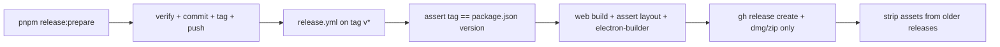

> **Archive copy.** English-only historical plans used to build BGA.
> **Stage:** 0C (implemented after Stage 0B, before Stage 1).
> **Origin:** Cursor plan for the desktop release pipeline.
> **Outcome:** implemented.

---

# Stage 0C — Desktop release pipeline

## Premortem (quick, after verifying the code)

**Context:** public repo, macOS-only Electron release, conventional commits →
changelog, only the newest release keeps installer files.

### Tigers (blocking — mitigations in this plan)

1. **The Next standalone path is already wrong (confirmed on disk)**
   - **Where:** [electron-builder.yml](../apps/desktop/electron-builder.yml)
     `from: …/.next/standalone` → `to: repo/apps/web`;
     [main.ts](../apps/desktop/src/main.ts) looks for `repo/apps/web/server.js`.
   - **Evidence:** after `pnpm --filter web build` the file lives at
     `apps/web/.next/standalone/apps/web/server.js`, and the standalone root
     also has `node_modules/` (monorepo tracing). Copying the whole
     `standalone` tree into `repo/apps/web` would yield
     `repo/apps/web/apps/web/server.js` plus the wrong relative `node_modules`.
   - **Mitigation checked:** no path assertion; the config was never verified
     against a package.
   - **Fix:** `from: ../../apps/web/.next/standalone` → **`to: repo`** (not
     `repo/apps/web`). Separately keep `from: …/.next/static` →
     `to: repo/apps/web/.next/static`. Assertion in `release:package`:
     `apps/web/.next/standalone/apps/web/server.js` and
     `apps/web/.next/static` exist **before** electron-builder.

2. **CI / `desktop package` does not build web before packaging**
   - **Where:** [apps/desktop/package.json](../apps/desktop/package.json) —
     `package` = only `tsc` + electron-builder.
   - **Fix:** root `pnpm release:package` = web build → assert → desktop
     package; the workflow calls only that.

3. **A denylist of `**/*` can still pull junk**
   - **Where:** [electron-builder.yml](../apps/desktop/electron-builder.yml).
   - **Fix:** runtime allowlist for `rag-engine` (no `**/*`):
     `rag_engine/**/*`, `pyproject.toml`, `uv.lock`, `.python-version`. Do not
     pack `tests/`, engine `package.json`/`turbo.json` (not needed for
     `uv run`), `.env*`, `*.pdf`, `*.pem`, `models/**`, `*.gguf`, `storage/**`,
     `.venv/**`, caches. Defence in depth: explicit `!` for those patterns
     even with an allowlist.

4. **Unsigned macOS on Actions fails unless signing is turned off**
   - **Where:** CI has no Apple certificate; electron-builder looks for an
     identity by default.
   - **Mitigation checked:** no `CSC_IDENTITY_AUTO_DISCOVERY` / `CSC_IDENTITY`
     in the repo.
   - **Fix:** in the workflow (and the package script):
     `CSC_IDENTITY_AUTO_DISCOVERY=false`. Matches D15 (unsigned for testers).

5. **Tag ≠ version in the tree**
   - **Risk:** someone pushes `v0.2.0` without prepare → the Release lies
     relative to `package.json`.
   - **Fix:** first workflow step: `TAG` (without `v`) === `version` from root
     [package.json](../package.json); otherwise fail.

### Elephants (consciously out of this PR / document them)

- The package **requires** system **uv** + **Ollama** —
  `bundledUvCandidate` in [main.ts](../apps/desktop/src/main.ts) points at
  `resources/bin/uv`, which **is not** in `electron-builder.yml`. Release
  notes must say this; bundling uv = follow-up.
- **Gatekeeper** (unsigned) — right-click Open; in the Release body.
- **CI architecture = arm64** (`macos-latest` ≈ Apple Silicon). An Intel Mac
  without a universal build may not run. This PR: arm64 only; universal
  `x64+arm64` is out of scope (2× time/cost).

### Paper tigers

- Actions minutes — public repo, standard free runners.
- Rulebook PDFs — not in git; the allowlist does not take them.
- Actions artifact storage — we do not use `upload-artifact`.

### False alarms / corrections vs the previous plan version

- **Python 3.14 + uv in the release job** — **not needed** to build the DMG
  (we copy engine sources, we do not run `uv sync` in CI). Dropped from the
  workflow → shorter job.
- **Copying the whole `packages/api-contract`** — probably unnecessary for
  web runtime (standalone already traces dependencies); **leave it for now**
  (low risk, small cost), no refactor in this PR.
- **Allowlist “+ package.json + turbo.json + .env.example”** — not needed for
  `uv run`; `.env.example` is optionally OK, not required. Prefer a minimal
  runtime set.

---

## Decisions (locked)

| Topic | Choice |
| --- | --- |
| Platform | macOS `dmg` + `zip`, **arm64** (CI host) |
| Trigger | `push` of `v*` tags (semver: `v0.1.0`) |
| Prepare | local `pnpm release:prepare` — **no** auto-push / auto-tag |
| Changelog | `git-cliff` + `cliff.toml`; Release notes = the section from the **committed** `CHANGELOG.md` on the tag (do not re-run cliff in CI) |
| Retention | only the **current** tag keeps assets; older Releases **stay** (changelog in the UI), without files |
| Actions artifacts | none |
| Canonical version | root `package.json`; sync: `apps/web`, `apps/desktop`, `packages/api-contract`, `services/rag-engine/package.json`, `pyproject.toml`, `rag_engine/__init__.py` |
| Signing | unsigned (`CSC_IDENTITY_AUTO_DISCOVERY=false`) |



---

## Path contract (normative)

After `pnpm --filter web build`:

```
apps/web/.next/standalone/
  apps/web/server.js      ← required
  apps/web/.next/…
  apps/web/node_modules/…
  node_modules/…          ← required (standalone root)
apps/web/.next/static/    ← copied separately
```

In the Electron artifact (`Contents/Resources/`):

```
repo/apps/web/server.js
repo/apps/web/.next/static/…
repo/node_modules/…          ← from standalone root
repo/services/rag-engine/    ← allowlist
repo/packages/api-contract/  ← as today
```

`release:package` **fails** if `standalone/apps/web/server.js` or `.next/static`
is missing before the builder.

---

## Files

| File | Role |
| --- | --- |
| [apps/desktop/electron-builder.yml](../apps/desktop/electron-builder.yml) | `standalone` → `to: repo`; rag-engine allowlist |
| `cliff.toml` | conventional commits → sections (feat/fix/…); ignore `chore(repo): release` |
| `scripts/release-prepare.mjs` | bump + cliff → CHANGELOG + print next steps |
| `scripts/release-package.mjs` (or `.sh`) | web build → assert → desktop package; unsigned env |
| `scripts/release-notes.mjs` | extract `## [x.y.z]` / `## x.y.z` from CHANGELOG (used in CI) |
| `scripts/release-prepare.test.mjs` | test of the pure bump / parse-notes function |
| `.github/workflows/release.yml` | tag → build → release → prune |
| [package.json](../package.json) | `release:prepare`, `release:package`; devDependency `git-cliff` |
| `CHANGELOG.md` | generated at prepare (committed) |
| [README.md](../README.md) | Release section |

---

## Implementation steps

### 1. Fix the package layout (tigers 1–2)

- Change [electron-builder.yml](../apps/desktop/electron-builder.yml):
  - `from: ../../apps/web/.next/standalone` → **`to: repo`**
  - keep static → `repo/apps/web/.next/static`
- Add `scripts/release-package.mjs`: order
  `pnpm --filter web build` → assert →
  `pnpm --filter desktop run package` with
  `CSC_IDENTITY_AUTO_DISCOVERY=false`.
- Do not treat `desktop package` alone as the full release path.

### 2. Harden filters (tiger 3)

Allowlist `rag-engine` (electron-builder `filter` = match any positive; no
leading `**/*`):

- `rag_engine/**/*`
- `pyproject.toml`
- `uv.lock`
- `.python-version`

Extra negatives (if `**/*` ever returns): `.env`, `.env.*`, `!.env.example`
only if added on purpose, `*.pdf`, `*.pem`, `models/**`, `*.gguf`, `tests/**`,
`storage/**`, `.venv/**`, `**/__pycache__/**`, mypy/ruff/pytest caches.

### 3. `release:prepare` (local)

- Arg: `patch` \| `minor` \| `major` (default `patch`).
- Bump every version location (decision table); one function, tested.
- Require a clean git (optionally warn if dirty).
- First release (no `v*` tag): cliff from the start of history / `--unreleased`.
- Update `CHANGELOG.md` (prepend a section).
- **Do not** commit / tag / push — print the exact commands:
  - `pnpm preflight` (or `verify`)
  - `git add … && git commit` with `chore(repo): release vX.Y.Z`
  - `git tag vX.Y.Z && git push && git push origin vX.Y.Z`
- `cliff.toml`: map conventional types; skip the release commit in the next
  cycle’s notes.

### 4. Workflow `.github/workflows/release.yml` (tigers 4–5)

```yaml
on:
  push:
    tags: ['v*']
permissions:
  contents: write
```

- Runner: `macos-latest` (arm64).
- Setup: Node 24, corepack/pnpm, `pnpm install --frozen-lockfile`. **No**
  setup-python/uv.
- Env: `CSC_IDENTITY_AUTO_DISCOVERY=false`, `HUSKY: 0`.
- Steps:
  1. Assert `github.ref_name` (`vX.Y.Z`) matches root `package.json` `version`.
  2. `pnpm release:package`.
  3. Collect **only** `*.dmg` and `*.zip` from `apps/desktop/release/` (skip
     `.blockmap`, `.yml` update metadata if they appear).
  4. Notes: `node scripts/release-notes.mjs` from CHANGELOG for this version;
     one-sentence fallback if the section is missing.
  5. `gh release create "$TAG" … --title "$TAG" --notes-file …` (fail if the
     release already exists — no blind `--clobber`).
  6. Prune: for every release **other than** `$TAG`, delete all assets
     (`gh api` / `gh release delete-asset`). Do not delete the release object
     or tags. Do not rely on GitHub’s “latest” flag for prerelease (this PR
     does not introduce prerelease).

Concurrency: `group: release-${{ github.ref }}`, `cancel-in-progress: false`
(do not cancel an in-flight build of the same tag on a retry — or one `release`
group with cancel false).

### 5. Docs + verification

- README: flow prepare → preflight → commit/tag/push → Actions; uv/Ollama
  requirements; Gatekeeper; **arm64**.
- Notes paragraph template (may be a fixed footer in `release-notes.mjs`).
- Before the first tag on origin: locally `pnpm release:package` and check
  that `apps/desktop/release/` has dmg/zip and (optionally) unzip and confirm
  `server.js` under the expected path in the `.app`.
- `node --test scripts/release-prepare.test.mjs` (or vitest) in
  `preflight`/`verify` or at least in CI verify — consistent with existing
  `commitlint.config.test.mjs`.

---

## Acceptance

- A local package produces DMG/zip; app resources contain
  `repo/apps/web/server.js`.
- The package **does not** contain `storage/`, `.venv`, `tests`, PDFs, `.env`,
  `models`.
- Pushing tag `vX.Y.Z` (after prepare) creates a GitHub Release with notes
  from CHANGELOG and two assets.
- The previous release loses assets; the tag and release description stay.
- The workflow fails when the tag does not match `package.json`.

---

## Out of scope

- Windows, universal Mac binary, notarisation, code signing
- Bundling uv / Ollama in the DMG
- release-please / a bot bumping `main`
- Prerelease / beta tags
- Publishing models, PDFs, indexes
- Removing the separate `extraResources` api-contract (follow-up)
