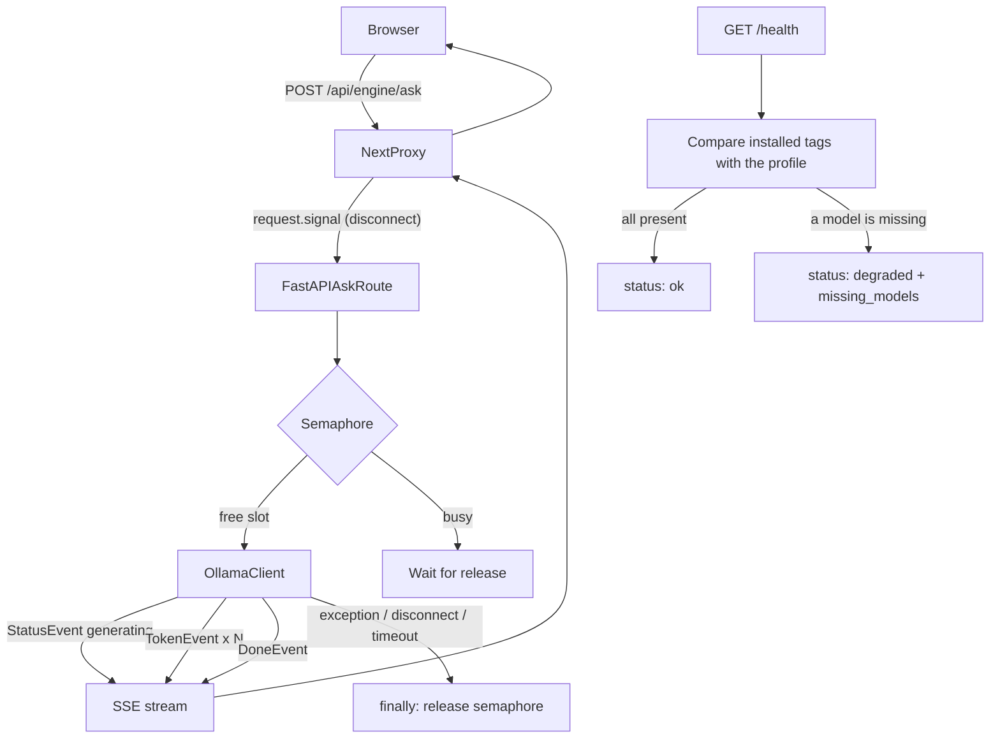

> **Archive copy.** English-only historical plans used to build BGA.
> **Stage:** 1.
> **Origin:** Cursor plan for Stage 1 (local models).
> **Outcome:** implemented.

---

# Stage 1 — Local models

## Goal

Turn on the first real answer mode from a local model on the user’s computer.
After this stage `/ask` returns an answer generated live by Ollama, and
`/health` honestly shows whether the required models are actually on disk.

## Premortem (after verifying the code)

### Tigers (blocking; must be solved in the implementation)

1. **`HealthReport` cannot describe missing models**
   - **Where:** [`contract.py`](../services/rag-engine/rag_engine/contract.py) and
     [`types.ts`](../packages/api-contract/src/types.ts). `HealthReport` has
     `models: dict[str, str]` — names only, no presence.
   - **Checked:** no `missing_models` or `model_status` on either side of the
     contract. `test_contract_parity.py` will block an asymmetric change.
   - **Fix:** add `missing_models: list[str]` (default empty) to `HealthReport`
     in `contract.py` and `types.ts` at the same time. The parity test enforces
     the sync.

2. **The semaphore must sit in `try/finally` inside the async generator**
   - **Where:** [`ask.py`](../services/rag-engine/rag_engine/routers/ask.py) —
     today’s `_stream_answer` generator is the only place a browser disconnect
     stops the stream.
   - **Checked:** FastAPI + `StreamingResponse` closes the generator when the
     client disconnects (`GeneratorExit`). The Next.js proxy passes
     `request.signal` into `fetch`, so HTTP disconnect already works.
   - **Fix:** acquire the semaphore before generation, release in `finally`
     inside the generator. Normal completion, an exception, and a disconnect
     all free the slot at once.

3. **No `StatusEvent(stage="generating")` before tokens**
   - **Where:** the contract defines `PipelineStage = "generating"`, but the
     stub does not emit that status.
   - **Checked:** frontend `useAskStream.ts` handles any `StatusEvent` and
     shows the matching loading copy.
   - **Fix:** `/ask` must send `StatusEvent(stage="generating")` just after
     `sources` and before the first `TokenEvent`.

4. **`groundedness` without documents — what to return in Stage 1?**
   - **Where:** the contract defines
     `Groundedness = "grounded" | "partial" | "insufficient_evidence"`.
   - **Checked:** the roadmap talks about answers without document search. The
     frontend uses groundedness to mark the answer visually.
   - **Fix:** in Stage 1, model answers (no documents) end as
     `groundedness="partial"` with empty `sources=[]`. When the model is
     missing, still return a notice + `insufficient_evidence`.

5. **Model validation in `pull_models` — the Ollama registry cannot be checked
   before a pull**
   - **Where:** [`pull_models.py`](../services/rag-engine/rag_engine/pull_models.py).
     `ollama_tags()` lists installed tags; there is no public-registry check.
   - **Checked:** Ollama `/api/pull` simply errors when the tag is not in the
     registry.
   - **Fix:** after `pull_ollama_model()`, call `ollama_tags()` again and
     confirm the pulled tag appeared. If not, print a clear message with the
     model name. That catches typos and retired tags.

### Elephants (known gaps, deliberately out of this stage)

- **The model answers from general knowledge, not from a rulebook.** Until
  document search exists (Stages 2–3), it can state a wrong rule. An explicit
  `groundedness="partial"` tells the interface; do not hide it.
- **The generation timeout is arbitrary.** We do not yet know how long a
  typical answer takes on each profile. Start at 5 minutes, because Ollama on
  weaker hardware is slow; tune after manual tests.
- **No priority queue or multi-slot limit.** A one-slot semaphore is enough for
  one user; do not build a multi-slot queue.

### Paper tigers

- **The frontend does not consume `/health`.** True, but not a Stage 1 blocker.
  The UI sees engine state through `/games` and `/ask`. Showing “model X is
  missing” on screen is a follow-up, not a roadmap requirement for Stage 1.
- **CI tests have no Ollama.** Tests mock Ollama HTTP — they do not need a real
  model. Existing `test_api.py` already runs without Ollama.
- **Changing the contract will fail the parity test.** Yes, and that is the
  point. Update both files and the test in one step.

---

## Chosen scope

This stage ends with a working answer from a local model, still **without
searching documents** and without citing pages:

- The model answers from its own general knowledge.
- `sources` stay empty.
- `groundedness` = `"partial"` (an answer with no source backing).
- Pulling and checking models works honestly, with readable messages.
- One generation slot (a second question waits).
- Closing the connection frees the slot immediately.

## Files to change

| File | Change |
| --- | --- |
| `services/rag-engine/rag_engine/engines/__init__.py` | New, empty, makes the package |
| `services/rag-engine/rag_engine/engines/llm.py` | New: Ollama client (tag list, streaming generate, timeout) |
| `services/rag-engine/rag_engine/routers/ask.py` | Replace the stub with real generation plus a semaphore |
| `services/rag-engine/rag_engine/routers/health.py` | Check that the profile models are present |
| `services/rag-engine/rag_engine/contract.py` | Add `missing_models` to `HealthReport` |
| `packages/api-contract/src/types.ts` | Mirror change on `HealthReport` |
| `services/rag-engine/rag_engine/pull_models.py` | Verify after pull, readable messages |
| `services/rag-engine/tests/test_api.py` | Tests: token stream, degraded health, semaphore, disconnect |
| `services/rag-engine/tests/test_pull_models.py` | Test: validation after download |
| `services/rag-engine/tests/test_contract_parity.py` | Enforces contract sync on its own |
| `README.md` | Stage 1 status |

## Flow

## Implementation steps

### 1. Extend the contract with `missing_models`

- Add `missing_models: list[str] = Field(default_factory=list)` to
  `HealthReport` in [`contract.py`](../services/rag-engine/rag_engine/contract.py).
- Add `missingModels?: string[]` to `HealthReport` in
  [`types.ts`](../packages/api-contract/src/types.ts).
- `test_contract_parity.py` needs no edit: it checks symmetry. Run it after the
  change.
- Existing `test_health_names_the_loaded_models` must still pass;
  `missing_models` is optional / default empty.

### 2. Extract an Ollama client

- Create `services/rag-engine/rag_engine/engines/__init__.py` (empty).
- Create `services/rag-engine/rag_engine/engines/llm.py`:
  - `async def installed_ollama_tags(ollama_url: str) -> set[str]` — wrap
    existing `pull_models.ollama_tags()`, asynchronously (via `httpx`).
  - `async def generate_stream(ollama_url: str, model: str, messages: list[dict], timeout_seconds: float) -> AsyncIterator[str]`
    — call Ollama `/api/chat` with `stream: true`, read JSON lines, yield
    `message.content`.
  - Distinct exceptions: `OllamaUnreachableError`, `ModelNotInstalledError`,
    `GenerationTimeoutError`.
  - Default timeout 300 seconds (5 minutes) — configurable via `Settings`.
  - Use `httpx.AsyncClient` with `timeout` (same as the rest of the engine,
    e.g. `health.py`).

### 3. Replace the stub `/ask` with real generation

- In [`ask.py`](../services/rag-engine/rag_engine/routers/ask.py):
  - Keep `_stream_answer` as an async generator inside `try/finally`
    (semaphore in `finally`).
  - Stream frame order:
    1. `StatusEvent(stage="retrieving")` (kept: a later stage replaces this
       with real search).
    2. `SourcesEvent(sources=[])` (empty — no documents yet).
    3. `StatusEvent(stage="generating")` (new).
    4. `TokenEvent(text=...)` × N (real pieces from the model).
    5. `DoneEvent(answer_id=..., groundedness="partial")` (was
       `insufficient_evidence`).
  - When the model is unavailable: keep the existing notice
    `engine_not_indexed` + `insufficient_evidence`.
  - Simple system prompt: you are a board-game rules assistant. Answer in
    Polish. At this stage you have no documents — answer from general
    knowledge and say you do not have this title’s rulebook.

### 4. Semaphore: one generation at a time

- Declare `asyncio.Semaphore(1)` at module level in `ask.py` (lives as long as
  the server process).
- `acquire()` before `generate_stream()`.
- `release()` in the generator’s `finally`.
- A second question waits for the slot. A disconnected client raises
  `GeneratorExit` → `finally` → slot free. A timeout in `llm.py` raises →
  `finally` → slot free.

### 5. Honest `/health`

- In [`health.py`](../services/rag-engine/rag_engine/routers/health.py):
  - Call `installed_ollama_tags()` from the new Ollama client.
  - Compare required Ollama tags from the profile (`ollama_fields()` in
    `pull_models.py`) with the installed list.
  - Missing tags → `missing_models` on `HealthReport` + `status = "degraded"`.
  - In Stage 1, at least check `llm` (used by `/ask`). `embedding` and
    `reranker` are later stages — they may be listed, but their absence should
    not block `ok` yet. Exception: if Ollama does not answer at all,
    `status = "degraded"` as today.
  - Tag-check timeout: same as today’s health (1 second,
    `PROBE_TIMEOUT_SECONDS`).

### 6. Tighten model pulling

- In [`pull_models.py`](../services/rag-engine/rag_engine/pull_models.py):
  - After each `pull_ollama_model()`, call `ollama_tags()` and check the tag
    appeared.
  - If missing, print:
    `"Model '{tag}' was pulled but did not appear in the installed list. The tag may have been renamed or removed from the Ollama registry."`
  - Print a full report at the end (how many pulled, how many missing).

### 7. Tests

All tests mock Ollama by swapping the HTTP client (or a FastAPI dependency
override):

- **Token stream:** POST `/ask` → stream contains empty `sources` →
  `status: generating` → tokens → `done` with `groundedness: "partial"`.
- **Sources before the first token** (extend
  `test_ask_streams_sources_before_the_answer`): `status: generating` sits
  between `sources` and the first `token`.
- **Degraded health:** mock `ollama_tags()` with an incomplete list →
  `/health` returns `degraded` and `missing_models` names the missing tag.
- **Semaphore:** two concurrent `/ask` requests both succeed, but do not
  generate in parallel (measured time proves queuing).
- **Disconnect:** a started `/ask` aborted by the client → semaphore is free
  for the next question.
- **pull_models validation:** mock `ollama_tags()` without the pulled tag →
  readable missing-model message.
- Existing tests (`test_ask_admits_it_has_no_evidence_yet`,
  `test_ask_reports_the_empty_index_as_a_code_not_as_prose`) need an update:
  when the model is available, `/ask` no longer returns `engine_not_indexed` —
  it returns real tokens. Keep “model unavailable” as a separate test.

### 8. Documentation

- Update “Current status” in [`README.md`](../README.md):
  - Under “What is working today”, local answer generation.
  - Explain that the model still answers from general knowledge; reading
    rulebooks comes in the next stage.
  - How to use `/health` to see whether models are ready.

## Acceptance (from the roadmap)

Stage 1 is done when:

1. `curl` against `/ask` returns a model-generated answer, token by token.
2. `/health` returns `degraded` with `missing_models` naming the missing model
   when a profile model is not installed.
3. Two questions at once are answered one after the other (not at the same
   time).
4. Aborting the first question (closing the connection) immediately frees the
   slot for the next one.
5. `./scripts/pull-models.sh` ends with a clear message when a pulled tag did
   not appear in the installed list.
6. `pnpm verify` passes after all changes.

## Out of scope

- Searching PDF documents.
- Citing pages and sources.
- Semantic search and ranking.
- Separate teach vs arbitrate prompts.
- Speech recognition and spoken answers.
- Showing model status in the user interface.
