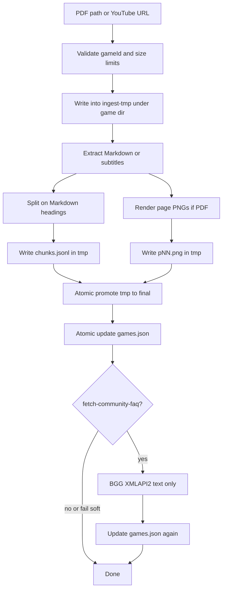

> **Archive copy.** English-only historical plans used to build BGA.
> **Stage:** 2.
> **Origin:** Cursor plan for Stage 2 (document ingestion).
> **Outcome:** implemented. Stage 2A later changed chunk ids and page paths to include `docKey`.

---

# Stage 2 — Document ingestion (verified plan)

## Goal

After this stage the user loads their own rulebook (PDF) or a video, and the
engine stores **ordered fragments with page numbers**, **page pictures**, and a
row in [`games.json`](../services/rag-engine/rag_engine/settings.py). The model
still **does not answer from documents** — that is Stage 3. Stage 2 ends at
“the material is ready to search”.

## What critical review changed

Relative to the first draft, this plan locked:

- **A lasting chunk format without LanceDB** (Stage 3 adds vectors; Stage 2
  does not fake an index).
- **`ChunkRecord` schema and `id` scheme** matching SSE tests
  (`azul:rulebook:p04:c02`).
- **Atomicity and re-ingest** (partial write / loading the same game again).
- **Concrete PDF limits** instead of “e.g. max pages”.
- **BoardGameGeek:** official XMLAPI2 only, plus an explicit ban on scraping
  Files/HTML; if there is no reliable FAQ endpoint, narrow the scope.
- **Desktop:** the same pattern as `pullModels` + `BGA_STORAGE_DIR` in
  `userData` (not the repo folder).
- **YouTube:** in implementation scope, **outside** the hard PDF acceptance
  (as on the roadmap).
- **Z5:** game titles are not in docs — CI acceptance = fixture; manual =
  two of the user’s own PDFs.

---

## Premortem (deep, after verifying the code)

### Tigers

1. **A game path escapes `storage/`**
   - **Where:** [`settings.py`](../services/rag-engine/rag_engine/settings.py)
     has `storage_dir` / `assets_dir` / `games_registry`, no `assets_path()`
     (D13 / ROADMAP).
   - **Checked:** `GAME_ID_PATTERN` and `isGameId` exist; no helper builds
     ingest paths; registry write = 0 production sites.
   - **Fix:** [`storage_paths.py`](../services/rag-engine/rag_engine/storage_paths.py):
     every join → `resolve()` → must sit under `storage_dir.resolve()`;
     `--game` validated with the same regex as the contract before any
     `mkdir`.

2. **A partial ingest leaves junk and lies about `chunkCount`**
   - **Where:** writing PNGs + JSONL + `games.json` is three steps; there is
     no transaction today.
   - **Checked:** `games.py` only reads; corrupt JSON → 500 (OK), but
     half-written PNGs without a registry update would desync.
   - **Fix:** working directory `…/<gameId>/.ingest-tmp-<uuid>/`, after
     success atomic replace of the target files, **last** update `games.json`
     (tmp + `os.replace`). On error: delete tmp, leave the registry. Re-ingest
     of the same `(gameId, kind, doc_key)`: overwrite that document’s chunks
     and page PNGs, recompute `chunkCount`.

3. **Chunk format that will not fit Stage 3**
   - **Where:** ROADMAP Stage 3: LanceDB `storage/index`, fields
     `id, gameId, documentKind, page, text, heading, vector`. The architecture
     diagram already puts LanceDB at ingest; the roadmap splits the stages.
     The annex also mentions `storage/lancedb` (name drift — Stage 3 unifies
     on `storage/index`).
   - **Checked:** no chunk writes yet; SSE tests use
     `id="azul:rulebook:p04:c02"` and
     `imageUrl="/static/assets/azul/p04.png"`.
   - **Fix:** Stage 2 writes **JSONL without `vector`**. Schema below. Stage 3
     only adds embeddings / a LanceDB table from the same fields + `vector`.
     Do not create LanceDB in Stage 2.

4. **BoardGameGeek “FAQ” without a clear, legal source**
   - **Where:** ARCHITECTURE myth 10: XMLAPI2 **does not** expose Files; bulk
     PDF download breaks the terms of service. ROADMAP option A wants FAQs /
     threads.
   - **Checked:** no BGG code; plan v1 said vaguely “public threads” (easy to
     slide into HTML scrape).
   - **Fix (hard rules):**
     - Allowed: **only HTTP to `boardgamegeek.com/xmlapi2/…`** (search +
       thing), User-Agent identifying the app, timeout, rate-limit (gap
       between requests).
     - From the thing/game: description / official text fields XMLAPI2
       exposes; external FAQ links **only if** the API returns them as text
       or a URL to fetch text — **not** PDFs from Files.
     - **Forbidden:** scrape HTML forums, `/filepage`, bulk attachment
       download.
     - If XMLAPI2 does not yield enough FAQ text: store what exists
       (description), or skip with notice `bgg_faq_unavailable` — **the PDF
       is still OK**.
     - Flag `--fetch-community-faq` / checkbox; default **off** in CI.

5. **Desktop writes to a different folder than the CLI**
   - **Where:** [`main.ts`](../apps/desktop/src/main.ts) `pullModels` sets
     `BGA_STORAGE_DIR: dataDir` (`userData/storage`); CLI without env uses
     `services/rag-engine/storage`.
   - **Checked:** intentional (gitignore of `storage/*`); ingest must follow
     the same Settings path.
   - **Fix:** `importPdf` = same pattern as `pullModels`:
     `uv run python -m rag_engine.ingest add …` with `BGA_STORAGE_DIR`. The
     engine in Electron reads that folder — `/games` will see the rows.

6. **A huge / malicious PDF kills memory**
   - **Where:** `pymupdf4llm` + 150 DPI render of every page.
   - **Checked:** no limits in code; ARCHITECTURE: a publisher PDF usually has
     a text layer (no Marker/OCR in Stage 2).
   - **Fix (starting limits):** max **80 MB** file, max **200 pages**, max
     **2 MB** per PNG; above that → readable error code, zero writes. Scan OCR
     is out of scope (ARCHITECTURE 3.8).

### Elephants

- **`/ask` still has no documents** — after Stage 2 the user will see the game
  on the list, but answers still come from general knowledge
  (`groundedness=partial`). The README must say this outright, or it looks
  like a regression.
- **YouTube on the ROADMAP vs acceptance** — acceptance lists PDF / games /
  assets / bad `--game`, not YouTube. YouTube is in implementation scope, but
  **does not block** closing Stage 2 if PDF + registry + CLI + desktop work.
- **Stage 3 index name** (`storage/index` vs `lancedb`) — not decided here;
  Stage 2 creates no index.

### Paper tigers

- **`gameId` slug** — contract + `isGameId` + parity test; CLI/IPC only have
  to use them.
- **Serving PNGs** — `StaticFiles` on `/static/assets` already in
  [`main.py`](../services/rag-engine/rag_engine/main.py); mint relative URLs.
- **Showing `fileName` in the UI** — that is not a disk write; the roadmap
  forbids names from the document **as filesystem paths**. The UI may show
  the original name in a message.

### False alarms

- **“We must build LanceDB immediately”** — rejected: ROADMAP splits Stage
  2/3; vectors = Stage 3.
- **“BGG Files can be automated legally”** — rejected in ARCHITECTURE myth 10.

---

## Scope

**In scope**

| Area | Decision |
| --- | --- |
| Extra `ingest` | `uv sync --extra ingest` ([`pyproject.toml`](../services/rag-engine/pyproject.toml) already declares deps) |
| PDF | `pymupdf4llm` → Markdown with page numbers; 150 DPI PNG `pNN.png` |
| Chunking | Split on MD headings; a fragment never crosses a section boundary |
| Persistence | JSONL `ChunkRecord` (no vector) + atomic `games.json` |
| CLI | `uv run python -m rag_engine.ingest add --game … --kind … [--title …] [--fetch-community-faq] path\|url` |
| Desktop | `importPdf` success/error; `ingestAvailable`; PdfDropZone + i18n |
| BGG | Optional, XMLAPI2 text only |
| YouTube | Subtitles; Whisper only with the `speech` extra |
| Tests + README | Fixture, no network in CI |

**Out of scope**

- LanceDB / embeddings / `/ask` with a citation (Stage 3)
- OCR of heavy scans (Marker/Unstructured)
- Online lookup during play (Stage 8)
- Downloading rulebook PDFs from the internet / BGG Files
- Cropping figures (Stage 7) — full page only

---

## Data schema (frozen for Stage 2→3)

### `ChunkRecord` (one JSONL line)

Fields = a future LanceDB row **without** `vector`:

- `id` — `{gameId}:{documentKind}:p{page:02d}:c{chunkIndex:02d}` or for a
  transcript `{gameId}:video_transcript:{videoId}:c{nn}`
- `gameId`, `documentKind`, `page` (`null` for a transcript/FAQ without pages)
- `text`, `heading` (string, may be `""`)
- `imageUrl` — for PDF pages: `/static/assets/<gameId>/pNN.png`; otherwise
  `null` (minted at ingest; the frontend still adds the proxy prefix — D10)

### Directory layout

```text
storage/                          # or BGA_STORAGE_DIR (Electron: userData/storage)
  games.json
  assets/<gameId>/
    p01.png …
    documents/
      <documentKind>/
        <docKey>/
          source.bin   # optional PDF copy under a stable name (not the original)
          chunks.jsonl
```

`docKey` for a rulebook = `main` (or a content hash); for BGG = `bgg-<thingId>`;
for YouTube = `yt-<videoId>`.

### `GameSummary` (no contract change)

- `title` — from `--title`, else existing title, else `gameId`
- `chunkCount` — sum of lines in **all** `chunks.jsonl` for the game
- `documentKinds` — sorted unique list
- `indexedAt` — ISO UTC of the last successful ingest

---

## Flow



---

## Implementation steps

### 1. `storage_paths.py` (D13)

- `assert_game_id(game_id)` → the same regex as `GAME_ID_PATTERN`
- `assert_under_storage(path, storage_dir)`
- `game_assets_dir`, `page_png_path(game_id, page)`,
  `document_dir(game_id, kind, doc_key)`, `chunks_path(...)`
- Tests: `../x`, `Azul`, `azul/../evil` → error **before** `mkdir`

### 2. PDF + chunking + registry + CLI

Package [`rag_engine/ingest/`](../services/rag-engine/rag_engine/ingest/):

| Module | Responsibility |
| --- | --- |
| `pdf.py` | Limits; `pymupdf4llm`; page-marker → number; 150 DPI render |
| `chunking.py` | Split on `#`/`##`/…; never cross a section; assign `page` from the source range |
| `registry.py` | Read → validate `GameSummary` → merge → write tmp → `os.replace` |
| `pipeline.py` | Orchestrate tmp → promote → registry |
| `__main__.py` | argparse like [`pull_models.py`](../services/rag-engine/rag_engine/pull_models.py) |

CLI:

```bash
uv sync --extra ingest
uv run python -m rag_engine.ingest add \
  --game azul --kind rulebook --title Azul \
  [--fetch-community-faq] \
  /path/to/file.pdf
```

Re-ingest: the same `--game` + `--kind` + the same `docKey` overwrites the
document; `chunkCount` is recomputed from zero for the game.

### 3. YouTube (non-blocking for acceptance)

- `transcript.py`: `youtube-transcript-api` (instance `.fetch()`)
- No subtitles: if `speech` is imported → `yt-dlp` + existing speech-to-text;
  otherwise a clear exit / error code
- `documentKind=video_transcript`; `page=null`; `imageUrl=null`

### 4. BGG XMLAPI2 (optional)

- `bgg_faq.py`: search by `--title`/`gameId`, fetch `thing`, extract text
  fields the API allows
- Soft-fail: log + notice; do not roll back the PDF
- Store `documentKind=faq`, `docKey=bgg-<id>`
- README: the user still supplies the PDF; BGG ≠ Files

### 5. Desktop + UI

Pattern: [`main.ts` pullModels](../apps/desktop/src/main.ts).

- `importPdf`: validate `isGameId` →
  `uv run python -m rag_engine.ingest add --game … --kind rulebook [--fetch-community-faq] <filePath>`
  with `BGA_STORAGE_DIR`
- Types in [`desktop-api.ts`](../apps/desktop/src/desktop-api.ts):
  `{ ok: true, gameId }` or
  `{ ok: false, reason: 'invalid_game_id' | 'ingest_not_ready' | 'limit_exceeded' | 'ingest_failed', message?: string }`
- `ingestAvailable`: `true` when `uv` is available and
  `python -c "import pymupdf4llm"` in the engine env passes (or an equivalent
  probe at setup start)
- Progress: stdout → IPC (like pull-models), so the UI does not look frozen
  on a long PDF
- [`PdfDropZone.tsx`](../apps/web/src/features/desktop-setup/PdfDropZone.tsx):
  success, BGG checkbox, new i18n keys `en`/`pl`; remove “stage 2 not ready”
  as a success state
- After success: refetch `/games` (RulesChat loads the list once on mount —
  refresh after a setup event or navigation; minimum: document “refresh the
  page”, better: shared reload / custom event)

### 6. Tests

- Fixture: a **generated** small PDF in the test (pypdf/reportlab or PDF bytes
  in fixtures/) — **zero** real rulebooks in git
- Unit: chunking (headings, boundaries, page)
- Path escape
- CLI bad `--game` → exit ≠ 0, no files
- Registry merge: 2 documents → `chunkCount` and `documentKinds`
- Re-ingest does not double-count
- Page/MB limit → error, no registry update
- BGG: mock HTTP XML; offline soft-fail
- Desktop: extend types + optional pure path-logic test; PdfDropZone Testing
  Library (success mock API)
- CI: **no network**, no Ollama

### 7. Documentation

- README: `uv sync --extra ingest`, sample CLI, Electron vs CLI storage, BGG
  checkbox = XMLAPI2 text only, **answers from the rulebook = Stage 3**
- ROADMAP: Stage 1 marked complete (if not already); Stage 2 acceptance
  unchanged except a JSONL note
- Spell out Z5 in the README: for a manual check take one simple and one
  complex game from your own PDFs (titles are not hardcoded in the repo)

---

## Acceptance

1. After CLI ingest of 1–2 fixture/demo PDFs: `GET /games` → non-zero
   `chunkCount`, correct `documentKinds`.
2. `storage/assets/<gameId>/pNN.png` exists; `imageUrl` in JSONL is relative
   `/static/assets/...`.
3. `--game ../x` / `Azul` → error before any write.
4. Re-ingest does not break the registry; a partial fail does not update
   `games.json`.
5. `importPdf` in Electron (or equivalent spawn) ends `ok: true` with
   `ingest` installed.
6. `--fetch-community-faq` + mock → optional `faq` chunks; without network
   the PDF is still OK.
7. `pnpm verify` passes.
8. YouTube: at least the subtitled path covered by a mock test; no subtitles
   without `speech` → readable error (not a crash).

## Work order

1. Paths + ChunkRecord schema + PDF + chunking + registry + CLI
2. Fixture tests / limits / re-ingest
3. Desktop IPC + PdfDropZone + i18n + list refetch
4. BGG XMLAPI2 (soft-fail)
5. YouTube subtitles
6. README + manual smoke on 2 of your own PDFs (Z5)
