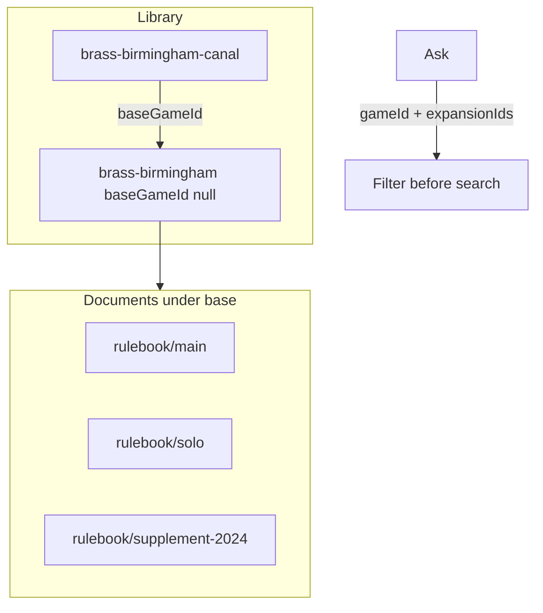

> **Archive copy.** English-only historical plans used to build BGA.
> **Stage:** 2A (implemented immediately after Stage 2; originally labelled 2B).
> **Origin:** Cursor plan for documents under a game + linked expansions.
> **Outcome:** implemented.

---

# Stage 2A — Documents under a game + linked expansions

## Problem

- One box often has several PDFs (intro, full rules, solo, almanac) and later a supplement.
- An expansion is its own product, added later with its own PDF.
- At the table it must be clear: base only vs base + which expansions.

**Today (verified):** one `gameId` on ask; PDF ingest always `doc_key="main"`; page images flat at `assets/<gameId>/pNN.png` ([`pipeline.py`](services/rag-engine/rag_engine/ingest/pipeline.py) promote); chunk ids `{game}:{kind}:pNN:cNN` **without** `docKey` ([`models.py`](services/rag-engine/rag_engine/ingest/models.py)); [`AGENTS.md`](AGENTS.md) invariant 1 says retrieval is scoped to **one** game.

## Chosen model (unchanged intent)



| Thing | Storage | User action |
| --- | --- | --- |
| Base / standalone | `gameId`, `baseGameId: null` | New game |
| Extra booklet / late supplement | Document under same `gameId` | Add PDF to existing game |
| Expansion | Separate `gameId` + `baseGameId` → base | New game + “expansion of …” |
| Ask / teach | `gameId` + `expansionIds[]` | Base select; expansion checkboxes (default off) |

**No per-booklet picker on Ask.** All documents of the selected base (and ticked expansions) are in scope. Ranking + `DOCUMENT_AUTHORITY` across kinds; within the same kind see “Same-kind conflicts” below.

---

## Premortem (deep)

**Context:** Stage 2A library model before Stage 3 retrieval.

### Tigers

- **Risk:** Two rulebooks under one game produce the **same chunk id** (`azul:rulebook:p01:c00`), so the later ingest replaces or confuses evidence.
  **Where:** [`chunk_id_for_page`](services/rag-engine/rag_engine/ingest/models.py) — no `doc_key`.
  **Severity:** high
  **Mitigation checked:** none in id scheme today.
  **Fix (blocking):** ids become `{gameId}:{kind}:{docKey}:pNN:cNN` (and FAQ/transcript already partly include a key — align all).

- **Risk:** Second PDF **overwrites** `p01.png` of the first.
  **Where:** [`_promote_document`](services/rag-engine/rag_engine/ingest/pipeline.py) moves PNGs into flat `game_assets_dir`.
  **Severity:** high
  **Mitigation checked:** flat `page_image_url(game_id, page)` only.
  **Fix (blocking):** pages under `documents/<kind>/<docKey>/pNN.png`; URL includes kind + docKey. Static mount `/static/assets` already serves nested paths ([`main.py`](services/rag-engine/rag_engine/main.py)).

- **Risk:** Shipping Stage 3 against old flat storage + new model → wrong/missing images.
  **Where:** existing local `storage/` from Stage 2.
  **Severity:** high
  **Mitigation checked:** no migration tool.
  **Fix (blocking):** one-shot migrate flat `pNN.png` + rewrite chunk `imageUrl` into `documents/rulebook/main/`, **or** document “re-ingest required” and refuse Stage 3 index if layout version missing. Prefer migrate helper + `libraryLayoutVersion` in registry.

- **Risk:** Ask with forged `expansionIds` pulls another game’s rules (cross-game leak).
  **Where:** future retrieval filter; today ask ignores docs.
  **Severity:** high for Stage 3
  **Mitigation checked:** only `gameId` validated as slug.
  **Fix:** server allows an expansion id only if `load_games(id).baseGameId === request.gameId`; reject otherwise with `invalid_expansion_ids`. Never union unvalidated ids.

- **Risk:** Rewriting invariant 1 to “many games” casually → agents filter after search.
  **Where:** [`AGENTS.md`](AGENTS.md) L42–43, ARCHITECTURE §3.1.
  **Severity:** high
  **Mitigation checked:** wording is “one game” only.
  **Fix:** new wording: *Retrieval is scoped to the **active game set** (`gameId` ∪ validated `expansionIds`) applied as a metadata filter **before** search, never after.*

- **Risk:** Contradictory **same-kind** PDFs (old rulebook vs living rules) with equal authority → confident wrong answer.
  **Where:** `DOCUMENT_AUTHORITY` only ranks kinds, not documents.
  **Severity:** medium
  **Mitigation checked:** no per-doc authority.
  **Fix (v1):** on conflict between same `documentKind`, prefer the document with newer `indexedAt`; prompt states that; show `documentTitle` in sources. Optional later: user marks one doc as “primary”.

### Elephants

- **Risk:** The Rulebooks screen tries to do “new game”, “extra PDF”, and “this is an expansion” as three competing mini-apps.
  **Fix:** Still **one** form. Only a **mode** control with two values — “New game” vs “Add PDF to a game you already have”. Linking an expansion is an optional field **inside** “New game”, not a third mode.

- **Risk:** Someone adds a **supplement** (or solo booklet) as a **new game** instead of attaching it to the existing entry — duplicate shelf items, broken expansion links, confused Ask.
  **Fix:** Clear catalogue copy on Rulebooks that states when to use which mode (e.g. supplement / second booklet / living rules → “Add to existing”; new box or expansion product → “New game”). Short helper under the mode control, both `en` and `pl`. No fancy detection logic required in v1.

- **Risk:** Plan once said “block delete of base while expansions exist” but **there is no delete API** yet.
  **Fix:** Do not pretend delete exists. When delete is added later: refuse deleting a base that still has children.

### Paper tigers

- **Nested static URLs break the proxy:** StaticFiles is mounted at `/static/assets`; nested files under `assets/<gameId>/documents/...` are fine. Proxy already treats `static` as asset.
- **One ingest lock:** remains; second upload still `ingest_busy`.
- **Accept-Language forcing English:** already fixed to default `pl`.

### False alarms

- **Must pick booklet on every ask:** discarded — search + titles in sources; keep Ask simple.
- **Expansions as documents under base:** rejected by product choice (late publish / separate import).

---

## Same-kind conflicts (v1 rule)

When two chunks are both `rulebook` (or both `faq`) and disagree:

1. Prefer higher `DOCUMENT_AUTHORITY` kind (unchanged).
2. Else prefer newer document `indexedAt`.
3. Sources always expose human `documentTitle` so the UI can show which booklet was cited.

Do **not** invent a new kind for “supplement” in v1 unless the user labels the upload as `errata` (optional kind select in advanced — default `rulebook`).

---

## Contract and registry

[`types.ts`](packages/api-contract/src/types.ts) + [`contract.py`](services/rag-engine/rag_engine/contract.py) + parity:

```ts
GameDocumentSummary {
  docKey: string;          // slug, same pattern as gameId-ish safe key
  documentKind: DocumentKind;
  title: string;           // human label
  chunkCount: number;
  indexedAt: string;
}

GameSummary {
  gameId, title, chunkCount, documentKinds, indexedAt;
  baseGameId: string | null;
  documents: GameDocumentSummary[];
}

AskRequest {
  gameId: string;                 // base or standalone only in UI; server accepts any gameId that exists
  expansionIds?: string[];        // each must have baseGameId === gameId
  question, mode, sessionId?;
}
```

**Ask `gameId` rule:** UI offers only `baseGameId == null` in the primary select. Server still accepts a lone expansion `gameId` with empty `expansionIds` (CLI/tests); UI does not emphasize that.

**Per-document title source of truth:** `documents/<kind>/<docKey>/manifest.json` `{ title, documentKind, indexedAt }` written at ingest; `recount_game` rebuilds `GameSummary.documents` from disk (D13-friendly). Do not rely on titles only in `games.json` without manifests.

**docKey rules:**

- Pattern: `^[a-z0-9][a-z0-9-]{0,63}$` (reuse slug discipline).
- First PDF of a new game: default title from i18n “Rulebook” → reserved key `main` if user leaves default; custom title → slug (if slug would be `main`, only allowed when intentional).
- Add-to-existing: slug from title; if folder exists → **replace that document** after confirming same title/key (server: idempotent replace; UI: status text “Replaced document …”).
- Never two live folders with the same `(kind, docKey)`.

---

## Storage layout

```text
storage/assets/<gameId>/
  documents/<kind>/<docKey>/
    manifest.json
    chunks.jsonl
    source.pdf          # if PDF
    p01.png, p02.png    # page images for THIS doc only
```

- `page_image_url(game_id, kind, doc_key, page)` → `/static/assets/.../documents/.../pNN.png`
- Migration: if `assets/<gameId>/p01.png` exists and `documents/rulebook/main/` missing, move PNGs + rewrite chunk image URLs + write manifest title “Rulebook”.

---

## How users extend a game / link an expansion

### Add booklet / late supplement

1. Rulebooks → mode **Add PDF to existing game**.
2. Select game (base or expansion).
3. Document title → drop PDF.
4. Same `gameId`; new `docKey` folder; registry `documents[]` grows.

### Link expansion to base

1. Rulebooks → mode **New game**.
2. Expansion `gameId` + title.
3. Field **“This is an expansion of”** (select of games with `baseGameId == null` only).
4. Drop first PDF → stored under the expansion’s `gameId`, `baseGameId` set on that summary.

Ask: primary select = bases; checkbox group = games where `baseGameId === selected`; request sends validated `expansionIds`.

---

## Accessibility and HTML semantics — blocking for UI work

Follow Testing Library rules ([`.cursor/skills/ui-testing`](.cursor/skills/ui-testing/SKILL.md)). Hard rule for **every** form on Rulebooks and Ask:

- Related controls live inside a real HTML **`<fieldset>`** with a visible **`<legend>`** (not a fake `role="group"` alone where a fieldset belongs).
- That is required semantics: screen readers and document structure get a proper form section, not a flat soup of inputs.
- Mantine controls may sit *inside* the fieldset; do not replace the fieldset with only a Paper/Stack.

### Import form ([`PdfDropZone`](apps/web/src/features/desktop-setup/PdfDropZone.tsx))

- One `<form aria-labelledby={…}>`.
- Fieldsets (each with legend from catalogues), for example:
  - How you are adding (mode)
  - New game *or* Add to existing (whichever mode is active)
  - PDF file (drop zone + Choose PDF)
- Clear **mode helper copy** (elephant above): when “Add to existing” vs “New game”.
- `aria-busy` while uploading; errors `role="alert"`; success `role="status"`.
- Keyboard path without drag-and-drop kept.

### Ask form ([`RulesChat`](apps/web/src/features/rules-chat/RulesChat.tsx))

- Form kept.
- `<fieldset>` + legend for the base game select.
- `<fieldset>` + legend for expansion checkboxes **only when** at least one expansion exists; omit the fieldset if empty.
- Changing base clears ticks; optional short `aria-live="polite"` status from catalogues.
- Teach / arbitrate mode: keep labelled control (fieldset if it is its own section of the form).

### Tests

- Query fieldsets via `getByRole('group', { name: legendText })` (native fieldset + legend).
- Assert mode helper text is visible.
- Expansion checkboxes named by expansion title; tab reaches submit / Choose PDF.

---

## Import API / CLI

Extend `POST /ingest/pdf` multipart fields:

- `gameId`, `title` (game title on create), `documentTitle`, `docKey?`, `baseGameId?`, `mode: create | attach`, `fetchCommunityFaq`

CLI: `--base-game`, `--doc-title`, `--doc-key`, attach vs create inferred from flags / existing registry.

Keep single-flight ingest lock.

---

## Docs / invariants to edit in the same Stage 2A change

- [`docs/ROADMAP.md`](docs/ROADMAP.md): Stage 2A between 2 and 3; acceptance below.
- [`AGENTS.md`](AGENTS.md) + ARCHITECTURE §3.1: active game set wording.
- README: Rulebooks flows (new / add / expansion).

---

## Acceptance (Stage 2A)

- Two PDFs under one base: distinct chunk ids; distinct page image URLs; `/games` lists both document titles; images render via proxy.
- Flat legacy layout migrates to `rulebook/main` **or** documented re-ingest gate passes in CI with a fixture.
- Expansion with `baseGameId`; Ask shows its checkbox only under that base; default unticked.
- Server rejects `expansionIds` that are not children of `gameId`.
- Ask with ticks includes those ids in the request body (assert in web test); engine validates (assert in API test).
- Import and Ask wrap related fields in real `<fieldset>` + `<legend>`; mode helper copy warns against adding a supplement as a new game; a11y tests as above.
- Same-kind newer doc preference covered by a unit test on the conflict helper (even if Stage 3 prompt comes later, helper lives in engine now or in a pure module Stage 3 will call).

## Out of scope for 2A

- Stage 3 vector index (but contract + paths must be ready).
- Delete-game UI.
- Per-booklet filter on Ask.
- Expansion-of-expansion trees.
- Progress bar (Stage 3A).
