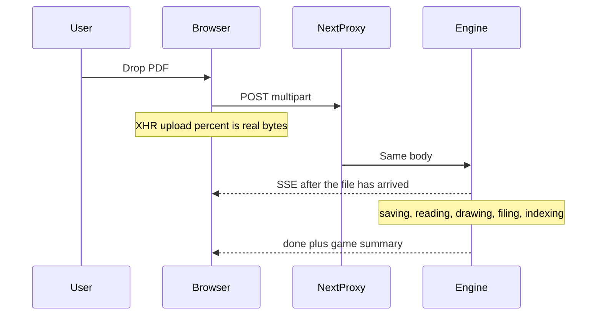

> **Archive copy.** English-only historical plans used to build BGA.
> **Stage:** 3A (after Stage 3 and 3B; not implemented yet).
> **Origin:** Cursor plan for Stage 3A (PDF ingest progress bar).
> **Outcome:** design parked until after Stage 3 (and 3B).

---
# Stage 3A — PDF ingest progress (after retrieval)

**Status:** design parked. When this plan is executed, the first change is to write Stage 3A into [`docs/ROADMAP.md`](docs/ROADMAP.md) (between Stage 3 and Stage 4) and one sentence in the README. Do **not** implement the bar until Stage 3 is complete.

Exact ROADMAP section to insert after Stage 3’s acceptance paragraph:

```markdown
## Stage 3A — Ingest progress

**Goal:** wherever a rulebook PDF is added (setup drop zone, desktop shell, or CLI), the
user sees a **smooth percent** and a **stage label**, not four equal jumps of 25%.

Do this **after** Stage 3. The last honest slice of the bar is writing search vectors
(`indexing`). Before Stage 3 that work does not exist; faking “the chat model is learning
the rules” would freeze the bar with nothing real happening.

- Stages are **codes** (UI copy in `en`/`pl`): `sending`, `saving`, `reading`, `drawing`,
  `filing`, `community` (only if the BoardGameGeek checkbox is on), `indexing`
- Measure what actually moves: upload **bytes** (`sending`), disk **bytes** (`saving`),
  **page i of n** (`reading` and `drawing`), library ticks (`filing`), then per-chunk or
  per-batch index writes (`indexing`). Blend so the bar never goes backwards
- `POST /ingest/pdf` streams progress the same way `/ask` streams an answer (progress
  frames, then done or error). Upload percent is measured in the browser; the engine
  cannot report it until the file has arrived
- `indexing` is search vectors, not training the chat model
- CLI prints the same percent and stage (English log lines, not the UI catalogues)

**Acceptance:** a multi-page PDF makes the bar tick often (at least once per page while
reading and drawing); the label under the bar matches the current code; a second import
while one is running is still rejected; cancelling the upload stops the work. After
Stage 3, `indexing` is visible and the bar reaches 100% only when the game is searchable.
```

README sentence to add after the Stage 3 caveat in “Adding a rulebook PDF”:

> A live percent bar while a PDF is imported is Stage 3A (after retrieval).

**Why after Stage 3:** the honest last slice of the bar is **indexing for search** (vectors), which does not exist until Stage 3. Building the bar now would either omit that slice or fake “the model is learning.”

## What to add to the roadmap (this is the next edit)

Insert **after Stage 3 — Retrieval** and **before Stage 4 — Teaching mode**:

**Stage 3A — Ingest progress**

- Goal: wherever a rulebook PDF is added (setup drop zone, desktop shell, CLI), the user sees a **smooth percent** and a **stage label**, not four jumps of 25%.
- Stages (engine **codes**, UI copy in `en`/`pl`): `sending`, `saving`, `reading`, `drawing`, `filing`, `community` (if BGG is on), `indexing` (Stage 3 embeddings, per chunk or batch).
- Measure: XHR **bytes** for sending; **bytes** for saving; **page i of n** for reading and drawing; filing ticks; indexing ticks. Blend so the bar never goes backwards.
- Transport: `POST /ingest/pdf` becomes SSE (`ingest_progress`, `ingest_done`, `error`), same proxy stream headers as `/ask`.
- No language-model training during ingest. `indexing` is search vectors, not “teaching the chat model.”

Also a short pointer under README “Adding a rulebook PDF” that a live percent bar is Stage 3A.

Keep the design below as the spec for when Stage 3A is implemented.

## What is actually slow (so the bar is not fake)

Ingest copies the PDF, turns pages into text and pictures, splits text into sections, and updates `games.json`. After Stage 3 it will also write vectors. Asking uses general knowledge until Stage 3 search exists.



## Stages the user will see (implementation spec)

Engine sends **codes**, never sentences. Copy lives in `en`/`pl` `pdfImport.progress.*`.

| Code | On screen (EN intent) | How percent moves | Typical share after the file arrived |
| --- | --- | --- | --- |
| `sending` | Sending the rulebook | Browser: bytes uploaded / file size | ~0–12% of the whole bar (localhost is often instant) |
| `saving` | Saving the file | Bytes written into the game folder | Small, ~12–18% |
| `reading` | Reading the pages | **Page i of n** while extracting text | ~18–45% |
| `drawing` | Drawing page pictures | **Page i of n** while writing `pNN.png` | ~45–75% |
| `filing` | Filing in the library | Chunks + `games.json` | ~75–82% |
| `community` | Fetching community notes | Only if the BGG checkbox is on | Small band, or skip |
| `indexing` | Learning for search | Chunk/batch vectors (Stage 3 store) | ~82–100% |

**Blending:** while sending, show `0–12%` from XHR. When the first server event arrives, take `max(shown, 12 + 0.88 * serverPercent)`. Server `percent` is 0–100 of **server** work only. Never go backwards.

## How we measure (implementation spec)

1. **Sending** — `XMLHttpRequest.upload.onprogress` (`loaded/total`). `fetch` cannot report upload bytes.
2. **Saving** — 1 MB loop in [`ingest.py`](services/rag-engine/rag_engine/routers/ingest.py), plus copy into `source.pdf`.
3. **Reading** — [`extract_markdown`](services/rag-engine/rag_engine/ingest/pdf.py) **one page at a time**.
4. **Drawing** — existing loop in [`render_page_pngs`](services/rag-engine/rag_engine/ingest/pdf.py).
5. **Filing** — chunks + registry.
6. **Indexing** — Stage 3 embedding/index writes.
7. **CLI** — same callbacks: `NN%` and English stage name.

Helper maps `(stage, current, total)` → monotonic `percent` (tests lock e.g. page 4/10 in `drawing`).

## Transport / UI / tests (implementation spec)

- SSE after multipart is received; upload % is client-side.
- Contract: `ingest_progress`, `ingest_done`, `error`; generalize [`encode_event`](services/rag-engine/rag_engine/sse.py); [`routeKind`](apps/web/src/lib/engine-proxy.ts) `ingest` → `'stream'`.
- [`PdfDropZone.tsx`](apps/web/src/features/desktop-setup/PdfDropZone.tsx): Mantine `Progress`, `role="progressbar"`, stage `role="status"`.
- XHR + existing SSE decoder; abort via `xhr.abort()`.
- Tests: monotonic percent; per-page ticks; `409` busy; UI catalogues; `GAMES_CHANGED_EVENT`.
