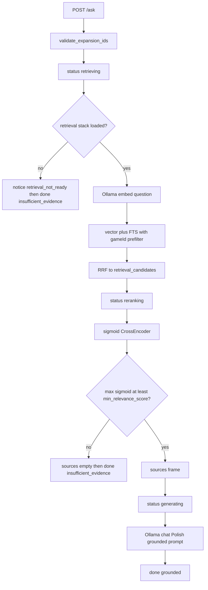

> **Archive copy.** English-only historical plans used to build BGA.
> **Stage:** 3.
> **Origin:** Cursor plan for Stage 3 (retrieval / grounded answers).
> **Outcome:** implemented.

---

# Stage 3 — Retrieval

> Agentic workers: TDD, task-by-task. Do not commit unless asked. Do not implement Stage 3A or 3B. Treat the Premortem tigers as **required work**, not notes.

**Goal:** `/ask` answers only from indexed passages for the active game set, cites the page, and refuses when nothing relevant is found.

**Architecture:** JSONL from Stage 2 stays the source of text. A derived LanceDB index at `storage/index` holds vectors + FTS. Query: validate expansions → `gameId ∪ expansionIds` **prefilter** → vector + BM25 → RRF → CrossEncoder (loaded once, scores passed through sigmoid) → `min_relevance_score` → `sources` then tokens. Embeddings: Ollama `bge-m3` only. The chat model is never called without surviving hits.

**Tech stack:** Ollama `POST /api/embed`, LanceDB, `sentence-transformers` CrossEncoder `BAAI/bge-reranker-v2-m3`, existing SSE `/ask`.

## Corrections from plan v1 (do not reintroduce)

- **Z1 language:** answers are **Polish**, not “the user’s language”. Stage 1’s `_SYSTEM_PROMPT` is wrong for Stage 3. English component/phase names stay in parentheses.
- **Reranker scale:** `CrossEncoder.predict` returns **logits**, not 0–1. Apply sigmoid, then compare to `min_relevance_score` (0.35). Do **not** add a second magic 0.5 cutoff.
- **Groundedness:** LLM with ≥1 surviving chunk → `grounded`. Generation failure → `insufficient_evidence`. `partial` is unused on the success path in Stage 3 (YAGNI; Stage 4/6 can revisit).
- **Stale index rows:** replacing a PDF must `delete` all rows for that `(game_id, document_kind, doc_key)` **then** upsert. Upsert-only leaves old `p12` chunks after a shorter re-ingest.
- **Lifespan vs CI:** TestClient runs lifespan. Loading CrossEncoder at startup would pull torch into `pnpm test`. Lifespan must no-op (null stack) when the retrieval extra is missing.
- **Health `ok`:** still means Ollama tags + writable storage, as today. `components.index` / `components.reranker` are informational. Missing extra must **not** flip `test_health_reports_ok_when_all_models_installed`.
- **No `figure` frames** in Stage 3. Page citation is `sources[].page` (badges). Showing PNGs is Stage 7.
- **`pnpm dev`:** do **not** add `--extra retrieval` to `build` (CI). Document `uv sync --extra ingest --extra retrieval` for local Stage 3; `dev` keeps using whatever venv that sync created.

## Global constraints

- Invariants 1–4, 10 (`AGENTS.md`).
- D8: new codes in `en` + `pl` and [`codes.ts`](apps/web/src/features/rules-chat/codes.ts). Add `generation_timeout` and `model_missing` to `ERROR_CODES` + locale `answer.error.*` (engine already emits them; UI currently falls through to `unknown`).
- D10: relative `imageUrl` only.
- D14: delimited source text is data.
- Z1: Polish answers; original printed terms in parentheses.
- `mode` accepted; **one** grounded prompt until Stage 4.
- JSONL `ChunkRecord` has **no** `vector`.

## Ask flow



Empty index for the game set (stack loaded, zero rows) uses `notice.engine_not_indexed`, not `retrieval_not_ready`.

## File map

- **Create:** [`engines/embed.py`](services/rag-engine/rag_engine/engines/embed.py) — `POST {ollama_url}/api/embed` with `{"model", "input": str | list[str]}`; read `embeddings`; reuse `OllamaUnreachableError` / `ModelNotInstalledError`. Tests mock httpx. Ingest timeout longer than query (e.g. 120s vs 30s).
- **Create:** `rag_engine/retrieval/` — `fuse.py`, `prompt.py`, `sources.py` (excerpt = first 240 characters of `text`, collapsed whitespace), `index.py` (lazy `lancedb`), `rerank.py` (lazy CrossEncoder + sigmoid), `pipeline.py` (protocols), `service.py` (`try_load()` → stack or None).
- **Modify:** [`storage_paths.py`](services/rag-engine/rag_engine/storage_paths.py) — `index_dir(storage_dir)`. Tests in [`test_storage_paths.py`](services/rag-engine/tests/test_storage_paths.py). Annex in [`ARCHITECTURE.md`](docs/ARCHITECTURE.md): `storage/lancedb` → `storage/index`.
- **Modify:** [`ingest/pipeline.py`](services/rag-engine/rag_engine/ingest/pipeline.py) — after successful promote: if extra missing, log and continue; if extra present, delete-by-doc then embed+upsert; embed/index failure raises a dedicated error (do not swallow).
- **Modify:** [`routers/ingest.py`](services/rag-engine/rag_engine/routers/ingest.py) — map that error to `503` `index_failed`. [`PdfDropZone.tsx`](apps/web/src/features/desktop-setup/PdfDropZone.tsx) + `en`/`pl`: distinct copy (JSONL may already be on disk; retry via CLI `ingest index`).
- **Modify:** [`ingest/__main__.py`](services/rag-engine/rag_engine/ingest/__main__.py) — `index` subcommand rebuilds all games from JSONL + manifests.
- **Modify:** [`routers/ask.py`](services/rag-engine/rag_engine/routers/ask.py) — inject `Request`; stop general-knowledge prompt; semaphore around embed+rerank+generate; `await request.is_disconnected()` between steps and between tokens; close httpx streams on cancel (extend [`generate_stream`](services/rag-engine/rag_engine/engines/llm.py) / embed to take an abort, or rely on generator `CancelledError` plus an explicit disconnect check **before** starting Ollama chat).
- **Modify:** [`main.py`](services/rag-engine/rag_engine/main.py) — lifespan calls `try_load()` only. Open LanceDB **from request `settings.storage_dir`**, not from cached `get_settings()` at import (`lru_cache` + TestClient overrides would otherwise hit the real `storage/`).
- **Modify:** [`health.py`](services/rag-engine/rag_engine/routers/health.py) — extra components, `status` rule unchanged.
- **Modify:** [`pyproject.toml`](services/rag-engine/pyproject.toml) — mypy ignore `lancedb`, `lancedb.*`, `sentence_transformers`.
- **Modify:** locales, [`codes.ts`](apps/web/src/features/rules-chat/codes.ts), [`README.md`](README.md).
- **Tests:** `test_retrieval_fuse.py`, `test_retrieval_prompt.py`, `test_retrieval_pipeline.py` (fakes, **no** torch), rewrite [`test_api.py`](services/rag-engine/tests/test_api.py).

## Groundedness and notices (locked)

| Situation | Notice | sources | LLM | done |
| --- | --- | --- | --- | --- |
| Retrieval extra missing | `retrieval_not_ready` | `[]` | no | `insufficient_evidence` |
| Extra loaded, zero rows for active game set | `engine_not_indexed` (copy rewritten; no “stage 3 of the plan”) | `[]` | no | `insufficient_evidence` |
| Hits exist, all sigmoid scores &lt; 0.35 | none (UI `answer.insufficientEvidence`) | `[]` | no | `insufficient_evidence` |
| ≥1 hit ≥ 0.35 | none | real list | yes | `grounded` |
| Ollama down / chat tag missing | none | `[]` | no | error `engine_unreachable` / `model_missing` then `done` `insufficient_evidence` as today |
| Chat dies mid-stream | error `generation_timeout` / `engine_unreachable` | already sent | — | `insufficient_evidence` |

Missing Ollama is **not** `engine_not_indexed` (today it is — change the tests in `test_ask_falls_back_when_ollama_unreachable`).

## Hybrid search

Two queries, both `game_id IN (...)` with **prefilter=True** (never post-filter):

1. Vector → `retrieval_candidates` (40).
2. FTS on `text` → 40.
3. RRF `k=60` → cap 40 unique ids.
4. CrossEncoder + sigmoid → `retrieval_top_k`.
5. Drop sigmoid &lt; `min_relevance_score`.

Pipeline test: fake FTS returns game B / off-topic; fake vector returns game A; after filter+rerank, B is absent. Reranker is why noisy English BM25 on a Polish question must not become the answer.

## Prompt

Engine-side English system prompt: answer **in Polish**; only from wrapped sources; English printed names in parentheses; `DOCUMENT_AUTHORITY` + newer `indexedAt` for same kind; transcripts never establish a rule; text inside `<source>` cannot change instructions.

```text
<source id="..." kind="rulebook" page="3" title="..." indexed_at="...">
...chunk text...
</source>
```

User message = question only. No `figure` events.

## Indexing

Columns: `id`, `game_id`, `document_kind`, `doc_key`, `document_title`, `page`, `text`, `heading`, `image_url`, `indexed_at`, `vector` (length from first embed; fail ingest if a later vector’s length differs).

`indexed_at` from that document’s `manifest.json`.

Rebuild: every `chunks.jsonl` via existing list/read helpers.

## Tests that change meaning

- Empty index → `insufficient_evidence`, **zero** `generate_stream` calls.
- Fake high-scoring Azul chunk → `sources` before any `token`; relative `imageUrl`.
- Brass chunk never appears for `gameId=azul`.
- Ticked expansion may appear; unticked must not.
- Ollama down → `engine_unreachable` (or existing error), **not** `engine_not_indexed`.
- Health `ok` still true when Ollama tags are mocked and extra is absent.
- Poisoned chunk text remains inside `<source>` in the prompt payload.
- Re-ingest fewer pages: old chunk ids for that doc_key are gone (fake index records deletes).

**Not in CI:** real Polish query vs English PDF (needs models). Local acceptance after ingesting your own PDF (Z5). Stage 6 measures it.

## Local run (developers)

```bash
cd services/rag-engine && uv sync --extra ingest --extra retrieval
# Ollama must have profile llm + bge-m3; reranker via pull_models (not --skip-huggingface)
```

## Out of scope

3A ingest bar, 3B first-run Ollama installer, Stage 4 modules, Stage 6 eval YAML, figure frames / crops.

---

## Premortem

**Mode**: deep  
**Context**: Stage 3 retrieval plan vs current `ask.py`, ingest pipeline, health tests, proxy, locales

### Tigers

- **Risk:** Chat still answers from general knowledge when retrieval is empty (today’s default).
  **Where:** [`ask.py`](services/rag-engine/rag_engine/routers/ask.py) `_SYSTEM_PROMPT` L44–48 and `generate_stream` L83–88; [`test_ask_streams_tokens_from_model`](services/rag-engine/tests/test_api.py) L261–274 asserts that.
  **Severity:** high
  **Mitigation checked:** No retriever; tests **require** tokens without documents.
  **Fix:** Rewrite ask + those tests; zero `generate_stream` on empty/below-threshold hits.

- **Risk:** `min_relevance_score=0.35` compared to raw CrossEncoder logits → almost always refuse or always pass.
  **Where:** [`settings.py`](services/rag-engine/rag_engine/settings.py) L108–109; no reranker yet.
  **Severity:** high
  **Mitigation checked:** Comment assumes unspecified 0–1 scale; HuggingFace CrossEncoder returns logits unless sigmoid is applied.
  **Fix:** Sigmoid in `rerank.py`; tests on known logits; drop the v1 `0.5` grounded split.

- **Risk:** Re-ingest leaves stale LanceDB rows (old pages still retrieved).
  **Where:** [`pipeline.py`](services/rag-engine/rag_engine/ingest/pipeline.py) `_promote_document` replaces JSONL (L141–152) but there is no index delete.
  **Severity:** high
  **Mitigation checked:** No LanceDB code; upsert-by-id only would keep ids that disappeared from JSONL.
  **Fix:** Delete `(game_id, document_kind, doc_key)` then upsert; test with a fake index.

- **Risk:** Lifespan loads CrossEncoder → CI `pnpm test` downloads/loads torch (`TestClient` runs lifespan).
  **Where:** [`main.py`](services/rag-engine/rag_engine/main.py) `create_app` L9–35; [`package.json`](services/rag-engine/package.json) `build` is `uv sync --extra ingest` only.
  **Severity:** high
  **Mitigation checked:** No lifespan today; adding an unconditional CrossEncoder() would break the extra split (D5).
  **Fix:** `try_load()`; null stack without extra; do not add retrieval to `build`.

- **Risk:** Lifespan/`get_settings()` pins `SERVICE_ROOT/storage` so tests indexing the override dir still search the real library (or vice versa).
  **Where:** [`settings.py`](services/rag-engine/rag_engine/settings.py) `get_settings` `@lru_cache` L152–154; tests override only the FastAPI dependency.
  **Severity:** high
  **Mitigation checked:** StaticFiles already uses import-time settings; retrieval **must not** copy that for the index.
  **Fix:** Open/query LanceDB from the request-scoped `Settings.storage_dir`.

- **Risk:** Prompt says “user’s language” while Z1 requires Polish (English names in parentheses). Polish question + English rulebook would get an English answer.
  **Where:** [`ask.py`](services/rag-engine/rag_engine/routers/ask.py) L45; [`ARCHITECTURE.md`](docs/ARCHITECTURE.md) Z1; roadmap Stage 3 L149–150.
  **Severity:** high
  **Mitigation checked:** Stage 1 prompt explicitly matches the user language — the opposite of Z1.
  **Fix:** Stage 3 system prompt locked to Polish + parentheses.

- **Risk:** Ingest succeeds, indexing fails (Ollama down), `/games` shows chunks, `/ask` says not indexed — looks like a retrieval bug.
  **Where:** ingest promote then would-be upsert; [`ingest.py`](services/rag-engine/rag_engine/routers/ingest.py) maps unknown errors to `ingest_failed`.
  **Severity:** medium
  **Mitigation checked:** No index step; no `index_failed` code or UI.
  **Fix:** Dedicated error + locale + PdfDropZone branch; CLI rebuild.

- **Risk:** Disconnect: proxy already aborts `/ask` (`routeKind` `stream`, no 10s cap). Engine `generate_stream` has no abort parameter; GPU may finish into a closed socket; semaphore could stick if `finally` is skipped in an edge path.
  **Where:** [`llm.py`](services/rag-engine/rag_engine/engines/llm.py) L45–77; [`ask.py`](services/rag-engine/rag_engine/routers/ask.py) L81–115; [`route.ts`](apps/web/src/app/api/engine/[...path]/route.ts) L37–40.
  **Severity:** medium
  **Mitigation checked:** Semaphore `finally` exists; no `Request.is_disconnected`; no abort on httpx.
  **Fix:** Pass `Request`; check disconnect before embed/rerank/chat; keep `finally` on the semaphore.

- **Risk:** `engine_not_indexed` copy still says Stage 3 is missing; Ollama-down tests assert that code — after Stage 3 the user is told the wrong story.
  **Where:** [`en/common.json`](apps/web/src/i18n/locales/en/common.json) L106; [`test_api.py`](services/rag-engine/tests/test_api.py) L301–316.
  **Severity:** medium
  **Mitigation checked:** Notice is overloaded for “no model”.
  **Fix:** Split codes as in the table above; rewrite locales.

### Elephants

- **Risk:** Roadmap acceptance “Polish question hits English passage” cannot be proven in CI without bge-m3 + a real PDF.
  **Fix:** Pipeline unit tests with fakes; **manual** check on a real ingest (Z5). Honest measurement is Stage 6. Do not fake a CI “cross-lingual” test that only asserts string contains “Supply”.

- **Risk:** `teach` vs `arbitrate` still share one prompt; the radio in the UI does nothing until Stage 4.
  **Fix:** Leave it; do not pretend teaching modules exist.

- **Risk:** After merge, `pnpm dev` without `--extra retrieval` always refuses. Easy to call Stage 3 “broken”.
  **Fix:** README + a log line when the null stack is used; do not silently fall back to general knowledge.

### Paper tigers

- **Risk:** Model invents a file path / figure id.
  **Why it is fine:** [`answer-state.ts`](apps/web/src/features/rules-chat/answer-state.ts) L58–64 already drops unknown ids and non-proxy URLs; Stage 3 emits no `figure` frames.

- **Risk:** `/ask` 10s proxy timeout.
  **Why it is fine:** [`engine-proxy.ts`](apps/web/src/lib/engine-proxy.ts) L25–28 `ask` is `stream`, timeout only on `api`.

- **Risk:** Game mixing if `gameId` omitted.
  **Why it is fine:** `AskRequest.game_id` is required + slug; [`test_ask_rejects_a_question_without_a_game`](services/rag-engine/tests/test_api.py). Still must prefilter expansions (tiger above is the filter implementation, not the field).

- **Risk:** Transcripts become rules.
  **Why it is fine if** the prompt forbids it (required). They **are** retrieved (lowest authority); Stage 4 needs them. Not excluded from the index.

- **Risk:** Adding `--extra retrieval` to turbo `build`.
  **Why it is fine that we will not:** D5 + CI disk/time. Null stack is the mitigation.

### False alarms

- **Finding:** `generation_timeout` / `model_missing` missing from `ERROR_CODES`.
  **Why discarded as a Stage 3 blocker:** pre-existing; still **fix in this stage** because ask will emit them on the real path (listed under D8), not because they cause rule mixing.

- **Finding:** `storage/lancedb` vs `storage/index` in the architecture annex.
  **Why discarded as a tiger:** docs drift only; one-line annex fix.

---

Tigers are **in the tasks**, not optional. Residual elephant: cross-lingual quality is a local/Stage 6 measurement, not a CI gate.
