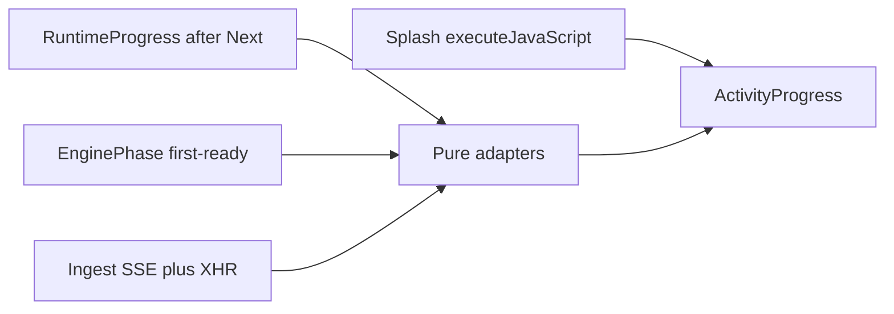

> **Archive copy.** English-only historical plan used to build BGA.
> **Stage:** 3A.
> **Origin:** Cursor plan for Stage 3A (reusable activity progress), revised
> after review. The first 3A draft was a PDF-only percent bar
> ([stage-3a-ingest-progress.md](stage-3a-ingest-progress.md)).
> **Outcome:** implemented — shared activity view, boot handoff so later-launch
> waits continue in React, honest PDF percent over SSE, `pnpm verify` passed.

---

# Stage 3A — Reusable activity progress (revised)

**Goal:** one reusable activity view for every long wait (first open, consented install, later launches, PDF import). Percent appears **only** when we can measure it.

Original ROADMAP 3A was a PDF percent bar ([stage-3a-ingest-progress.md](stage-3a-ingest-progress.md)). That work stays. The shell ships first; ingest SSE second. Living acceptance is [`docs/ROADMAP.md`](../ROADMAP.md) Stage 3A.

## What the review changed

The first draft overweighted a React loader and underweighted **when the wait actually happens**.

- **Later launch:** `apps/desktop/src/main/main.ts` ran `startBackend` then `await runEnsureRuntime()` **before** `loadAppPage()`. Model pull and search wait ran on the native splash. `emitRuntimeProgress` sent IPC, but splash HTML had no listener — events were discarded. A React loader after navigation would often appear for a blink. **Must change boot order** (locked below).
- **DesktopGate is not engine readiness.** Gate = setup flag + live probe. Warm-up phases live in `packages/utils/src/engine-readiness/engine-readiness.ts`. Do not poll `/health` inside DesktopGate.
- **`pdfImport.progress.*` does not exist.** Only `pdfImport.busy`. One new tree: `activity.*`.
- **`routeKind` treated all `ingest` as `'long'`** — not only `reindex`. Must branch on `segments[1] === 'pdf'`.
- **Cancel cannot kill `asyncio.to_thread(ingest_rulebook)`.** Abort stops the UI wait; the worker and `_INGEST_BUSY` lock finish on their own. Do not promise “cancel stops the work”.
- **Fallback PDF read is one-shot** (`pymupdf4llm.to_markdown` in `services/rag-engine/rag_engine/ingest/pdf.py`). Layout path is per-page. Do not claim a tick every page on the fallback.
- **`encode_event` was typed to `AssistantEvent` only** (`services/rag-engine/rag_engine/sse.py`). Ingest needs a wider union or a second encoder.

## Honest progress (locked)

A frozen or lying bar is worse than a spinner. `percent: number | null`. `null` = indeterminate. Producers must not guess.

- **First-open hardware check** — no percent. Snapshot. Loader + `checking_computer`.
- **Consented install** — no whole-flow percent. Installer bytes may set percent **only** on `downloading_installer` when `totalBytes` is known (`apps/desktop/src/runtime/ollama_runtime.ts` already emits them; UI ignored them). `waiting_for_ollama`, `pulling_models`, `preparing_search` stay indeterminate. Do **not** turn on Ollama `stream: true` in this stage.
- **Later launches** — no percent. Live text only.
- **PDF import** — the one honest smooth percent, after SSE exists. Upload bytes (browser). Server work: save bytes, page *i* of *n* on layout-read and draw, chunk/batch index writes. `community` (BGG checkbox in `PdfDropZone`) is label-only. Fallback markdown extract may jump one step. Blend so the bar never goes backwards.

Copy is everyday words in `en`/`pl`. Never “parsing”, “vector graph”, or “embeddings”. Keep the word Ollama only on installer stages (OS will show that name). `indexing` on screen = “Making these pages searchable…”.

## Visual

Custom `ActivityProgress` in `@bga/components`, Mantine CSS variables, no new motion library. Stock Mantine `Progress` / `Loader` are not the full-page wait.

- Two-ring orbital mark (CSS). If `percent` is a number, the outer ring is a determinate arc (CSS transition); the inner ring keeps moving so a slow page does not look dead.
- Activity line fades on code change. Optional detail line when `current` and `total` exist (`activity.detail` = “{{current}} of {{total}}”).
- `layout="page"` — first-open wait, install after consent, later launch, first-ready hold.
- `layout="inline"` — PDF drop zone.
- **CSS:** colocated `ActivityProgress.module.css` with `@keyframes` and `var(--mantine-color-*)`. Not Tailwind.
- **A11y:** indeterminate → `role="status"` + `aria-busy` + `aria-live="polite"` (not `progressbar`). Determinate → `role="progressbar"` + `valuemin/valuemax/valuenow`. Button `loading` stays for retry/submit.

## Shared model

The component only renders. It calls `t(\`activity.${code}\`)` with `defaultValue: t('activity.unknown')`. It does not talk to Electron, `/health`, or ingest.

```ts
export type ActivityCode =
  | 'checking_computer'
  | 'starting_assistant'
  | 'downloading_installer'
  | 'waiting_for_ollama'
  | 'pulling_models'
  | 'preparing_search'
  | 'reading_layout'
  | 'sending'
  | 'saving'
  | 'reading'
  | 'drawing'
  | 'filing'
  | 'community'
  | 'indexing';

export interface ActivityView {
  activity: ActivityCode | null;
  params?: Record<string, string>;
  percent: number | null;
  current?: number;
  total?: number;
}
```

Adapters in `@bga/utils/activity-progress` (pure):

- `runtimeProgressToActivity(RuntimeProgress)` — installer bytes → percent only when `totalBytes` is a finite number `>= 1`; else `null`.
- `enginePhaseToActivity(EnginePhase)` — `starting` → `preparing_search`; `reading_layout` → `reading_layout`; failed/ready phases are **not** activities (recovery UI, not this component).
- `ingestProgressToActivity(event)` — copies stage/current/total; `percent` is the **already blended display value** from the client blend helper (below).
- `bootStageToActivity` — splash/main uses the same codes; splash cannot import React.

**Percent math (do not duplicate blindly):**

- Python owns **server** 0–100 from `(stage, current, total)` — tested helper next to ingest. Event sends `stage`, `current`, `total`, `percent` (server work only).
- TypeScript owns **upload blend only**: while sending, show XHR `loaded/total` mapped into a small leading band (original 3A archive: ~0–12%). When the first server event arrives, `max(shown, 12 + 0.88 * serverPercent)`. Never go backwards. Tests lock a few fixtures (e.g. drawing page 4/10).
- CLI prints English `NN%` + stage name from the **Python** helper. Not UI catalogues.

One i18n tree `activity.*` in both catalogues. Remove SetupPanel’s private `t('setup.runtime.stage.*')` once the component is wired. Do not create a second `pdfImport.progress.*` tree.



Splash does not go through React adapters. Main reads `activity.*` from the same JSON files it already reads for `apps/desktop/src/setup/splash.ts`. Extend that reader; escape HTML; `executeJavaScript` sets `#activity-title` / `#activity-body`.

## Four situations

### 1. First open — checking the computer

After Next loads `/setup`, `SetupPanel` `state === null` is a bare `setup.loading` line. Show page `ActivityProgress` (`checking_computer`). When `getSetupState()` returns, show hardware / profile / **Install and download**. Do not skip consent.

### 2. After consent — install until the assistant

On Install, replace the form with page `ActivityProgress` driven by `onRuntimeProgress`. On `ready`, navigate home (existing). On `error`, show the form + existing error alert.

### 3. Later opens — this is the path the first draft got wrong

**Before this stage** (`main.ts`):

1. Window loads a `data:` splash (preload is injected; splash has no IPC handler).
2. `startBackend` — snapshot, `uv sync`, spawn engine + Next, wait until both answer HTTP. Returning player does **not** skip retrieval warm.
3. `await runEnsureRuntime()` — installer / models / search. Still on splash. IPC discarded.
4. `loadAppPage()` — home or setup. React finally mounts.

**Locked boot order:**

1. Splash + live text during `startBackend` only (`checking_computer` → `starting_assistant`; after engine `/health` is up, poll and map `layout_ingest` / `retrieval_loading` to `reading_layout` / `preparing_search`).
2. `await splashShown` then `loadAppPage()` **as soon as Next answers** — do **not** wait for `runEnsureRuntime`.
3. Then, if returning player (`setupComplete` or Ollama present): `await runEnsureRuntime()`. React is up; IPC works.

**Landing page while Ask is not ready:** `initialAppPath` uses `gatePassed` (flag ∧ live probe). After step 2, probe is often still false → player hits **`/setup`**. That must not look like first-run consent.

- Expose `runtimeBusy: boolean` on `DesktopSetupState` (main already has `ensureRuntimeBusy`).
- SetupPanel: if `runtimeBusy` **or** (`setupComplete || ollamaPath`) && !`askReady`, show page loader and **do not** show Install. Main owns the returning-player `ensureRuntime` call so the panel does not start a second one (`runEnsureRuntime` already throws if busy).
- First-open (no flag, no Ollama): still the consent form. Button is the only `ensureRuntime` starter.

**DesktopGate:** while `getSetupState()` is in flight, render `ActivityProgress` (`starting_assistant`), never `return null`. Still only a setup redirect. No `/health` here.

**First-ready hold (new client island, not DesktopGate):** `AssistantReadyGate` in `apps/web/src/app/[locale]/layout.tsx` inside DesktopGate. Until this tab has seen `enginePhase === 'ready'` once, layout `page` loader for `starting` / `reading_layout`. After first ready, later warm-ups keep today’s `EngineReadinessBanner` (“you can look around”). `search_unavailable` and `offline` always use the banner + retry — never an endless loader.

Applies to desktop **and** `pnpm dev` (banner-on-home is the other “stuck loading” surface).

### 4. PDF import

`POST /ingest/pdf` was blocking JSON. `PdfDropZone` used `fetch` + `pdfImport.busy`.

- New contract union `IngestEvent`: `ingest_progress` | `ingest_done` | `error`. Not mixed into `AssistantEvent`. Mirror in `contract.py`; `test_contract_parity.py` covers the new union the same way as ask. Separate decoder (ask decoder stays untouched).
- After the file is on disk, `StreamingResponse`. Validation/`409` **before** the stream stay JSON. Client must branch on `Content-Type`.
- Worker thread pushes structured ticks onto a `queue.Queue`; the async generator yields SSE. Disconnect aborts the HTTP wait; the thread runs until the current ingest returns; `_end_ingest` in `finally`. Acceptance: UI returns to idle; a second import may still get `409` until that worker exits.
- `routeKind(['ingest','pdf'])` → `'stream'`. `['ingest','reindex']` stays `'long'`.
- Upload percent: **XHR** (`fetch` has no `upload.onprogress`). Same `/api/engine/ingest/pdf` path. After `load`, parse the response as SSE (same decoder as a streamed body). `xhr.abort()` clears the UI.
- Pipeline callback becomes structured `(stage, current, total)`, not English log strings. Stages: `saving`, `reading`, `drawing`, `filing`, `community?`, `indexing`. `sending` is client-only.
- Inline `ActivityProgress`. Keep `409 ingest_busy`.

## File map

**Create**

- `packages/utils/src/activity-progress/` — types, adapters, upload-blend helper, tests
- `packages/components/src/activity-progress/` — component, CSS module, tests
- `packages/components/src/assistant-ready-gate/` — first-ready hold
- Ingest event types + decoder beside `packages/api-contract/src/event-stream.ts`
- Python `ingest_percent` helper + tests next to ingest

**Modify**

- `apps/desktop/src/setup/splash.ts` / `splash.test.ts` — ring CSS, element ids, activity copy reader
- `apps/desktop/src/main/main.ts` — boot order, splash `executeJavaScript`, `runtimeBusy` on setup state
- `packages/utils/src/desktop-bridge/desktop-bridge.ts` + `apps/desktop/src/ipc/desktop-api.ts`
- `DesktopGate.tsx`, `SetupPanel.tsx`, `apps/web/src/app/[locale]/layout.tsx`
- `PdfDropZone.tsx`
- Ingest router, pipeline, layout/pdf/indexer hooks, `sse.py`
- `engine-proxy.ts` + tests
- `en/common.json`, `pl/common.json`
- `docs/ROADMAP.md` Stage 3A

Follow existing package rules: one folder per unit, named exports, no barrels, client islands in components, pages stay server.

## Implementation sequence

1. `ActivityCode` / `ActivityView` / adapters / upload-blend tests.
2. `ActivityProgress` + `activity.*` keys + component tests (page/inline, determinate/indeterminate, a11y roles).
3. Boot handoff: splash live text + **loadAppPage before returning `ensureRuntime`** + `runtimeBusy`.
4. DesktopGate loader, SetupPanel (probe, consent, auto-resume), `AssistantReadyGate`.
5. Ingest contract, Python percent, SSE, proxy kind, XHR + inline loader, CLI English lines.
6. ROADMAP 3A rewrite; `pnpm verify`.

## Premortem

**Mode:** deep
**Context:** activity UI + boot reorder + ingest SSE

### Tigers

- **Risk:** Fancy React loader never covers later-launch (ensureRuntime still awaited on splash).
  **Where:** `main.ts` boot loop.
  **Severity:** high
  **Mitigation checked:** splash has no `desktop:runtime-progress` listener; IPC is fire-and-forget to all windows.
  **Fix:** locked boot order above; test that `loadAppPage` is invoked before `runEnsureRuntime` on the returning path (extract the sequence so a unit test can lock it).

- **Risk:** Returning player sees first-run **Install** again after we navigate before the probe is live.
  **Where:** `initialAppPath` + `gatePassed` in `gate.ts`; SetupPanel always renders the form once `state` is set.
  **Severity:** high
  **Mitigation checked:** no `runtimeBusy` on `DesktopSetupState`; SetupPanel has no auto-resume branch.
  **Fix:** `runtimeBusy` + auto-resume UI; main still starts returning-player ensureRuntime.

- **Risk:** First-ready hold never releases, or blanks the app on a later `/retrieval/reload`.
  **Where:** `engine-readiness.ts`; banner today is non-blocking.
  **Severity:** high
  **Mitigation checked:** no session “have we been ready” flag.
  **Fix:** hold only until first `ready`; `search_unavailable` / `offline` never use the page loader.

- **Risk:** Fake or duplicated percent (Python bands ≠ TS bands).
  **Where:** would be new helpers; original 3A archive defined bands only in markdown.
  **Severity:** high
  **Mitigation checked:** no percent helper in repo before this stage.
  **Fix:** Python = server percent; TS = upload blend only; fixtures in both test suites.

- **Risk:** Engine or component sends a sentence.
  **Where:** `ProgressCallback = Callable[[str], None]` in `pipeline.py`.
  **Severity:** high
  **Mitigation checked:** HTTP ingest does not pass a callback before this stage.
  **Fix:** structured codes; `activity.*` in both locales in the same change.

- **Risk:** Abort advertised as stopping ingest while `_INGEST_BUSY` stays true and the thread keeps writing.
  **Where:** ingest router `asyncio.to_thread(ingest_rulebook)` + `finally: _end_ingest`.
  **Severity:** medium
  **Mitigation checked:** no cancel flag in page loops.
  **Fix:** honest copy/acceptance; optional later cooperative cancel is out of scope.

- **Risk:** `ingest` → `'stream'` also flips `reindex`, or XHR is skipped so upload % is always 0.
  **Where:** `engine-proxy.ts`; PdfDropZone `fetch`.
  **Severity:** medium
  **Mitigation checked:** `routeKind(['ingest','pdf'])` test expected `'long'`.
  **Fix:** branch on `pdf`; XHR required for the sending stage.

### Elephants

- **Risk:** Scope is two stages (launch UX + ingest SSE). Shipping only the component leaves the frozen splash.
  **Fix:** sequence puts boot handoff before ingest SSE.

- **Risk:** Two visuals (splash HTML vs React) drift.
  **Fix:** same `activity.*` strings; splash ring is a CSS cousin, not a second product. Accept small visual delta for the short pre-Next wait.

### Paper tigers

- **Risk:** Mixing ingest frames into the ask decoder.
  **Why it is fine:** separate union + decoder; `useAskStream` unchanged.

- **Risk:** Preload missing on `data:` splash so `executeJavaScript` fails.
  **Why it is fine:** `executeJavaScript` is main→page, not IPC. Preload is already set on the window; we do not need it for DOM text updates.

### False alarms

- **Finding:** Hardware probe needs a percent bar.
  **Why discarded:** it is a snapshot.

- **Finding:** Must stream Ollama pulls in 3A.
  **Why discarded:** “Downloading the models…” is true without a fake %.

- **Finding:** `extract_markdown` already loops pages so reading % is free.
  **Why discarded:** the loop runs **after** one blocking `to_markdown` call. Only the layout reader ticks per page during work.

## Out of scope

- Ask-stream status in RulesChat (`stage.*`).
- Ollama pull `stream: true` / Hugging Face / Piper percent.
- Cooperative cancel of an in-flight ingest thread.
- Teaching the chat model during ingest.
- Browser first-run Ollama install (`setup.browserOnly`).

## Acceptance

- Later launch: splash text changes during backend start; after Next is up the same wait continues in React until Ask-ready; returning player never sees Install; no blank DesktopGate.
- First open: short check loader → consent → page loader → assistant.
- Install/launch percent is absent except installer bytes when `totalBytes` is known. PDF percent is monotonic and real; fallback read may jump.
- PDF: layout path ticks at least once per page while reading/drawing; label matches the code; busy import still 409; abort returns the drop zone to idle (a second import may 409 until the worker finishes).
- Failed search/offline shows the existing banner, not a spinner that never ends.
- No hardcoded player-facing strings; `pnpm verify` passes.
