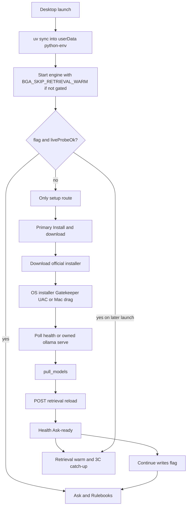

> **Archive copy.** English-only historical plan used to build BGA.
> **Stage:** 3B.
> **Origin:** Cursor plan for Stage 3B (first-run install gate), tightened after
> critical review (probe SSOT, Ask-ready gate, uv+venv, 3C ordering, Mac DMG).
> **Outcome:** implemented — hard gate, official installer download, Ask-ready
> probe, deferred 3C warm until models exist. Mac + Windows smoke still required
> before treating a release as verified.

---

# Stage 3B — First-run install gate Implementation Plan

> **For agentic workers:** REQUIRED SUB-SKILL: Use `superpowers:subagent-driven-development`
> (recommended) or `superpowers:executing-plans` to implement this plan task-by-task.
> Steps use checkbox (`- [ ]`) syntax for tracking.
> **Commits:** this repo forbids agent-initiated commits (`no-auto-commit`). After each
> task, leave a clean diff for the user; commit only when they ask.

**Goal:** A packaged Mac or Windows build cannot reach Ask or Rulebooks until the
assistant is actually usable: Ollama up, profile Ollama models present, reranker
loaded, retrieval not still loading. The player sees why, clicks once, finishes or
quits — never skips into an empty assistant. Browser `pnpm dev` stays ungated.

**Architecture:** Extend the existing Electron setup path. Boot still starts the
engine before the window (needs bundled `uv` + a **writable** userData venv). While
the gate is closed, the engine skips retrieval warm-up / Stage 3C catch-up. A
**gate** is `setup-complete` **and** a live probe of engine `/health` that matches
Ask readiness (`ollama` up, no `missingModels`, `reranker` true,
`retrieval_loading` false). Main downloads the official Ollama installer (not
inside `BGA.app`), opens it for OS confirmation, ensures the API is up (spawn
`ollama serve` only when owned), runs `pull_models`, then `POST /retrieval/reload`
and waits until Ask-ready. Navigation is locked to `/[locale]/setup` until the
gate passes.

**Tech Stack:** Electron main/preload (`apps/desktop`), Next setup route
(`apps/web`), i18n `en`/`pl`, `rag_engine.pull_models` + `/health` +
`/retrieval/reload`, Vitest + Node tests, `pnpm verify`.

## Global Constraints

- Player-first: no terminal, `uv`, or `pnpm` on any **desktop** player path.
  Browser-only setup copy may mention `pnpm dev`.
- Official Ollama installer only — never ship Ollama inside `BGA.app`.
- Same app UI sequence on Mac and Windows; OS-specific confirmation strings only.
- Engine and downloads stay on this computer (`127.0.0.1` / main-process HTTPS).
- Packaged macOS release artifacts are **arm64 only** (Stage 0C); Windows NSIS as
  today. Fail packaging if the matching `uv` binary is missing.
- `pnpm verify` must pass; ROADMAP 3B ✅ only after Mac **and** Windows smoke of
  the gate (owner has a second Windows machine for that check).
- Stage 3A / 3D out of scope.

## Critical-review lock-ins (do not reopen)

| Topic | Locked decision |
| --- | --- |
| Probe SSOT | **Only** `GET http://127.0.0.1:${enginePort}/health`. Never reimplement tag lists in desktop; never duplicate Python `PROFILES`. |
| `liveProbeOk` | `components.ollama === true` ∧ `missingModels.length === 0` ∧ `components.reranker === true` ∧ `components.retrieval_loading === false`. |
| Gate formula | `flagExists && liveProbeOk`. Each launch: if flag set but probe fails → clear/ignore flag → setup only. |
| Continue / `markSetupComplete` | Allowed only when `liveProbeOk`. Main refuses otherwise. |
| Primary CTA | One button → download installer (if needed) → openPath → wait for Ollama API → `pull_models` → `POST /retrieval/reload` → wait Ask-ready. |
| Progress stages | `downloading_installer` \| `waiting_for_ollama` \| `pulling_models` \| `preparing_search` \| `ready` \| `error` |
| 3C / retrieval warm | Packaged desktop sets `BGA_SKIP_RETRIEVAL_WARM=1` on the engine until gate passes. Engine lifespan skips `schedule_retrieval_load` when that env is set. After Ask-ready (or on later launches when launch probe already passes), clear the skip and call `POST /retrieval/reload` once so Stage 3C catch-up runs **with** embeddings present. |
| uv packaging | Ship platform `uv` at `resources/bin/uv` (darwin aarch64) / `resources/bin/uv.exe` (win x64). Package script **fails** if missing/wrong. |
| Python env | Every `uv` spawn uses `UV_PROJECT_ENVIRONMENT=join(userData,'python-env')`. First launch (and after engine package change) runs `uv sync` into that dir **before** uvicorn — never write a venv into the app bundle. |
| Installer open | Fixed HTTPS URLs only; no off-host redirects; write only under `userData/downloads/` with fixed basenames; **only** `shell.openPath` (never spawn the installer). Fail → `openExternalHttps('https://ollama.com/download')` via bridged API. |
| Mac after open | Same CTA; copy must tell the player to drag Ollama into Applications (`setup.runtime.macDragToApplications`). Poll `resolveBinary` + `/health`. No auto-copy into `/Applications`. |
| Windows after open | UAC copy only; poll the same way. |
| `ollama serve` | Spawn only if binary resolves and `/health` still shows Ollama down. If spawn fails (port in use), keep `waiting_for_ollama` and re-poll — do not assume ownership. Kill on quit **only** if `ollamaServeOwned === true`. |
| Navigation | Gate closed → **rewrite** in-app navigations to `/${locale}/setup`; **deny** `window.open` / external opens from the window. |
| Locale | `desktopLocale()` from `app.getLocale()` → `en` \| `pl` (default `en`). Use for `loadURL` **and** `waitForHttp` of the web root (replace hardcoded `/pl`). |
| Desktop player copy | Dual keys or `getDesktopApi()` branch for every desktop-reachable `pnpm`/`uv` string: `engineReadiness.offline.*`, `pdfImport.error.ingestNotReadyBody`, `pdfImport.error.engineUnreachableBody`, plus all `setup.runtime.*`. Desktop wording = close/reopen or try again in the app. Locale tests ban `uv\|pnpm` on those desktop keys. |
| Linux packaged | Soft setup only (out of scope for ROADMAP Mac/Windows acceptance). |

## Already shipped (do not rebuild)

| Piece | Where |
| --- | --- |
| Setup route (no AppNav) | `apps/web/src/app/[locale]/setup/page.tsx` |
| Hardware + profile snapshot UI | `SetupPanel.tsx`, `machine.ts`, `capabilities.ts` |
| Soft `userData/setup-complete` + first load path | `apps/desktop/src/main.ts` |
| Resolve `ollama` / `uv` without PATH | `binaries.ts` (`bundledUvCandidate` already looks at `resources/bin`) |
| `pullModels` IPC → `python -m rag_engine.pull_models` (Ollama + HF reranker) | `main.ts`, `pull_models.py` |
| Browser ungated when `getDesktopApi()` is null | `SetupPanel.tsx` |
| Engine `/health` + `POST /retrieval/reload` | `health.py`, `main.py` |
| Ask readiness uses `reranker` / `retrieval_loading` | `engine-readiness.ts` |

## Gaps this plan closes

1. Continue always works → empty assistant.
2. No live check → deleting Ollama does not restore the wall.
3. No navigation lock → Ask/Rulebooks reachable while gated.
4. Ollama is a website link, not in-app download + OS installer.
5. `ollama serve` never started when API is down.
6. Packaged `uv` missing + no userData venv → engine dies before the gate UI.
7. Retrieval/3C catch-up races first-run downloads.
8. Gate could go green on Ollama tags alone while Ask still waits on the reranker.
9. First load hardcoded `/pl`.
10. Desktop-visible errors still say `pnpm` / `uv`.



## File map

| File | Responsibility |
| --- | --- |
| `apps/desktop/electron-builder.yml` | `extraResources` → `bin/uv[.exe]` |
| `apps/desktop/scripts/fetch-uv.mjs` (new) | Download pinned platform uv; fail if missing |
| `apps/desktop/package.json` | `package` depends on fetch-uv |
| `apps/desktop/src/main.ts` | venv env, skip-retrieval flag, gate, IPC, locale, nav lock |
| `apps/desktop/src/gate.ts` (new) | Pure `gatePassed` / Ask-ready parse of health JSON |
| `apps/desktop/src/ollama_runtime.ts` (new) | Allowlisted download, openPath, serve ownership |
| `apps/desktop/src/preload.ts` / `desktop-api.ts` | `ensureRuntime`, progress, `openExternalHttps`, richer setup state |
| `apps/web/src/lib/desktop-bridge.ts` | Mirror API |
| `apps/web/src/features/desktop-setup/SetupPanel.tsx` | One CTA, disabled Continue, progress |
| `apps/web/src/features/desktop-setup/DesktopGate.tsx` (new) | Client rewrite to setup when desktop + not passed |
| `apps/web/src/app/[locale]/layout.tsx` | Mount gate; hide AppNav when gated |
| `services/rag-engine/rag_engine/main.py` | Honour `BGA_SKIP_RETRIEVAL_WARM` |
| `apps/web/src/i18n/locales/en/common.json` + `pl` | Runtime + Mac drag + desktop recovery copy |
| `docs/ROADMAP.md`, `ARCHITECTURE.md`, `archive/README.md` | Complete after verify + dual-platform smoke |

---

### Task 1: Bundle `uv` + writable userData venv

**Files:**
- Create: `apps/desktop/scripts/fetch-uv.mjs`
- Modify: `apps/desktop/package.json`, `apps/desktop/electron-builder.yml`
- Modify: `apps/desktop/src/main.ts` (`startBackend`, all `uv` spawns)
- Test: `apps/desktop/src/binaries.test.ts` (path shape) + script exits non-zero without binary

**Pinned artifacts:**

- macOS package: `uv` for `aarch64-apple-darwin` → `apps/desktop/packaging/bin/uv` → builder `to: bin/uv`
- Windows package: `uv.exe` for `x86_64-pc-windows-msvc` → `packaging/bin/uv.exe` → `to: bin/uv.exe`

Pin an exact GitHub release asset URL in `fetch-uv.mjs` (version constant in one place).

**Runtime:**

```ts
process.env.UV_PROJECT_ENVIRONMENT = join(app.getPath('userData'), 'python-env');
// before uvicorn:
// uv sync --frozen --extra retrieval   (cwd = engineDir; extras required for Ask)
```

Use the same env on `pull_models` spawns.

- [ ] **Step 1:** Write failing test / script check that packaging bin path is required.

- [ ] **Step 2:** Implement fetch-uv + electron-builder `extraResources` `to: bin`.

- [ ] **Step 3:** Wire `UV_PROJECT_ENVIRONMENT` + first-run `uv sync` before uvicorn.

- [ ] **Step 4:** Confirm `bundledUvCandidate()` resolves under `process.resourcesPath/bin` without Homebrew.

---

### Task 2: Defer retrieval warm until gate passes (3C seam)

**Files:**
- Modify: `services/rag-engine/rag_engine/main.py` lifespan
- Modify: `apps/desktop/src/main.ts` engine env
- Test: `services/rag-engine/tests/test_retrieval_reload.py` (or new) — with env set, lifespan does not schedule warm; `POST /retrieval/reload` still works

**Behaviour:**

```python
# lifespan
if os.environ.get("BGA_SKIP_RETRIEVAL_WARM") == "1":
    # serve /health and /games only; no CrossEncoder / ensure_search_index yet
    ...
else:
    schedule_retrieval_load(app, settings.profile.reranker)
```

Desktop:

- If launch `gatePassed` is false → set `BGA_SKIP_RETRIEVAL_WARM=1`.
- After `ensureRuntime` reaches Ask-ready → `POST /retrieval/reload` (clears skip for that process by scheduling warm; if env still set in the child, reload must still schedule — **lock:** `schedule_retrieval_load` from `/retrieval/reload` **always** runs, ignoring the skip env; skip only affects **lifespan** auto-start).
- Later launches with gate already passed → do **not** set the env (warm + 3C catch-up on boot as today).

- [ ] **Step 1:** Failing engine test for skip-on-lifespan / reload-still-works.

- [ ] **Step 2:** Implement env honour + desktop wiring.

- [ ] **Step 3:** Tests pass.

---

### Task 3: Pure gate helpers from `/health` JSON

**Files:**
- Create: `apps/desktop/src/gate.ts`
- Create: `apps/desktop/src/gate.test.ts`

**Interfaces:**

```ts
export type HealthProbe = {
  ollama: boolean;
  reranker: boolean;
  retrievalLoading: boolean;
  missingModels: string[];
};

export function parseHealthProbe(payload: unknown): HealthProbe | null { /* contract shape */ }

export function liveProbeOk(probe: HealthProbe): boolean {
  return (
    probe.ollama &&
    probe.missingModels.length === 0 &&
    probe.reranker &&
    !probe.retrievalLoading
  );
}

export function gatePassed(options: {
  setupCompleteFlag: boolean;
  probe: HealthProbe;
}): boolean {
  return options.setupCompleteFlag && liveProbeOk(options.probe);
}
```

Probe fetch in main: `GET http://127.0.0.1:${enginePort}/health` (engine already waited at boot).

- [ ] **Step 1:** Matrix tests (flag/missingModels/ollama/reranker/loading).

- [ ] **Step 2:** Implement parse + predicates.

- [ ] **Step 3:** PASS.

---

### Task 4: Allowlisted installer download + owned `ollama serve`

**Files:**
- Create: `apps/desktop/src/ollama_runtime.ts`
- Create: `apps/desktop/src/ollama_runtime.test.ts`
- Modify: `apps/desktop/src/main.ts`, `processes.ts` as needed

```ts
export function ollamaInstallerUrl(platform: NodeJS.Platform): string {
  if (platform === 'win32') return 'https://ollama.com/download/OllamaSetup.exe';
  if (platform === 'darwin') return 'https://ollama.com/download/Ollama.dmg';
  throw new Error(`Unsupported platform: ${platform}`);
}
```

Rules:

1. Download only those URLs; reject redirects whose final host is not `ollama.com`.
2. Save as fixed basenames under `userData/downloads/`.
3. `shell.openPath` only.
4. Poll: re-resolve ollama binary + `parseHealthProbe` until ollama component true or timeout (emit `waiting_for_ollama`; Mac UI shows drag-to-Applications).
5. If binary exists and ollama still down → spawn `ollama serve`, set `ollamaServeOwned=true`; on spawn failure, keep polling.
6. Quit cleanup kills serve only when owned.

- [ ] **Step 1:** Tests for URL, redirect rejection, owned cleanup flag.

- [ ] **Step 2:** Implement.

- [ ] **Step 3:** PASS.

---

### Task 5: IPC `ensureRuntime`, progress, refuse complete, bridge

**Files:**
- Modify: `apps/desktop/src/main.ts`, `preload.ts`, `desktop-api.ts`
- Modify: `apps/web/src/lib/desktop-bridge.ts`

```ts
type RuntimeProgress =
  | { stage: 'downloading_installer'; receivedBytes?: number; totalBytes?: number }
  | { stage: 'waiting_for_ollama' }
  | { stage: 'pulling_models' }
  | { stage: 'preparing_search' }
  | { stage: 'ready' }
  | { stage: 'error'; code: string }; // codes only; UI owns copy

interface DesktopApi {
  getSetupState: () => Promise<DesktopSetupState>;
  ensureRuntime: () => Promise<{ ok: true }>;
  onRuntimeProgress: (handler: (event: RuntimeProgress) => void) => () => void;
  openExternalHttps: (url: string) => Promise<void>; // https only
  markSetupComplete: () => Promise<DesktopSetupState>;
  // existing: saveDiagnostics, pullModels (pullModels may become internal-only)
}

interface DesktopSetupState {
  // existing fields...
  gatePassed: boolean;
  missingModels: string[];
  healthModels: { llm: string; embedding: string }; // from /health models for UI labels
}
```

`ensureRuntime` pipeline:

1. If ollama not up → download (if binary missing) → openPath → wait.
2. `pull_models` (existing; includes HF reranker).
3. Progress `preparing_search` → `POST /retrieval/reload` → poll until `liveProbeOk`.
4. Emit `ready`.

`markSetupComplete`: re-probe; if `!liveProbeOk` throw; else write flag.

`getSetupState`: include `gatePassed` from flag ∧ current probe (probe may be partial before reload).

- [ ] **Step 1:** Types both sides.

- [ ] **Step 2:** Handlers + refusal test.

- [ ] **Step 3:** PASS.

---

### Task 6: Navigation lock + locale + DesktopGate

**Files:**
- Modify: `apps/desktop/src/main.ts`
- Create: `apps/web/src/features/desktop-setup/DesktopGate.tsx` + test
- Modify: locale layout / AppNav visibility

- Initial URL: `gatePassed ? /${locale} : /${locale}/setup`.
- `waitForHttp` uses `/${locale}` not `/pl`.
- `will-navigate`: rewrite non-setup app paths to setup while gated; deny `window.open`.
- `DesktopGate`: desktop + `!gatePassed` → `router.replace(/${locale}/setup)`; hide AppNav.
- Browser: no API → no redirect.

- [ ] **Step 1:** Locale + initial-path unit tests.

- [ ] **Step 2:** Main lock + DesktopGate.

- [ ] **Step 3:** PASS.

---

### Task 7: SetupPanel + desktop player copy

**Files:**
- Modify: `SetupPanel.tsx` + new `SetupPanel.test.tsx`
- Modify: `en/common.json`, `pl/common.json`, `locales.test.ts`
- Follow: `.cursor/skills/translations/SKILL.md`

**UI:**

1. Hardware + profile alerts (unchanged source).
2. Needs list: Ollama + model labels from `healthModels` / `missingModels` (plain language).
3. OS prompt **before** CTA (`osPromptMac` / `osPromptWindows`) + Mac drag string when `platform === 'darwin'`.
4. Primary → `ensureRuntime`; stage labels from progress.
5. Continue disabled until `gatePassed`; then `markSetupComplete` → home.
6. Download failure → secondary control calling `openExternalHttps('https://ollama.com/download')`.

**Copy / hygiene:** all keys listed in lock-ins; locale tests ban `uv|pnpm` on desktop recovery strings.

- [ ] **Step 1:** Add en/pl keys.

- [ ] **Step 2:** Panel + tests (Continue gated; browser advisory unchanged).

- [ ] **Step 3:** `pnpm --filter web test` for setup + locales.

---

### Task 8: Docs + verify + dual-platform smoke

**Files:** ROADMAP (3B ✅), ARCHITECTURE (gate + skip-warm + official installer), archive README + this Outcome line.

- [ ] **Step 1:** `pnpm verify`

- [ ] **Step 2:** **Required** smoke Mac: fresh userData, no Ollama → only setup; full CTA → Ask; quit mid-pull → wall; stop Ollama → wall on relaunch.

- [ ] **Step 3:** **Required** smoke Windows: same sequence (UAC path).

- [ ] **Step 4:** Mark ROADMAP / archive Implemented only after both smokes.

## Out of scope

- Stage 3A ingest percent bar; Stage 3D thread.
- Bundling Ollama; silent install; auto-copy into `/Applications`.
- Linux packaged hard gate.
- Inventing installer checksums unless Ollama publishes one (then pin).

## Spec coverage checklist

| ROADMAP acceptance | Task |
| --- | --- |
| Only setup until gate | Task 6 |
| Copy from profile needs | Task 7 |
| One primary install/download | Tasks 4–5, 7 |
| Official installer not in BGA signature | Task 4 |
| OS confirmation explained | Task 7 |
| Continue disabled until ready | Tasks 3, 5, 7 |
| Flag + live check; Ollama removal restores wall | Tasks 3, 5, 6 |
| Browser ungated | Task 7 |
| Mac and Windows same app steps | Tasks 4, 7, 8 |
| Packaged 3C after models | Task 2 |
| Ask usable after Continue (reranker) | Tasks 3, 5 |
| `pnpm verify` | Task 8 |

## Required automated tests (not optional)

1. `gatePassed` / `liveProbeOk` matrix including reranker and `retrievalLoading`.
2. `parseHealthProbe` against real health JSON shape (`missingModels`, `components`).
3. `markSetupComplete` refuses when probe fails.
4. Flag true + probe fail ⇒ gated (flag cleared).
5. Installer URL by platform; download rejects non-allowlisted / bad redirect.
6. `ollamaServeOwned` cleanup only when owned.
7. Lifespan skip warm when `BGA_SKIP_RETRIEVAL_WARM=1`; reload still schedules.
8. SetupPanel Continue disabled until `gatePassed`; browser ungated.
9. `DesktopGate` redirects when desktop + not passed.
10. Locale mapping + initial path helper.
11. Desktop locale keys ban `uv|pnpm`.
12. Packaged `resources/bin` path shape matches builder.

## Self-review

- Soft “prefer / or / optional / if available” removed from lock-ins.
- Probe, Ask-ready, 3C ordering, uv+venv, Mac DMG copy, nav rewrite all single-pathed.
- Commits deferred to the user.
