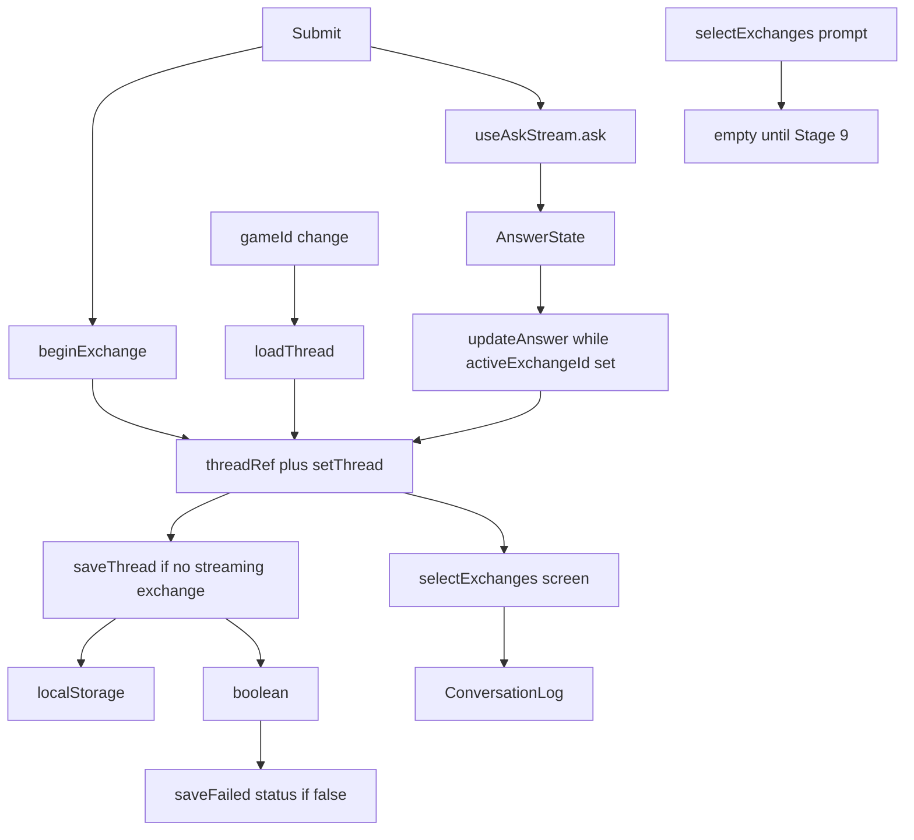

> **Archive copy.** English-only historical plan used to build BGA.
> **Stage:** 3D.
> **Origin:** Cursor plan for Stage 3D (scrollable per-game conversation thread).
> **Outcome:** implemented. Ask appends turns, persists `bga.thread.v1.<gameId>` in the renderer, `/ask` stays stateless.

---

# Stage 3D — Conversation thread

Working name: `stage-3d-conversation-thread.md`. In-repo copy: `docs/superpowers/plans/stage-3d-conversation-thread.md`. After ship: `docs/archive/stage-3d-conversation-thread.md`. Delete `docs/superpowers/plans/2026-09-09-stage-3d-conversation-thread.md` so nobody implements the first draft.

**Goal:** Ask is a scrollable, per-game conversation that survives quit-and-reopen. `/ask` still gets only the current question plus retrieved passages.

## What the premortem review changed

These are design changes forced by re-reading the tigers against the code. They replace the earlier wording.

1. **Persist is not “after `setThread`”.** A functional updater cannot persist its `next` without a side effect. Use a `threadRef` that always holds the latest thread: compute `next` from the ref, assign the ref, `setThread(next)`, then `saveThread` only if no exchange is streaming. Do **not** persist inside the updater. Do **not** persist in a `useEffect` on `thread` (a load would rewrite storage and can hit quota just by opening a game).
2. **Reload only when `gameId` changes** (including `null` → `azul`). Drop “skip reload if streaming”. That clause, if `gameId` ever changed mid-stream, would keep Azul in memory while the picker said Brass. Task 5 disables the picker while streaming, so a mid-stream `gameId` change is not a supported path.
3. **Parse: drop bad turns, not the whole night.** Wrong envelope (`version`, `gameId`, not an array) → empty thread. A single corrupt exchange is skipped; the rest stay.
4. **`saveThread` returns `boolean`.** Catch `setItem`. On `false`, do not crash. Show `rulesChat.thread.saveFailed` as a `role="status"` under the composer (not `answer.notice` — [isBlockingNotice](packages/utils/src/answer-state/answer-state.ts) treats unknown codes as blocking paper). Clear the flag on the next successful save. Player-first: they must know the last rulings may vanish if they quit.
5. **`aria-label={answer.regionLabel}` only when `live`.** Otherwise every completed turn is a region named “Model answer”.
6. **Duplicate-panel test:** use two *different* answer strings and assert each `getAllByText` has length 1. Do not assert uniqueness of identical sentences.

## What stays

- `localStorage` key `bga.thread.v1.<gameId>`, not `BGA_STORAGE_DIR`.
- `AskRequest` unchanged. `selectExchanges(..., 'prompt' | 'archive')` is `[]`.
- Cancel drops the in-flight exchange. No archive UI, auto-trim, similar-question pointer, clear-chat button.
- No auto-commit. `pnpm verify` before ✅.
- Premortem tigers are **required mitigations inside the same task**, not a hold before coding. The user does not need to accept or dismiss each tiger. Implementing the task *is* implementing the Fix.

Roadmap tradeoff: library vs Chromium chat. Clearing site data loses the conversation, not the PDFs.

## Data flow



Sync rule: while `activeExchangeId` is set, always `updateAnswer(id, state)` (including the final non-streaming frame). Clear the id only after a stream was **seen** (`wasStreamingRef`) and then stopped. Mermaid used to say “update only if stream seen” — that would skip the final persist.

## Layout

One form. Order: game / expansions / mode (disabled while streaming); `ConversationLog` (one `role="log"`); textarea (stays enabled so the next question can be drafted); Ask, Cancel, stream status, optional save-failed status.

---

### Task 1: Thread model and Stage 9 seam

`emptyThread`, `appendExchange`, `replaceExchangeAnswer`, `dropExchange`, `freezeAnswer`, `parseThread`, `serializeThread`, `selectExchanges`. Envelope invalid → empty. Bad item in an otherwise valid list → skip that item, keep the others. Freeze on parse/serialize. Comment only on empty `prompt` / `archive`.

#### Premortem

**Mode**: quick

##### Tigers

- **Empty `prompt` filled in later and sent to the model.** Pin `[]` in tests. Do not call the prompt slice from `RulesChat`. Comment: Stage 9 fills these. Today [build_messages](services/rag-engine/rag_engine/retrieval/prompt.py) is system + question only; [AskRequest](packages/api-contract/src/types.ts) has no history field.
- **`isRetrievedSource` must be `value is RetrievedSource`.** [selectVisibleFigures](packages/utils/src/answer-state/answer-state.ts) stays the display gate.

##### Elephants

- Roadmap “with that game” vs renderer keys — Task 2 comment + Task 6 ROADMAP. No engine file.

##### Paper tigers

- Retrieval cross-game leak and ingest-as-FAQ: this task does not touch the engine.

---

### Task 2: Renderer store

`threadStorageKey`, `loadThread`, `saveThread(thread, storage): boolean`. `!isGameId` → load empty / save `false` and write nothing. Corrupt JSON → empty. `setItem` throw → `false`, previous key unchanged.

#### Premortem

**Mode**: quick

##### Tigers

- **`setItem` throw crashes Ask.** try/catch; return `false`. Test a throwing mock.
- **Non-slug key.** Test `../x`.

##### Elephants

- Site data vs `BGA_STORAGE_DIR` — ROADMAP only.

##### Paper tigers

- Index poison: ingest does not read `bga.thread.v1.*`.

---

### Task 3: `useConversationThread`

`beginExchange` → id, `updateAnswer`, `dropExchange`, `lastSaveSucceeded: boolean` (true until a completed persist returns `false`). Inject `storage` / `now` / `createId`.

**Persist algorithm (locked):**

```ts
const apply = (next: ConversationThread): void => {
  threadRef.current = next;
  setThread(next);
  const streaming = next.exchanges.some((exchange) => exchange.answer.isStreaming);
  if (streaming || next.gameId.length === 0 || storage === null) {
    return;
  }
  setLastSaveSucceeded(saveThread(next, storage));
};
```

`beginExchange` / `updateAnswer` / `dropExchange` all go through `apply` (or share this persist tail). `updateAnswer` no-ops if the id is missing.

**Load algorithm (locked):** `useEffect` on `gameId` only. When `gameId` differs from `previousGameIdRef`, `loadThread` (or `emptyThread('')` if null), assign ref + `setThread`. Do not persist on load. Do not list `storage` in the effect deps.

Tests: Azul survives Wingspan; `beginExchange` + streaming `updateAnswer` does not write; completed `updateAnswer` writes; throwing `setItem` sets `lastSaveSucceeded` false without throwing; changing `gameId` loads the other thread.

#### Premortem

**Mode**: quick

##### Tigers

- **Persist in the updater** — forbidden; use `apply` above.
- **Reload on mount / storage identity wipes in-flight** — reload only on `gameId` change.

##### Elephants

- Strict remount / orphaned `useAskStream` fetch ([cleanup is only `stopFlushing`](packages/hooks/src/use-ask-stream/useAskStream.ts)) — accept in dev; do not persist streaming placeholders.

---

### Task 4: Copy, `AnswerPanel`, `ConversationLog`

Keys in **both** catalogues:

- `rulesChat.thread.regionLabel` — “Conversation about this game” / “Rozmowa o tej grze”
- `rulesChat.thread.playerLabel` — “Your question” / “Twoje pytanie”
- `rulesChat.thread.saveFailed` — “Couldn’t save this conversation on this computer. The latest answers may disappear if you close the app.” / Polish equivalent (no terminal, no “localStorage”)

`AnswerPanel`: `live?: boolean`; no `role="log"`; `aria-live` and `aria-label={t('answer.regionLabel')}` **only when `live`**. `ConversationLog`: one log; visible caption + question text (no `aria-label` on the question); `live={exchange.answer.isStreaming}`; `ScrollArea` `mah="60vh"`. Empty list renders nothing.

Tests: two turns both visible; `getByText(question)`; `getAllByText(playerLabel)`; exactly one `getByRole('log', { name: regionLabel })`; `locales.test.ts` green.

#### Premortem

**Mode**: quick

##### Tigers

- Question `aria-label` hides the question — caption + text.
- Nested `role="log"` — remove from `AnswerPanel` ([today at line 56](packages/components/src/answer-panel/AnswerPanel.tsx)).
- Keys in one locale — both files this task.

##### Elephants

- Similar-question pointer — out of scope; one ROADMAP sentence.

##### Paper tigers

- `scrollIntoView` stubbed in [vitest.setup.ts](packages/components/vitest.setup.ts).

---

### Task 5: Wire `RulesChat`

Remove `<AnswerPanel state={state} />` ([line 250](packages/components/src/rules-chat/RulesChat.tsx)).

**Sync (locked):**

```ts
useEffect(() => {
  if (activeExchangeId === null) {
    wasStreamingRef.current = false;
    return;
  }
  updateAnswer(activeExchangeId, state);
  if (state.isStreaming) {
    wasStreamingRef.current = true;
    return;
  }
  if (wasStreamingRef.current) {
    wasStreamingRef.current = false;
    setActiveExchangeId(null);
  }
}, [activeExchangeId, state, updateAnswer]);
```

Same-click: `beginExchange`, `setActiveExchangeId`, clear textarea, `void ask(...)`. Cancel: `cancel()`, `dropExchange`, clear id (in the handler, before effects). Disable game, expansions, and mode while streaming. Do not change `gameId` in `onBaseGameChange` while streaming (disabled control is the guarantee). `selectExchanges(thread, 'screen')` only.

When `lastSaveSucceeded` is false, render `t('rulesChat.thread.saveFailed')` with `role="status"`.

Tests (clear `localStorage` in `afterEach`):

- Distinct answers “First ruling.” / “Second ruling.” — both questions and both answers visible; each answer `getAllByText` length 1
- Azul → Brass → Azul restores Azul
- Second `/ask` JSON keys ⊆ `gameId`, `question`, `mode`, `expansionIds`, `sessionId` — no `messages`, `thread`, `history`
- Existing tests keep passing

#### Premortem

**Mode**: quick

##### Tigers

- Idle-clear without `wasStreamingRef` — use the effect above.
- Duplicate `AnswerPanel` — remove; unique strings, length 1.
- Game select enabled mid-stream ([line 185](packages/components/src/rules-chat/RulesChat.tsx)) — disable game/expansions/mode.
- Extra Ask fields — pin the second POST body.

##### Elephants

- Cancel looks like the question never happened — keep drop; no new “stopped” copy.

##### Paper tigers

- Double submit: `canAsk` already requires `!state.isStreaming`.

##### False alarms

- Disabling the textarea — leave enabled so the next question can be typed.

---

### Task 6: Docs after `pnpm verify`

Rewrite [docs/ROADMAP.md](docs/ROADMAP.md) Stage 3D: append, `localStorage`, stateless `/ask`, not indexed, empty prompt/archive until Stage 9, similar-question deferred, library vs chat split, save-failed is in-app. ✅ only after verify. [docs/archive/README.md](docs/archive/README.md) row for `stage-3d-conversation-thread.md`. Copy working plan into `docs/archive/` only when the stage is done. Delete the dated superpowers file.

#### Premortem

**Mode**: quick

##### Tigers

- ✅ with old “replaces the previous answer” prose, or ✅ before verify.
- Dated draft still in the tree.

##### Elephants

- “Stored with that game” vs Chromium — say both places.

##### Paper tigers

- Do not raise `num_ctx`.

---

## Execution

Write `docs/superpowers/plans/stage-3d-conversation-thread.md` from this file, then implement task by task. Do not pause for a per-tiger decision — each tiger already has a Fix in that task. Commit only if asked.
