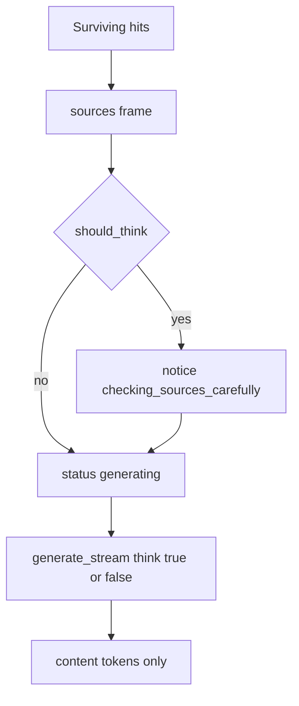

> **Archive copy.** English-only historical plans used to build BGA.
> **Stage:** 3E.
> **Origin:** Cursor plan for Stage 3E (adaptive thinking on `/ask`).
> **Outcome:** implemented.

---

# Stage 3E — Think only when the sources need it

> For the implementer: TDD, task-by-task. Do **not** commit unless the user asks. Do **not** start Stage 3F / 3C / 3B / 3A / 3D. Treat the Premortem **tigers as required work**, not notes.

**Goal:** Simple rules questions stay fast (`think: false`). When the surviving passages can disagree, or the best match is barely above the cutoff, `/ask` may think — without dumping that hidden trace as the answer, and with an in-app wait message in English and Polish.

**Architecture:** A pure function decides from **already retrieved** hits (no extra model). `generate_stream` gains `think: bool = False` and still yields only `message.content`. The engine sends a notice **code**; the UI owns the sentence. Default stays off (D16 as an exception, not a repeal).

**Tech stack:** Existing Ollama `/api/chat`, SSE `/ask`, i18next `en`/`pl`. No new event type. No NLI model.

## Global constraints

- Invariants 1–4, 10 (`AGENTS.md`): still scoped to the active game set; still `insufficient_evidence` when nothing survives; still no hardcoded player-facing strings; engine sends codes only.
- D16 **amended, not deleted:** default `think: false`. Thinking is an exception when `should_think` is true. Hidden traces are never streamed.
- Player-first: no “model”, “Ollama”, “Qwen”, or “thinking token” on screen. The wait names the **pages** being checked, never a claim that they disagree — the real trigger can be a weak match, not a conflict (see "What the player sees").
- `AskRequest` does **not** grow a `think` flag. The server decides. A client must not be able to force the slow path.
- No semantic contradiction detector (no NLI, no keyword fight). Stage 3E uses **checkable structure** only. Stage 6 later measures whether that beats always-off.
- Token-budget constants live in **one place** (`settings.py`). `think.py` imports them rather than redefining its own numbers — two modules guessing the same constant is how they drift.
- `pnpm verify` must pass. Do not commit unless asked.

## Locked design

### When thinking turns on

Pure function `should_think(hits, min_relevance_score, context_tokens) -> bool` in a new module [`services/rag-engine/rag_engine/retrieval/think.py`](services/rag-engine/rag_engine/retrieval/think.py). Empty hits → `False` (the ask path never generates without hits anyway).

`True` if **any** of these hold on the surviving hits (after `min_relevance_score`) **and** the context guard (below) allows it:

1. **Near-miss search.** Best `score` is below `min_relevance_score + THINK_SCORE_MARGIN`. Margin is a named constant `0.10` in `think.py` (threshold 0.35 → think when best score &lt; 0.45). One clear hit at 0.9 stays off.
2. **Authority-bearing kinds that can disagree.** Among hits whose `document_kind` is in `{player_aid, rulebook, faq, errata}`, there are **two or more distinct kinds**. `video_transcript` is ignored: it never establishes a rule, so rulebook + transcript must **not** think.
3. **Two booklets of the same kind.** Among those same authority-bearing hits, group by **`(game_id, doc_key)`**, not `doc_key` alone — an expansion can reuse `doc_key="main"` for its own rulebook, and that is a *different* document from the base game's `main`. One kind appears under **two distinct `(game_id, doc_key)` pairs** (core vs solo booklet; or a base rulebook and an expansion rulebook both ticked). Two pages of the **same** `(game_id, doc_key)` do **not** think.

**Context guard (overrides 1–3):** thinking shares the model's context window (`num_ctx`) with the source passages and the answer — nothing raises `num_ctx` in this stage (that is Stage 9's job). Compute `headroom = context_tokens - PROMPT_RESERVE_TOKENS - len(hits) * CHUNK_BUDGET_TOKENS` (both constants imported from [`settings.py`](services/rag-engine/rag_engine/settings.py), made non-private for this reuse). If `headroom < THINK_MIN_HEADROOM_TOKENS` (`1500`, same order of magnitude as the prompt reserve — a thinking trace this small or smaller should not starve the sources), return `False` regardless of triggers 1–3. On `minimal-16gb` (`context_tokens=4096`, typically 3 hits) headroom is `4096 - 1500 - 1800 = 796` — **always below the floor**, so that profile never thinks; this is intentional, not a bug, and the smallest/weakest model is exactly where a truncated source list is most dangerous. `starter-32gb` and `full-64gb` clear the floor comfortably.

Not in this stage: comparing passage text for contradiction; always-on thinking; a new `PipelineStage`; real per-request token counting (the budget is the same conservative per-chunk estimate `settings.py` already uses for `profile_context_budget_ok`).

### Stream and wait



Order stays: **sources before the first token**. Notice (when thinking) sits **after sources, before tokens**, so the player already sees which pages are in play.

[`generate_stream`](services/rag-engine/rag_engine/engines/llm.py) signature:

```python
async def generate_stream(
    ollama_url: str,
    model: str,
    messages: list[dict[str, str]],
    *,
    context_tokens: int,
    think: bool = False,
    timeout_seconds: float = 300.0,
) -> AsyncIterator[str]:
```

Request body uses `"think": think`. The reader **only** yields `chunk["message"]["content"]`. It must **not** yield `message.thinking` (Ollama’s field when `think` is true). Keep `keep_alive` and `num_ctx` as today.

Call site in [`ask.py`](services/rag-engine/rag_engine/routers/ask.py) after hits exist:

```python
think = should_think(hits, settings.min_relevance_score, settings.profile.context_tokens)
if think:
    yield encode_event(NoticeEvent(code="checking_sources_carefully", params={}))
yield encode_event(StatusEvent(stage="generating"))
async for text in generate_stream(..., think=think, context_tokens=...):
```

### What the player sees

New notice code `checking_sources_carefully` (not a new SSE type). The copy is deliberately **cause-agnostic**: the trigger might be a near-miss search (nothing actually disagrees, the match was just weak) rather than two documents in conflict, so the sentence must not assert a disagreement it cannot prove — that would be the same kind of overclaim the whole product exists to avoid.

| Surface | Behaviour |
| --- | --- |
| Status line in [`RulesChat.tsx`](apps/web/src/features/rules-chat/RulesChat.tsx) (`role="status"`) | While streaming, text is still empty, and `notice.code === 'checking_sources_carefully'`, show `t('notice.checking_sources_carefully')` instead of `stage.generating` (“Writing the answer…”). That line is the wait they actually watch. |
| [`AnswerPanel.tsx`](apps/web/src/features/rules-chat/AnswerPanel.tsx) | Do **not** render `checking_sources_carefully` as the bordered notice paper. That paper is for “you cannot ask yet” states. A wait must not look like a leftover error under the ruling. |
| First token | Status line falls back to `stage.generating` as words appear. Reducer may keep the notice object; the panel ignores this code. `done` already stops streaming. |

Copy (same key in both catalogues):

- **en** `notice.checking_sources_carefully`: `Checking these pages carefully before answering…`
- **pl** `notice.checking_sources_carefully`: `Sprawdzam dokładnie te strony, zanim odpowiem…`

Add the code to [`NOTICE_CODES`](apps/web/src/features/rules-chat/codes.ts). `codes.test.ts` will fail until both locales have the key.

## File map

- **Create:** [`services/rag-engine/rag_engine/retrieval/think.py`](services/rag-engine/rag_engine/retrieval/think.py) — `THINK_SCORE_MARGIN`, `THINK_MIN_HEADROOM_TOKENS`, `should_think`.
- **Create:** [`services/rag-engine/tests/test_think.py`](services/rag-engine/tests/test_think.py) — table of fixtures below.
- **Modify:** [`services/rag-engine/rag_engine/settings.py`](services/rag-engine/rag_engine/settings.py) — rename `_PROMPT_RESERVE_TOKENS` → `PROMPT_RESERVE_TOKENS` and `_CHUNK_BUDGET_TOKENS` → `CHUNK_BUDGET_TOKENS` (drop the leading underscore so `think.py` can import them instead of redefining the numbers). No behaviour change; `profile_context_budget_ok` keeps working. [`test_profiles.py`](services/rag-engine/tests/test_profiles.py) only imports `PROFILES` and `profile_context_budget_ok`, not the constants, so it is unaffected.
- **Modify:** [`services/rag-engine/rag_engine/engines/llm.py`](services/rag-engine/rag_engine/engines/llm.py) — `think` argument; still content-only.
- **Modify:** [`services/rag-engine/tests/test_llm.py`](services/rag-engine/tests/test_llm.py) — default false; true when asked; thinking field never becomes a token.
- **Modify:** [`services/rag-engine/rag_engine/routers/ask.py`](services/rag-engine/rag_engine/routers/ask.py) — decide, notice, pass `think=`.
- **Modify:** [`services/rag-engine/tests/test_api.py`](services/rag-engine/tests/test_api.py) — pin request JSON on simple vs conflict fixtures; notice present only on conflict; existing happy path stays `think is False` (`_AlwaysRelevant` scores 0.9, one rulebook chunk).
- **Modify:** locales [`en/common.json`](apps/web/src/i18n/locales/en/common.json) and [`pl/common.json`](apps/web/src/i18n/locales/pl/common.json), [`codes.ts`](apps/web/src/features/rules-chat/codes.ts), [`RulesChat.tsx`](apps/web/src/features/rules-chat/RulesChat.tsx), [`AnswerPanel.tsx`](apps/web/src/features/rules-chat/AnswerPanel.tsx) + their tests.
- **Modify:** [`docs/ARCHITECTURE.md`](docs/ARCHITECTURE.md) D16, [`docs/ROADMAP.md`](docs/ROADMAP.md) Stage 3E as complete when the work lands, [`README.md`](README.md) “Next at the table” checkbox for extra care when book and errata disagree.
- **Create:** `docs/archive/stage-3e-adaptive-thinking.md` — the archive copy of this implementation plan, per the convention already documented in [`docs/archive/README.md`](docs/archive/README.md) and `docs/ROADMAP.md`'s own header ("Implementation plans used to build each stage … live in `docs/archive/`"). Every landed stage has one (`stage-3-retrieval.md`, `stage-3a-ingest-progress.md`, …); Stage 3E should not be the first exception.
- **Modify:** [`docs/archive/README.md`](docs/archive/README.md) — add a row to the stage/outcome table for the new file.

No change to [`packages/api-contract/src/types.ts`](packages/api-contract/src/types.ts) unless you add a stage (do not).

## Premortem

**Mode:** deep
**Context:** Adaptive `think` on `/ask` after Stage 3 retrieval

### Tigers (required mitigations)

- **Risk:** Hidden reasoning is shown as the ruling. With `think: true`, Ollama puts the trace in `message.thinking` while `content` is empty, then later fills `content`. Today [`llm.py`](services/rag-engine/rag_engine/engines/llm.py) only reads `content`, but there is **no test** with a `thinking` field present (`test_llm.py` only sends `content`). If someone “helpfully” concatenates fields, the player reads a chain of thought as a rule.
  **Where:** `services/rag-engine/rag_engine/engines/llm.py:124-126`
  **Severity:** high
  **Mitigation checked:** No skip of `thinking`; no fixture where `thinking` is non-empty and `content` is empty.
  **Fix:** Keep yielding only `content`. Add `test_generate_stream_does_not_yield_thinking_field` (chunk with `thinking` only → no token; later `content` → token). Do not strip tags from content as a substitute.

- **Risk:** Everyday questions get slow. If transcripts count as a conflicting kind, or two pages of one booklet count as two documents, almost every Ask will think (expansions ticked, or `top_k` 3–6 pages).
  **Where:** new `should_think`; hits from [`pipeline.py`](services/rag-engine/rag_engine/retrieval/pipeline.py)
  **Severity:** high
  **Mitigation checked:** No trigger function exists; prompt authority is not used at ask time ([`authority.py`](services/rag-engine/rag_engine/authority.py) is test-only).
  **Fix:** Ignore `video_transcript`. Same `(game_id, doc_key)` + same kind = one booklet. Pin tests: rulebook+transcript + high scores → `False`; two pages of the same `(game_id, doc_key)` → `False`; rulebook+errata → `True`.

- **Risk:** With expansions ticked, a base game's rulebook and its expansion's rulebook can each be imported with `doc_key="main"` (Stage 2A: `doc_key` is chosen per import, not globally unique). Grouping "one booklet" by `doc_key` alone treats these as the *same* document, so a real base-vs-expansion rule change never triggers thinking — the one case where two same-kind documents most plausibly disagree is exactly the one this trigger would miss.
  **Where:** new `should_think` trigger 3; `RetrievedChunk.game_id` / `doc_key` ([`retrieval/types.py`](services/rag-engine/rag_engine/retrieval/types.py))
  **Severity:** medium
  **Mitigation checked:** No existing helper keys retrieval hits by `(game_id, doc_key)`; `authority.py` only compares kind and `indexed_at`.
  **Fix:** Group by the tuple `(game_id, doc_key)`, not `doc_key` alone. Pin test: two rulebook hits, `doc_key="main"` on both, but `game_id` differing (base vs expansion) → `True`.

- **Risk:** Turning `think: true` on does not raise `num_ctx`. A Qwen3 thinking trace can run several hundred to a couple thousand tokens, sharing the *same* context window as the source passages and the final answer. On `minimal-16gb` (`context_tokens=4096`, `retrieval_top_k=3`), [`settings.py`](services/rag-engine/rag_engine/settings.py)'s own budget check already spends `1500 + 3*600 = 3300` of the 4096 just on the prompt reserve and sources, leaving ~800 tokens. A thinking trace that size or larger forces Ollama to truncate something — and if it truncates the `<source>` blocks instead of the trace, the model would generate an ungrounded answer while still citing `sources` on the wire, which is exactly the "sounds right and is wrong" failure `AGENTS.md` calls out.
  **Where:** `services/rag-engine/rag_engine/settings.py:16-18,50-51` (`minimal-16gb` profile); [`llm.py`](services/rag-engine/rag_engine/engines/llm.py) `_chat_options`
  **Severity:** high
  **Mitigation checked:** No headroom check anywhere; `should_think` as first drafted decided purely from retrieval signals, blind to the active profile's context budget.
  **Fix:** Context guard in `should_think` (see Locked design): compute headroom from the same constants `settings.py` already uses for `profile_context_budget_ok`, and force `False` below `THINK_MIN_HEADROOM_TOKENS`. Pin test: `minimal-16gb`-shaped call (`context_tokens=4096`, 3 hits, rulebook+errata — would otherwise be `True`) → `False`.

- **Risk:** The wait looks like a freeze. Status stays `generating` (“Writing the answer…”) for tens of seconds of silence — the original D16 failure, plus a notice buried in AnswerPanel that looks like “cannot ask”.
  **Where:** [`RulesChat.tsx`](apps/web/src/features/rules-chat/RulesChat.tsx) ~208; [`AnswerPanel.tsx`](apps/web/src/features/rules-chat/AnswerPanel.tsx) ~44-52
  **Severity:** high
  **Mitigation checked:** Status line is only `stage.*`. Every notice uses the same bordered paper as `engine_not_indexed`.
  **Fix:** Status line uses `notice.checking_sources_carefully` until the first token. AnswerPanel skips that code. Tests: wait copy visible with empty text; after a token, panel still has no leftover “cannot ask” box for this code.

- **Risk:** Near-miss trigger never fires in `/ask` tests because `_AlwaysRelevant` always scores 0.9, so a buggy `think=True` on the simple path would still look green if we only unit-test `should_think`.
  **Where:** [`test_api.py`](services/rag-engine/tests/test_api.py) `_AlwaysRelevant` and `_GEN_PATCH`
  **Severity:** medium
  **Mitigation checked:** `_fake_generate` ignores kwargs; no assertion on the Ollama JSON from `/ask`.
  **Fix:** Recording mock on the simple seed (one rulebook, 0.9) asserts `think is False`. Conflict fixture (rulebook + errata, 0.9) asserts `think is True` and a `checking_sources_carefully` notice before the first token.

### Elephants

- **Risk:** Roadmap wording “two passages that contradict on the same topic” sounds like reading the text. Shipping structural proxies without saying so will look unfinished — or someone will bolt on a second model in this stage.
  **Fix:** This plan is the spec: structure only. Document in D16 / Stage 3E that semantic contradiction waits for Stage 6 measurement. Do not add NLI.

- **Risk:** D16 still says “therefore sets `think: false`” as if it were absolute. Tests and docs will fight.
  **Fix:** Rewrite D16 in the same change as `generate_stream`.

- **Risk:** The context-headroom guard is a rough per-chunk estimate (`CHUNK_BUDGET_TOKENS`), not a real tokenizer count, and it quietly makes `minimal-16gb` never think. Framing this as "Stage 9 will handle context" and skipping the guard now would ship the truncation risk above instead of a heuristic fence around it.
  **Fix:** Ship the cheap guard in this stage (reuses an estimate `settings.py` already trusts elsewhere); leave real token counting and a general reshaping of `num_ctx` vs thread length to Stage 9, as the roadmap already scopes it. Say so explicitly in D16's rewrite so the next reader does not mistake the guard for a real budget system.

### Paper tigers

- **Contract drift / new event type.** Notice `code` is already a string. No TS/Python shape change.
- **Answers without evidence.** `should_think` runs only after surviving hits; empty retrieval still skips the model.
- **Cross-game leak.** Unchanged prefilter in `retrieve`.
- **Hardcoded UI strings.** New keys in both catalogues; engine sends a code.
- **GPU thrash from two thinks.** Semaphore of 1 already serialises generation.

### False alarms

- New `PipelineStage` `thinking` — unnecessary; status line can read the notice code.
- `AskRequest.think` from the browser — would let anyone force the slow path.
- Raising the 300s generation timeout — thinking uses the same budget; `generation_timeout` already exists.

## Tasks

### Task 1: `should_think` (TDD)

**Files:** create `retrieval/think.py`, `tests/test_think.py`. Helper chunks can be small `RetrievedChunk` literals (see `_seed_chunk` in `test_api.py`).

**Consumes:** `PROMPT_RESERVE_TOKENS`, `CHUNK_BUDGET_TOKENS` from [`rag_engine.settings`](services/rag-engine/rag_engine/settings.py) (Task 1 also renames them there — see Step 0 below).

**Produces:** `should_think(hits: Sequence[RetrievedChunk], min_relevance_score: float, context_tokens: int) -> bool`

- [ ] **Step 0:** In `settings.py`, rename `_PROMPT_RESERVE_TOKENS` → `PROMPT_RESERVE_TOKENS` and `_CHUNK_BUDGET_TOKENS` → `CHUNK_BUDGET_TOKENS` (both the definitions and the two uses inside `profile_context_budget_ok`). Run `uv run pytest tests/test_profiles.py -v` — still PASS (it never imported the private names).
- [ ] Write failing tests in `test_think.py` (default `context_tokens=8192`, i.e. `starter-32gb`, unless noted — plenty of headroom so these isolate the score/kind logic):
  - one rulebook, score 0.9, min 0.35 → `False`
  - one rulebook, score 0.36, min 0.35 → `True` (near-miss)
  - one rulebook, score 0.45, min 0.35 → `False` (on the margin boundary; use `<` not `<=`)
  - rulebook + errata, scores 0.9 → `True`
  - rulebook + faq → `True`
  - player_aid + rulebook → `True`
  - rulebook + video_transcript, scores 0.9 → `False`
  - two pages, same `game_id`, same `doc_key` `main`, kind rulebook → `False`
  - two rulebooks, same `game_id`, `doc_key` `main` vs `solo`, scores 0.9 → `True`
  - two rulebooks, **different `game_id`** (e.g. `azul` and `azul-crystal`), **same `doc_key` `main`**, scores 0.9 → `True` (an expansion's own rulebook is not the base game's rulebook, even when both happened to choose the doc key `main`)
  - `[]` → `False`
  - `context_tokens=4096` (minimal-16gb), 3 hits, rulebook + errata, scores 0.9 (would be `True` on score/kind alone) → `False` (headroom guard: `4096 - 1500 - 3*600 = 796 < 1500`)
  - `context_tokens=8192` (starter-32gb), 6 hits, rulebook + errata, scores 0.9 → `True` (headroom `8192 - 1500 - 3600 = 3092 ≥ 1500`, guard does not block)
- [ ] Run `uv run pytest tests/test_think.py -v` in `services/rag-engine` — expect FAIL (module missing).
- [ ] Implement `should_think` with `THINK_SCORE_MARGIN = 0.10`, `THINK_MIN_HEADROOM_TOKENS = 1500`, authority kinds excluding transcripts, and `(game_id, doc_key)` grouping for trigger 3.
- [ ] Re-run tests — expect PASS.

### Task 2: Ollama `think` argument (TDD)

**Files:** [`llm.py`](services/rag-engine/rag_engine/engines/llm.py), [`test_llm.py`](services/rag-engine/tests/test_llm.py)

- [ ] Extend `test_generate_stream_skips_thinking_and_keeps_the_model_loaded`: default call still has `"think": false`.
- [ ] Add test: `think=True` → payload `"think": true`.
- [ ] Add test: stream lines `{"message": {"content": "", "thinking": "secret chain"}, "done": false}` then `{"message": {"content": "Draw one."}, "done": true}` → tokens `["Draw one."]` only.
- [ ] Run those tests — FAIL until implementation.
- [ ] Add `think: bool = False` to `generate_stream`; put it in the JSON body; keep content-only yield.
- [ ] Re-run `uv run pytest tests/test_llm.py -v` — PASS.

### Task 3: Wire `/ask` (TDD)

**Files:** [`ask.py`](services/rag-engine/rag_engine/routers/ask.py), [`test_api.py`](services/rag-engine/tests/test_api.py)

Need a recording stand-in, because `_fake_generate` swallows kwargs:

```python
def _record_generate(bucket: list[bool]):
    async def _gen(*_args: object, **kwargs: object) -> AsyncIterator[str]:
        bucket.append(bool(kwargs.get("think", False)))
        yield "Ok"
    return _gen
```

Conflict seed: two `_seed_chunk` calls, same `game_id`, kinds `rulebook` and `errata`, different `doc_key`, `_AlwaysRelevant` (0.9). The test client's default `Settings` uses `model_profile="starter-32gb"` (`context_tokens=8192`), so the headroom guard does not interfere here — that boundary is covered at the unit level in Task 1, not duplicated in the API tests.

- [ ] Test simple path (`_seed_chunk()` only): recorded `think` is `False`; no notice `checking_sources_carefully`. Existing token/sources tests stay green.
- [ ] Test conflict path: recorded `think` is `True`; a notice with that code appears **after** `sources` and **before** the first `token`; `done` groundedness stays `grounded`.
- [ ] Run `uv run pytest tests/test_api.py -v` — FAIL on new tests.
- [ ] In `_stream_answer`, after non-empty `hits`: `think = should_think(hits, settings.min_relevance_score, settings.profile.context_tokens)`; conditional `NoticeEvent`; pass `think=think` into `generate_stream`.
- [ ] Re-run — PASS. Empty-index and unreachable-Ollama paths must still not call generate.

### Task 4: Player-facing wait (TDD)

**Files:** both locale files, `codes.ts`, `RulesChat.tsx`, `AnswerPanel.tsx`, tests: [`codes.test.ts`](apps/web/src/features/rules-chat/codes.test.ts), [`AnswerPanel.test.tsx`](apps/web/src/features/rules-chat/AnswerPanel.test.tsx), add/extend a RulesChat or status-line test (follow existing `getByRole('status')` if present; otherwise test a tiny helper so the JSX stays thin).

Suggested helper in `answer-state.ts` (keeps JSX free of nested ternaries):

```ts
export function streamingStatusKey(state: AnswerState): string | null {
  if (!state.isStreaming || state.stage === 'idle') return null;
  if (
    state.text.length === 0 &&
    state.notice?.code === 'checking_sources_carefully'
  ) {
    return 'notice.checking_sources_carefully';
  }
  return `stage.${state.stage}`;
}

export function isBlockingNotice(code: string): boolean {
  return code !== 'checking_sources_carefully';
}
```

- [ ] Unit-test `streamingStatusKey` / `isBlockingNotice`.
- [ ] Add `NOTICE_CODES` entry + en/pl strings (exact copy above).
- [ ] In `RulesChat.tsx`, compute `const statusKey = streamingStatusKey(state);` once above the returned JSX, then replace the existing inline ternary:

  ```tsx
  // Before
  {state.isStreaming && state.stage !== 'idle' ? t(`stage.${state.stage}`) : ''}

  // After
  {statusKey !== null ? t(statusKey) : ''}
  ```

  (Single-level ternary on a plain variable — not nested — so it stays within the frontend-code rule.)
- [ ] AnswerPanel renders the paper only when `state.notice !== null && isBlockingNotice(state.notice.code)`.
- [ ] AnswerPanel test: `checking_sources_carefully` does not appear as the bordered notice; `engine_not_indexed` still does.
- [ ] Run `pnpm --filter web test` for the touched tests.

### Task 5: Docs and verify

- [ ] Rewrite **D16** in [`docs/ARCHITECTURE.md`](docs/ARCHITECTURE.md): Qwen3 still must not think **by default**; `/api/chat` sets `think: false` unless `should_think` is true; content-only streaming stays mandatory; `keep_alive` / `num_ctx` unchanged; note that `num_ctx` is *not* raised for thinking, so `should_think` includes a headroom guard and `minimal-16gb` never thinks — real context-budget work stays Stage 9's.
- [ ] Mark Stage 3E complete in [`docs/ROADMAP.md`](docs/ROADMAP.md) (acceptance lines become a short “done” note, same style as Stage 3). Tick the matching README “Next at the table” item about extra care when the book and errata disagree.
- [ ] **Archive this plan.** Copy the finished version of this document (with any changes made while implementing it) into `docs/archive/stage-3e-adaptive-thinking.md`, prefixed with the same header block `stage-3-retrieval.md` uses:

  ```markdown
  > **Archive copy.** English-only historical plans used to build BGA.
  > **Stage:** 3E.
  > **Origin:** Cursor plan for Stage 3E (adaptive thinking on `/ask`).
  > **Outcome:** implemented.
  ```

  Then add a row to the table in [`docs/archive/README.md`](docs/archive/README.md):

  ```markdown
  | [stage-3e-adaptive-thinking.md](stage-3e-adaptive-thinking.md) | 3E — think only when hits conflict or barely clear the cutoff | Implemented |
  ```

  Keep the row ordered with the others by stage number (right after the `stage-3a-ingest-progress.md` row).
- [ ] Run `pnpm verify`. Fix anything that fails.

## Acceptance (from the roadmap, made checkable)

- Single-source high-score question: Ollama body `think: false`; no `checking_sources_carefully` notice.
- Rulebook vs errata fixture on `starter-32gb`: Ollama body `think: true`; notice code before tokens; answer still cites `sources` (page on the wire unchanged).
- The same rulebook-vs-errata fixture on `minimal-16gb` (`context_tokens=4096`) still sends `think: false` — the context guard wins even though the kind-mix trigger alone would say `True`.
- A base game and its expansion, both imported with `doc_key="main"`, both ticked and both surviving retrieval: `think: true` (distinct `game_id` makes them two documents, not one booklet).
- Thinking field in the Ollama stream never becomes answer text.
- Player sees the wait sentence in `en`/`pl` on the status line while there are no words yet; that sentence does not claim the pages disagree when the real trigger was a weak match, and it is not reused as an error box under the ruling.
- `pnpm verify` passes.
