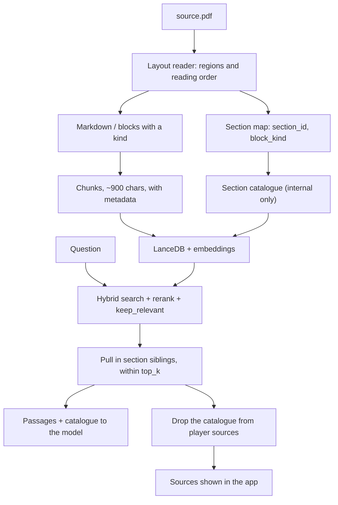

> **Archive copy.** English-only historical plans used to build BGA.
> **Stage:** 3G.
> **Origin:** Cursor plan for Stage 3G (rulebook import understanding: section
> coverage and page layout gate).
> **Outcome:** Phase 0 on Through the Ages handbook justified Phase 2. Phase 1
> shipped. Phase 2 shipped: geometry layout reader + `ingestLayoutVersion`
> migration; handbook pages 3 / 9 / 13 are regression fixtures.

---

# Stage 3G — Rulebook import understanding

**Goal:** a question that asks for a whole list ("list every action") gets the whole
list, not just the first few passages the reranker kept. Also settle whether page
layout (columns, boxes, examples) is a second, separate loss — before building a
reader for it.

## Why this stage, and why phased

- A rulebook is imported **once**; it is questioned **many times** at the table. Work
  spent understanding it at import time pays for itself on every later question,
  unlike widening the prompt per question, which pays for itself never.
- The app does not fine-tune, and does not learn from past answers. "A better base" is
  better passages plus explicit structure plus a better pick at question time — not
  training or chat memory.
- The reported regression ("list every action" loses items) is a **coverage** problem:
  the full list lives in the table of contents (split across two chunks) plus eight
  section headings (about 26 chunks total). After the relevance-score fix earlier in
  Stage 3 (fewer, sharper passages instead of six padded ones), a list question
  regularly keeps 1–4 chunks — not enough. Phase 1 (section map, catalogue chunk,
  sibling expansion) fixes exactly this. Layout does not.
- Page layout (columns, sidenotes, example boxes) is a **different**, **unverified**
  loss. `pymupdf4llm`, already in use, advertises layout-aware extraction and pulls in
  `pymupdf-layout` as a transitive dependency. The premortem below found that the
  claim "boxes get orphaned today" had not actually been measured on a real PDF.
- `docs/ROADMAP.md` Stage 6A already specifies the correct discipline for this exact
  work: measure the miss before building a heavier reader. This stage runs that gate
  now, right after Stage 3, instead of waiting for Stage 6's full evaluation harness.

## Premortem findings applied

The full premortem is below; these are the seven concrete design changes it forced
into the phases that follow.

1. No version field exists on `GameSummary`, `GameDocumentSummary`, or the document
   manifest. Without one, a heavy, PDF-dependent migration copying today's
   `resplit_stored_chunks` startup-loop pattern would re-run on **every engine start**,
   forever — not once. Fix: a persisted `ingestLayoutVersion` in `manifest.json`
   (engine-internal, not on the wire contract).
2. `resplit_stored_chunks`'s startup loop touches every document kind
   unconditionally, including FAQ and video-transcript documents that have no
   `source.pdf`. A layout migration copying that loop verbatim would try to open a PDF
   that does not exist. Fix: gate on `source_pdf_path(...).exists()`, never on
   `document_kind` alone.
3. Pulling in "sibling" chunks of the same section reintroduces, by design, chunks
   that did **not** clear the relevance filter — the exact class of noise the
   double-sigmoid fix just removed. Fix: expansion never exceeds the profile's
   `retrieval_top_k`; already-kept hits always outrank siblings; a regression test
   pins that a short, single-fact question keeps exactly the passages it kept before
   this stage.
4. A synthetic "catalogue" chunk, if treated like any other retrieved chunk, would be
   shown to the player as a citable source with an empty page number and a heading
   like "Section catalogue" — a leak of internal machinery past the player-first
   boundary. Fix (as shipped): a catalogue chunk that clears the filter triggers
   expansion to the sections it names; it **stays in the model prompt** (it is the
   complete list) and is **stripped only from player-facing sources**.
5. No timing budget exists for a heavier parser on a large PDF (up to
   `MAX_PDF_PAGES = 200` / 80 MB), while the upload path is already fully blocking and
   the Next.js route caps at `maxDuration = 300` with no cancellation wired to the
   Python thread. Fix: a benchmark fixture near the page ceiling with a measured time
   budget, and an automatic fallback to the light reader if exceeded.
6. Today's `resplit_stored_chunks` mutates `chunks.jsonl` directly and reindexes
   afterwards, with no shared transaction — a crash mid-parse on 200 pages could leave
   the JSONL and the LanceDB index diverged. Fix: the layout migration writes to a
   temporary document directory and swaps atomically, the same way `_promote_document`
   already does for a fresh import.
7. New chunk cross-references (`prev_chunk_id` / `next_chunk_id`) would be fragile
   against the *existing* resplit pass, which already rewrites chunk ids on every
   boot when a chunk is oversized. Fix: the layout-aware reader decides final chunk
   boundaries once, replacing resplit's role for PDF-sourced documents, instead of
   layering a second, blind splitter after the fact.

## Target flow (after Phase 2)

## Phase 0 — Measure before building (blocks Phase 2 only)

**Goal:** know whether `pymupdf4llm` already loses column order or box/rule links,
before anyone writes a custom reader.

- Find 2–3 passages in World Order (and a denser rulebook, if one is imported) that
  sit in a sidenote, an example box, or a second column.
- Ask the current, unmodified pipeline about them. Record whether the right passage is
  even retrieved, and whether the answer uses it.
- Write the miss rate down in `docs/ARCHITECTURE.md`, the same way the double-sigmoid
  fix's measurement is recorded there.

**Decision:**
- Miss is small → stop. Keep `pymupdf4llm`. The written number closes this question
  for the next person, per Stage 6A's own acceptance criteria.
- Miss is large on real, dense rulebooks → Phase 2 is justified, with the concrete
  failing example as its first regression test.

## Phase 1 — Section map, catalogue chunk, sibling expansion (independent, low risk)

Fixes the reported "list every action" regression directly. Does not touch the PDF
parser; works from today's `chunks.jsonl`.

### 1.1 Section map from what already exists

Built from the headings already in `chunks.jsonl` — no PDF re-read. Adds to
`ChunkRecord` ([`services/rag-engine/rag_engine/ingest/models.py`](../../services/rag-engine/rag_engine/ingest/models.py)):
section order, page, a `section_id`, and a `block_kind` (`"rule"` by default;
`"catalogue"` for the new synthetic chunk below). No separate graph model — explicit
fields, not learned relations.

### 1.2 Section catalogue — internal signal, never a citable source

One or more synthetic `block_kind="catalogue"` chunks per document, holding an
ordered list of section names and pages. Reachable through hybrid search like any
text, but:

- when a `catalogue` chunk clears `keep_relevant`, it triggers expansion to the
  sections it names (see 1.3). The catalogue **stays in the model prompt** (it is
  the complete list) and is **removed only from player-facing sources** — never
  shown as a citable page in the UI.

Test: a question whose keywords appear in many section headings (risk: the
keyword-dense catalogue chunk dominates the 15 hybrid-search candidates) must not
starve real sections out of the candidate pool.

### 1.3 Sibling expansion, inside the existing budget

In [`retrieval/pipeline.py`](../../services/rag-engine/rag_engine/retrieval/pipeline.py),
**after** `keep_relevant`, **before** the `[:top_k]` cutoff:

- for a `catalogue` hit that cleared the filter: pull in the `rule` chunks for the
  section names it lists, up to `retrieval_top_k`,
- for an ordinary hit that is part of a multi-chunk section: pull in the rest of that
  `section_id`, **only** when the section has few chunks (say, at most 6) — a single
  incidental hit in a large, unrelated section must not drag in the whole section,
- **hard limit**: the total after expansion never exceeds the profile's
  `retrieval_top_k` (3 on 16 GB, 6 on 32/64 GB); on overflow, higher relevance scores
  win, exactly like today's `[:top_k]`,
- **priority**: hits already kept by `keep_relevant` are never displaced by an
  expansion sibling.

`keep_relevant` (floor 0.05, 20% of the best score) is unchanged — this does not
reopen the "everything passes" bug.

### 1.4 Tests and measurement

- A short, single-fact question ("what does the Trade action do?") does not regain
  noise it correctly dropped, via expansion.
- A question that hits the catalogue keeps the catalogue for the model, and never
  exposes it in player-facing sources (`player_facing_hits`).
- `if not relevant: return []` still runs **before** expansion — an empty list stays
  empty (the double-sigmoid regression does not come back).
- On World Order: "list every action" names all eight; "what does the Trade action
  do?" still answers in a few seconds; "how much is a pizza at the station?" still
  returns `insufficient_evidence`.

## Phase 2 — Layout-aware PDF reader (gated on Phase 0)

Only built if Phase 0 finds a real miss on dense, real publisher PDFs.

### 2.1 The reader

Built on the PyMuPDF already in use — no new large language model, no vision model at
import time (vision stays Stage 7's job, for diagrams):

- per-page text blocks with geometry; columns ordered by reading position,
- an example/callout box attached to the nearest rule (`block_kind="example"` /
  `"note"`), never an orphaned heading,
- `pymupdf4llm` as the fallback when the layout reader fails, or the page is a scan
  with no text layer (OCR stays the existing, separate extra).

The reader decides chunk boundaries directly, combining the 900-character cap with
region boundaries — it **replaces** `split_section_text`'s role for PDF-sourced
documents. FAQ and transcripts have no layout and keep the existing splitter.

### 2.2 Migration: versioned and atomic

- `ingestLayoutVersion: int` in `manifest.json` (engine-internal, not on the wire) —
  migration runs once per document, not once per restart.
- A migration only touches a document where
  [`source_pdf_path(...)`](../../services/rag-engine/rag_engine/storage_paths.py)
  exists — an explicit check, never inferred from `document_kind`.
- Writes to a fresh temporary document directory, full processing, then an atomic
  swap via the same mechanism `_promote_document` already uses (`rmtree` + `move`) —
  never a direct mutation of the live `chunks.jsonl`.
- An in-app status in English and Polish (new i18n keys in both `common.json` files,
  in the same change) — no terminal.

### 2.3 Time budget

- A benchmark fixture near `MAX_PDF_PAGES` (200) / `MAX_PDF_BYTES` (80 MB), with a
  measured time budget leaving headroom under the Next.js route's `maxDuration=300`.
- Exceeding the budget falls back to `pymupdf4llm` for that document; it does not fail
  the upload.

### 2.4 Measurement

The specific failing example Phase 0 found now succeeds; every Phase 1 test still
passes without regression.

## Out of scope for this stage

- Fine-tuning, or learning from player feedback / chat history.
- A separate relation-embedding or graph model.
- A vision model at import time (Stage 7 — diagrams).
- Raising `top_k` / `num_ctx` globally "back to how it was".
- Turning on `partial` groundedness (separate follow-up).

## File map

- Phase 1: [`ingest/models.py`](../../services/rag-engine/rag_engine/ingest/models.py)
  (`section_id`, `block_kind`),
  [`ingest/pipeline.py`](../../services/rag-engine/rag_engine/ingest/pipeline.py)
  (catalogue construction),
  [`retrieval/pipeline.py`](../../services/rag-engine/rag_engine/retrieval/pipeline.py)
  (expansion + catalogue strip),
  [`retrieval/index.py`](../../services/rag-engine/rag_engine/retrieval/index.py)
  (metadata lookup, if the expansion needs one beyond what `search_text` gives).
- Phase 2: [`ingest/pdf.py`](../../services/rag-engine/rag_engine/ingest/pdf.py)
  (layout reader + fallback),
  [`storage_paths.py`](../../services/rag-engine/rag_engine/storage_paths.py)
  (`source_pdf_path` gets its first real caller), `en`/`pl` `common.json`.
- Tests: `test_ingest.py`, `test_retrieval_pipeline.py`, a new section-map test, a
  timing-budget test.
- [`docs/ARCHITECTURE.md`](../ARCHITECTURE.md), [`docs/ROADMAP.md`](../ROADMAP.md) —
  Phase 0's written miss rate; the decision that a catalogue chunk is an internal
  signal, never a source.

## Premortem

**Mode:** deep
**Context:** import-time PDF layout parsing, a section map, a synthetic catalogue
chunk, and sibling expansion at retrieval time, layered on the relevance-score fix
earlier in Stage 3.

### Tigers

- **Risk:** Without a persisted version marker, a heavy, PDF-dependent migration
  copying today's startup-loop pattern re-runs on every engine start, for every game,
  forever — not once.
  **Where:** `services/rag-engine/rag_engine/contract.py:129-144` (`GameSummary`,
  `GameDocumentSummary` — no version field);
  `services/rag-engine/rag_engine/ingest/pipeline.py:449-466` (`resplit_stored_chunks`
  runs unconditionally at every startup).
  **Severity:** high.
  **Mitigation checked:** searched for `version` / `schemaVersion` / `ingestVersion`
  on `GameSummary`, `GameDocumentSummary`, and `manifest.json` — none exists.
  **Fix:** add `ingestLayoutVersion` to `manifest.json` (engine-internal, not on the
  wire contract) so the migration is idempotent per document.

- **Risk:** `resplit_stored_chunks`'s startup loop touches every document kind
  unconditionally, including FAQ and video-transcript documents. A layout migration
  copying that loop verbatim would try to open a `source.pdf` that does not exist for
  those kinds.
  **Where:** `services/rag-engine/rag_engine/ingest/pipeline.py:119-125` (allowed
  kinds include `faq`, `video_transcript`);
  `services/rag-engine/rag_engine/ingest/bgg_faq.py:105-119` and
  `services/rag-engine/rag_engine/ingest/transcript.py:181-194` (`page=None`,
  `image_url=None`, no PDF); `storage_paths.py:120-128` (`source_pdf_path` has zero
  callers today).
  **Severity:** high.
  **Mitigation checked:** `resplit_stored_chunks` has no PDF-presence guard because it
  does not need one; a new migration that does needs one and today has none.
  **Fix:** gate on `source_pdf_path(...).exists()`, never on `document_kind` alone.

- **Risk:** Pulling in same-section siblings deliberately reintroduces chunks that did
  **not** clear the relevance filter — the exact class of noise the double-sigmoid fix
  just removed, for a different reason.
  **Where:** `services/rag-engine/rag_engine/retrieval/pipeline.py:67-107`
  (`keep_relevant` → sort → `[:top_k]`).
  **Severity:** high.
  **Mitigation checked:** the draft plan said expansion "replaces noise, does not add
  a second bag," but defined no hard rule or test enforcing it.
  **Fix:** expansion never exceeds the profile's `retrieval_top_k`; siblings are
  always lower priority than already-kept hits; a regression test pins that a short,
  single-fact question does not regain dropped noise.

- **Risk:** A catalogue chunk shown as an ordinary `<source>` / `RetrievedSource`
  could reach the player as a cited "source" with an empty page and a heading like
  "Section catalogue" — a player-first violation — and the model could quote it
  verbatim.
  **Where:** `services/rag-engine/rag_engine/retrieval/prompt.py:44-61`
  (`wrap_passages` includes every kept chunk's page/section verbatim);
  `services/rag-engine/rag_engine/retrieval/sources.py:14-24` (`to_retrieved_source`
  exposes every kept hit).
  **Severity:** medium-high.
  **Mitigation checked:** nullable `page` means this "does not crash" the UI
  (`types.ts:47`), but "does not crash" is not "makes sense to a player" — nothing
  today excludes a chunk kind from `SourcesEvent`.
  **Fix (as shipped):** expansion consumes the catalogue as a coverage signal; the
  catalogue stays in model passages and is stripped only via `player_facing_hits`
  before `to_retrieved_source` — never shown to the player.

- **Risk:** No timing budget exists for heavier layout parsing on large PDFs (up to
  `MAX_PDF_PAGES = 200` / 80 MB); the upload path is already fully blocking, and the
  Next.js route caps at `maxDuration = 300` with no cancellation wired to the Python
  thread.
  **Where:** `services/rag-engine/rag_engine/routers/ingest.py:152-162` (blocking
  `asyncio.to_thread`); `services/rag-engine/rag_engine/ingest/pdf.py:8-9`
  (`MAX_PDF_BYTES`, `MAX_PDF_PAGES`); `apps/web/src/lib/engine-proxy.ts:31-35` and the
  ingest route (`maxDuration=300`, no abort wired to the thread).
  **Severity:** high.
  **Mitigation checked:** no timing benchmark exists today even for the current light
  extractor at max size, let alone the proposed heavier one; no acceptance criterion
  bounded worst-case time.
  **Fix:** a benchmark fixture near the page ceiling, a measured time budget with
  headroom under 300s, and an automatic fallback to the light reader on overrun.

- **Risk:** An in-place migration (write `chunks.jsonl`, then reindex, no shared
  transaction) risks the JSONL and the LanceDB index diverging if the process dies
  mid-parse on 200 pages.
  **Where:** `services/rag-engine/rag_engine/ingest/pipeline.py:435-467` (resplit's
  direct write, no atomic swap) vs. `pipeline.py:174-178` (`_promote_document` already
  does an atomic `rmtree` + `move` for a fresh import).
  **Severity:** medium.
  **Mitigation checked:** a fresh import already has a safe pattern; resplit does not;
  the draft plan did not choose which pattern the new migration follows.
  **Fix:** the layout migration writes to a temp document directory and swaps
  atomically through `_promote_document`'s existing mechanism, never mutating the
  live `chunks.jsonl` in place.

- **Risk:** New cross-reference fields (`prev_chunk_id` / `next_chunk_id`) are fragile
  against the *existing* resplit pass, which already rewrites chunk ids on every boot
  when a chunk is oversized (`f"{chunk.id}:s{index:02d}"`) — a pointer to a
  "previous/next" chunk can dangle on an id that no longer exists.
  **Where:** `services/rag-engine/rag_engine/ingest/pipeline.py:435-446`
  (`_resplit_chunks` generates new ids whenever needed, on every boot).
  **Severity:** medium.
  **Mitigation checked:** nothing today recomputes cross-references after an id
  rewrite, because no such references exist yet; adding them without addressing this
  is a designed-in bug.
  **Fix:** the layout-aware reader decides final chunk boundaries once (folding the
  900-char cap into the same pass), replacing resplit's role for PDF-sourced
  documents, instead of layering a second, blind splitter afterwards.

### Elephants

- **Risk:** Nobody verified that `pymupdf4llm` — already in use, with
  `pymupdf-layout==1.28.2` as a transitive dependency — actually loses columns or
  boxes on a real PDF. The whole premise ("boxes get orphaned today") is an
  assertion, not a measurement, and this library was originally chosen specifically
  for layout-aware extraction (`docs/ARCHITECTURE.md:216`). Building a custom reader
  to fix something that might already be fixed is an expensive detour.
  **Fix:** Phase 0 measures this on a real PDF before any custom parser is written.

- **Risk:** The plan bundles two very different risk levels into one release: (a) a
  section map, catalogue chunk, and sibling expansion — small, testable, fixes the
  reported regression directly; (b) a custom PDF layout reader — large, unverified
  need, high cost. Bundling them means the urgent fix waits on the much larger,
  riskier project.
  **Fix:** split into phases that can ship independently; Phase 1 does not wait on
  Phase 2.

- **Risk:** `docs/ROADMAP.md` Stage 6A already specifies the exact discipline this
  work needs: "measure the miss first... shipping a heavier reader is optional;
  measuring the miss is not," with concrete acceptance criteria (run on one simple and
  one dense rulebook; write the miss rate down). An earlier draft of this plan skipped
  that gate in favor of a vague "small regression check."
  **Fix:** restore the gate, in a shortened but real form, as Phase 0.

### Paper tigers

- **Risk:** synthetic chunks with no real page anchor might break the contract or the
  UI.
  **Why it is fine:** `page: number | null` is already part of the contract ("null for
  transcripts", `types.ts:47`); the UI already renders without error at `page=null`
  and `imageUrl=null` (`AnswerPanel.tsx:95-100`, `answer-state.test.ts:73`).

- **Risk:** expansion could resurrect the "insufficient_evidence unreachable" bug
  (the double-sigmoid failure).
  **Why it is fine:** the existing guard (`best < floor -> return []]`) runs strictly
  before the planned expansion insertion point; expansion cannot turn an empty list
  non-empty.

### False alarms

- **Finding:** this change requires updates to `packages/api-contract/src/types.ts`
  and `test_contract_parity.py`.
  **Why discarded:** `ChunkRecord` and `RetrievedChunk` never cross the wire boundary
  — confirmed by grep: zero references in `contract.py`, `types.ts`, or
  `test_contract_parity.py`. Only `RetrievedSource` is shared, and it already handles
  a nullable `page`.

## Success

- Phase 0: a written miss-rate number in `docs/ARCHITECTURE.md`, closing the question
  for the next reader either way.
- Phase 1: "list every action" is complete on World Order; ordinary single-fact
  questions are not slower than before Phase 1; the catalogue chunk is never visible
  to the player.
- Phase 2 (if justified): import is slower within a measured, accepted budget; `/ask`
  never runs a layout model; an existing game with a stored `source.pdf` re-processes
  itself once, inside the app, with no terminal step.
- `pnpm verify` passes at every phase.
