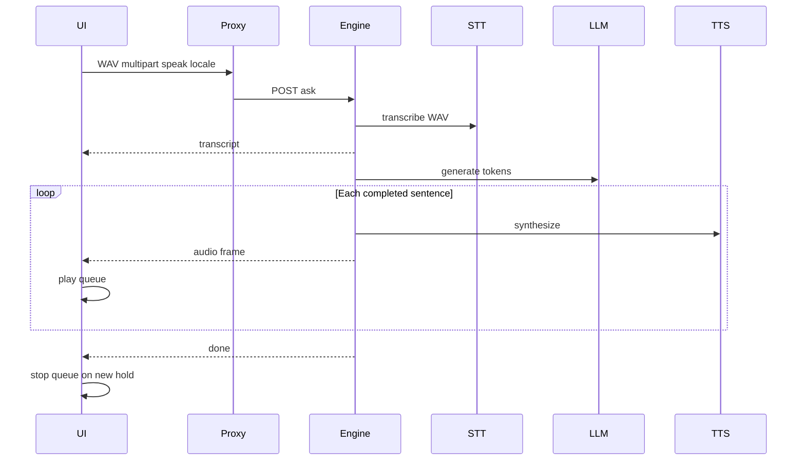

# Stage 5 — Voice (local, no tablet)

> **For agentic workers:** Prefer `superpowers:subagent-driven-development` or `superpowers:executing-plans`. Premortem **tigers are required mitigations inside the same task**. `pnpm verify` before closing. No auto-commit. Mirror to [`docs/superpowers/plans/2026-09-09-stage-5-voice.md`](docs/superpowers/plans/2026-09-09-stage-5-voice.md) when implementing docs task.

**Goal:** Hold-to-talk questions on **Questions** and **Learn**, optional read-aloud, same written thread/log. **First spoken sentence starts before the LLM finishes.** Works on **macOS and Windows** at `127.0.0.1` / Electron.

**Architecture:** Extend Ask / lesson **SSE**. Client sends **WAV** audio through `/api/engine/…` (multipart). Engine STT → `transcript` → existing retrieve/generate → **while tokens stream**, Piper emits `audio` frames **per completed sentence** (not after `done`). FE plays a queue and **stops immediately** on new hold or new typed submit. Stage 5B (tablet / mkcert / LAN / CSP) is deferred to the **end of the roadmap**. ROADMAP footnote only: WebSocket audio channel if SSE interrupt proves inadequate.

**Tech stack:** MediaRecorder → FE WAV encode, FastAPI multipart + SSE, `piper-tts`, mlx-whisper (Darwin) / faster-whisper (else), Electron mic handler (already auto-grants), Mantine + `@bga/*`, i18n.

---

## Locked product decisions

- Scope: voice on localhost / Electron only; **no** tablet / HTTPS / LAN bind / enforcing CSP
- Surfaces: Questions **and** Learn
- Mic: hold button or **Space** → speak → release → send (**Space disabled while focus is in a text field**)
- Read aloud: toggle, **default off**; on = speak every new assistant turn; off = never; FE always sends `speak` from this preference
- Interrupt: cut playback **immediately** on new mic hold or new typed send (and abort in-flight fetch)
- Locale: OS → `desktopLocale` (`pl` / else `en`) for first-run voice + initial UI path; **every speak/STT request sends `locale` from the current URL locale**; language switch → in-app ensure/download missing voice + plain status
- Acceptance: manual **Mac and Windows**

---

## Critical review fixes (vs first draft)

| Gap | Fix in this plan |
| --- | --- |
| TTS after full answer (violates ROADMAP “sound before generation ends”) | **Interleave:** sentence boundary in token buffer → Piper → `audio` frame while LLM still streaming; `done` only after last audio (or after tokens if `speak=false`) |
| MediaRecorder `webm` + no ffmpeg on Windows/Mac app | **FE encodes 16 kHz mono WAV**; engine STT accepts WAV only (no ffmpeg dependency) |
| Profile `stt` is always `mlx-community/…` | Darwin uses that HF id; **non-Darwin** uses faster-whisper model name `large-v3-turbo` (or pinned equivalent) resolved in `speech` layer / settings helper — not mlx repo on Windows |
| `speak` only described on multipart | **`speak` + `locale` on JSON Ask and all lesson JSON bodies** too |
| Space steals typing | Hold-Space **ignored** when `input`/`textarea`/contenteditable focused |
| Transcript not wired to 3D thread | On `transcript` event, **player turn text** = transcript (thread + Learn digression log) |
| Semaphore / parallel Ask while TTS | Keep **`generation_semaphore` through TTS** when `speak=true`; client abort releases |
| Empty / failed STT still hits LLM | **Fail closed:** notice/error + `done` insufficient; no retrieve |
| `pull_piper_voice` stub; always `pl_PL-bass-high` | Real download; first-run pulls **voice for `uiLocale` only**; map `pl`→`pl_PL-bass-high`, `en`→`en_US-lessac-medium` (fixed ids in settings) |
| Lesson auto-advance vs speech | **Do not start 8s timer** until stream `done` **and** audio queue empty (or interrupted) |
| Browser `pnpm dev` without `speech` extra | Health/setup codes; UI recovery — not a silent hang |
| Dual `/ask` content-types | One route: if `content-type` multipart → parse form; else JSON body (same handler → `AskRequest`) |

---

## Premortem (tigers → mitigations in tasks)

1. **Tiger — late or missing first audio:** Interleaved sentence TTS (Task 3/4); test that an `audio` frame can appear before final token.
2. **Tiger — Windows cannot transcribe mlx weights:** Platform STT resolver + pull Windows weights in owned-models (Tasks 1–2, 7).
3. **Tiger — ffmpeg missing breaks STT:** WAV-from-FE only (Task 5 + 1).
4. **Tiger — second question overlaps first voice:** Semaphore through TTS; FE stops queue + aborts fetch (Tasks 3, 5).
5. **Tiger — empty hold sends garbage Ask:** Empty transcript fail-closed (Task 3).
6. **Tiger — huge SSE payloads / hung stream:** Cap recording duration (~30s) and WAV size server-side; sentence-sized audio chunks; disconnect checks between sentences (Tasks 3, 5).
7. **Tiger — language switch leaves broken speak:** `POST /speech/ensure-voice` (or desktop IPC + engine) with activity UI (Task 6).
8. **Paper tiger — Electron mic permission:** Already auto-grant + plist; verify in manual acceptance only.
9. **Elephant — browser default locale `/` → `pl` in proxy vs OS `en`:** Desktop first paint uses OS; browser-only keeps existing routing. Voice always follows **URL locale** on the request.

---

## Global constraints

- No hardcoded UI strings — [`en`/`pl` common.json](apps/web/src/i18n/locales/en/common.json); engine codes only
- Player-first downloads and mic errors
- Only door: [`apps/web/src/app/api/engine/[...path]/route.ts`](apps/web/src/app/api/engine/[...path]/route.ts) (multipart already forwarded like ingest)
- Contract parity TS ↔ Python; extend [`AskRequest`](packages/api-contract/src/types.ts) / lesson requests with `speak: boolean`, `locale?: 'en' \| 'pl'`
- `sources` before first token; `insufficient_evidence` valid
- Shared [`generation_semaphore`](services/rag-engine/rag_engine/engines/generation_lock.py)

---

## API shape (concrete)

### Ask

- **JSON** (typed): existing fields + `speak: boolean` + optional `locale: 'en' \| 'pl'` (default `en` if omitted).
- **Multipart** (voice): fields `gameId`, `mode`, `speak`, optional `expansionIds` (JSON array string), optional `locale`, file `audio` (`audio/wav`). No `question` field required when `audio` present.
- Stream when audio: `status:transcribing` → STT → `transcript` → (if empty: notice `speech_empty` + empty sources + done insufficient) → retrieve… → `sources` → tokens; **on each completed sentence** while generating (and `speak`): `status:speaking` (once) + `audio{sequence, mimeType, dataBase64}`; then `done`.
- When `speak=false`: identical to today after transcript (no `audio` frames).
- Cap: reject audio over size limit / duration with notice code.

### Lesson

- JSON bodies for `start` / `continue` / `repeat` / `ask`: add `speak` + optional `locale`.
- `ask` also multipart with `audio` instead of `question` (same WAV rules).
- TTS applies to unit text and digression answers when `speak=true`, same interleaving rules.
- Auto-advance (FE): arm 8s only after `!isStreaming && !audioQueuePlaying` (or after interrupt cleared).

### Voice ensure

- `POST /speech/ensure-voice` JSON `{ "locale": "en" \| "pl" }` → downloads Piper voice if missing; returns `{ "ready": true }` or streams progress via existing activity pattern / long JSON with stages — **player-visible** on language switch. `routeKind`: `long` or `api` with honest UI (prefer activity events if we already have a pattern; else blocking call with setup-style progress polling).
- First-run: [`pull_models.py`](services/rag-engine/rag_engine/pull_models.py) `pull_piper_voice` becomes real; desktop passes **locale** so only one voice is fetched initially.

### Voices (fixed)

| Locale | Piper id |
| --- | --- |
| `pl` | `pl_PL-bass-high` |
| `en` | `en_US-lessac-medium` |

Settings keep `tts_voice` as profile default for pl; add `tts_voice_en` (or resolver function `voice_for_locale(locale)`).

---

## File map

| Area | Touch |
| --- | --- |
| STT/TTS | [`speech.py`](services/rag-engine/rag_engine/speech.py) → package `rag_engine/speech/` (protocol, mlx, faster, piper, sentences, voices) |
| Ask / lesson | [`routers/ask.py`](services/rag-engine/rag_engine/routers/ask.py), [`routers/lesson.py`](services/rag-engine/rag_engine/routers/lesson.py) |
| Ensure voice | new `routers/speech.py` (or under speech package) |
| Pull / owned | [`pull_models.py`](services/rag-engine/rag_engine/pull_models.py), [`owned-models.json`](apps/desktop/src/uninstall/owned-models.json) + TS/Python parity |
| Contract | `types.ts` / `contract.py` + parity tests |
| Proxy | [`engine-proxy.ts`](packages/utils/src/engine-proxy/engine-proxy.ts) — `speech/*` routeKind (`long` for ensure, `stream` if any stream) |
| FE | `use-hold-to-talk` (WAV), `use-audio-queue` (stop/abort), extend `useAskStream` / `useLessonStream` for FormData + `speak`/`locale`; [`RulesChat`](packages/components/src/rules-chat/RulesChat.tsx), [`LessonPanel`](packages/components/src/lesson-panel/LessonPanel.tsx); LanguageSwitcher ensure-voice |
| Answer state | Keep ignoring storage of audio blobs; queue plays from events; transcript already in reducer — wire into thread `beginExchange` question text |
| Docs | ROADMAP Stage 5 / 5B / WebSocket footnote; README |

---

## Tasks

### Task 1 — STT backends
- Implement `SpeechToText` for Darwin (mlx) and else (faster-whisper).
- Input: 16 kHz mono WAV path/bytes only.
- Resolver for model ids per platform; unit tests for `speech_backend_name` + “wrong platform model not selected”.
- Missing speech extra → clear error code for health/Ask.

### Task 2 — Piper + pull + owned
- Sentence splitter (pure function + tests): punctuation boundaries for pl/en.
- Piper synthesize → bytes + mime for `AudioEvent`.
- Real `pull_piper_voice(locale)`; owned paths for both voices + Windows STT cache; uninstall removes them.
- `voice_for_locale('en'|'pl')`.

### Task 3 — Ask path
- Parse JSON or multipart → `AskRequest` (+ audio bytes).
- Transcribe → `transcript` → empty fail-closed.
- Token loop with sentence flush → optional `audio` interleaved; disconnect → stop TTS, no orphan work.
- Semaphore held for full speak path.
- Contract + API tests (mock STT/TTS).

### Task 4 — Lesson path
- Same `speak`/`locale`/audio on lesson actions; digression + unit TTS; FE auto-advance gating documented and implemented in Task 5 with hooks from stream state.

### Task 5 — FE voice UI
- Hold-to-talk → WAV (cap ~30s); Space only when not in text field.
- Toggle read-aloud default off (`localStorage` `bga.voice.readAloud.v1`).
- Audio queue: play by `sequence`, `stop()` on cancel/new send.
- Pass `speak` + `locale` on every Ask/lesson call; multipart when audio present.
- Questions: transcript becomes player question in thread; Learn: digression question text.
- i18n for mic, toggle, empty speech, downloading voice.

### Task 6 — Language → voice
- On locale change: notify + call ensure-voice; activity/progress until ready; speak waits or shows notice if voice missing mid-download.

### Task 7 — Health / setup
- Health components or fields for stt/tts ready; setup gate can pull voice; notices use catalogues.

### Task 8 — Docs
- Rewrite Stage 5 acceptance to this slice; **Stage 5B** tablet/HTTPS/CSP sits at the **end of the roadmap**; footnote WebSocket audio; copy plan under `docs/superpowers/plans/`.

### Task 9 — Verify
- `pnpm verify`.
- Manual Mac + Windows: hold-to-talk → transcript on screen → answer → hear first sentence before stream ends; interrupt; toggle off silent; switch language downloads other voice.

---

## Out of scope

- LAN / mkcert / non-localhost bind / enforcing CSP / HSTS (Stage 5B — end of roadmap)
- Web Speech API / cloud STT-TTS
- Implementing WebSocket audio now
- Fetching **both** Piper voices on every first run (only OS/UI locale; other on demand)
