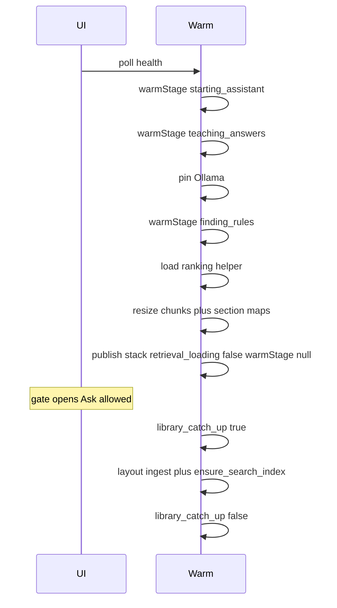

# Startup + game picker implementation plan

> **For agentic workers:** Prefer `superpowers:subagent-driven-development` or `superpowers:executing-plans`. **Premortem tigers are required mitigations inside the same task.** TDD. Do **not** auto-commit. Mirror to [`docs/superpowers/plans/2026-09-11-startup-and-game-picker.md`](docs/superpowers/plans/2026-09-11-startup-and-game-picker.md) when executing. Spec: [`docs/superpowers/specs/2026-09-11-startup-and-game-picker-design.md`](docs/superpowers/specs/2026-09-11-startup-and-game-picker-design.md).

**Goal:** Faster app entry and a scalable game chooser without blocking the UI on checking every game’s search rows.

**Architecture:** Blocking warm finishes pin + ranking helper + **chunk/section migrations that must not race Ask**, then publishes `retrieval_stack` and clears `retrieval_loading`. Full-library **search catch-up** and **layout re-read** run under `library_catch_up` with a bottom bar. Health exposes `warmStage` for splash copy. Shared virtualized `GamePicker` over slim catalogue + recent IDs in localStorage.

**Tech stack:** FastAPI, LanceDB catch-up, `@bga/*`, Mantine 9 `Combobox` + `useVirtualizedCombobox`, `@tanstack/react-virtual`, `Intl.Collator`, i18n en/pl.

## Global constraints

- No hardcoded UI strings — en/pl `common.json` same change; engine sends codes only
- Player-facing copy: no “model”, “reranker”, “Ollama”, “index”
- Contract parity TS ↔ Python (`test_contract_parity.py`)
- Ask still filters by `gameId` before search
- Per-game search stores: ROADMAP note only
- `pnpm verify` before closing; no auto-commit

---

## Critical review fixes (vs first plan draft)

| Gap | Fix locked in this plan |
| --- | --- |
| Moving `_resize_oversized_chunks` to background contradicts its own comment (Ask must not hit half-rewritten docs) | Keep **resize + section maps in blocking warm** before publishing stack. Background = **layout ingest + `ensure_search_index` only**. |
| `phaseFromPoll` checks `layout_ingest` **before** ready ([`engine-readiness.ts`](packages/utils/src/engine-readiness/engine-readiness.ts) L36–44) — background layout would demote UI to `reading_layout` and re-trigger full-page gate | Once `reranker && !retrieval_loading` → **`ready`**. Never return `reading_layout` / `starting` when Ask-ready. Soft banner only if we still want layout progress (optional; default: rely on catch-up bar / existing notices). |
| Concurrent Ask `ensure_search_index(gameId)` vs background full walk → LanceDB races | One process-wide **`catch_up_lock`** (asyncio lock wrapping thread work). Ask waits on lock; background holds it for each game or whole walk. |
| Vague “prioritize on Ask” could block SSE for minutes | Prioritized path: ensure **only that `gameId`**, emit existing `search_catch_up_needed` / wait notices; do not run full library inside Ask. |
| Splash stage order vs load order | UX stages stay 1→2→3. Load: stage1 → **pin (2)** → **try_load (3)** → resize/section maps → ready → background. Pin failure already non-fatal ([`main.py`](services/rag-engine/rag_engine/main.py) L37–38). |
| Virtualized list + section headers | Flat row model: `{ type: 'header', id }` \| `{ type: 'game', game }`; headers are normal virtual rows (no sticky header requirement in v1). |
| Recent IDs for deleted games | `buildPickerSections` **drops** recent ids not in catalogue. |
| Desktop `liveProbeOk` | Continues to require `!retrievalLoading`; **ignore** `library_catch_up` (unknown/false is fine). Update splash mapping for `warmStage`. |
| `HealthReport.warmStage` optional for older parsers | Top-level field; FE treats missing as `null`. `components.library_catch_up` missing → false. |
| Who shows stages on web vs desktop | Web/desktop app chrome: [`AssistantReadyGate`](packages/components/src/assistant-ready-gate/AssistantReadyGate.tsx) driven by `warmStage`. Desktop native splash: map same codes in [`gate.ts`](apps/desktop/src/setup/gate.ts) / [`splash.ts`](apps/desktop/src/setup/splash.ts). |

---

## Locked warm order

**Blocking (splash / `retrieval_loading`):**

1. `warmStage = starting_assistant`
2. `warmStage = teaching_answers` → `_pin_ollama_weights` (errors logged; continue)
3. `warmStage = finding_rules` → `try_load`; if `None`, leave stack unset, clear loading in `finally`, UI → `search_unavailable`
4. `_resize_oversized_chunks` → `_ensure_section_maps` (still blocking; not the “all games search” walk)
5. Set `retrieval_stack`, `retrieval_loading = false`, `warmStage = null`

**Background (`library_catch_up`):**

6. `library_catch_up = true`
7. `_ensure_layout_ingest` then `_ensure_search_index` (under `catch_up_lock`)
8. `library_catch_up = false` in `finally` for this phase (even on cancel/error)

**Early Ask:** if stack present and catch-up running → acquire lock → `ensure_search_index(..., prioritize_game_id=gameId)` that **only processes that game** (or processes it first then returns if a `only_game_id` flag is cleaner — prefer **`only_game_id`** for Ask path to bound latency).

---

## File map

| Area | Files |
| --- | --- |
| Warm / health | [`main.py`](services/rag-engine/rag_engine/main.py), [`health.py`](services/rag-engine/rag_engine/routers/health.py), [`pipeline.py`](services/rag-engine/rag_engine/ingest/pipeline.py), ask/lesson routers for only-game ensure |
| Contract | [`types.ts`](packages/api-contract/src/types.ts), [`contract.py`](services/rag-engine/rag_engine/contract.py), parity tests |
| Readiness FE | [`engine-readiness/`](packages/utils/src/engine-readiness/), AssistantReadyGate, EngineReadinessBanner, new `library-catch-up-bar/`, activity-progress, desktop gate/splash |
| Catalogue | [`games.py`](services/rag-engine/rag_engine/routers/games.py), proxy (default `api` kind OK) |
| Picker | `@bga/utils` recent-games + game-catalogue; `@bga/hooks` useGameCatalogue; `@bga/components` game-picker; RulesChat, LessonPanel, PdfDropZone |
| i18n / docs | en/pl `common.json`, ROADMAP footnote, plan mirror |

---

## Global premortem (deep, two-pass)

**Mode:** deep  
**Context:** Startup warm split + game picker

### Tigers

- **Risk:** Background `layout_ingest` flips FE back to full-page “reading layout”.  
  **Where:** [`engine-readiness.ts`](packages/utils/src/engine-readiness/engine-readiness.ts) L36–37 before ready check.  
  **Severity:** high  
  **Mitigation checked:** No “ready wins” rule today.  
  **Fix:** Task 3 — ready dominates; do not demote.

- **Risk:** Ask during `resplit_stored_chunks` sees half-updated docs.  
  **Where:** [`main.py`](services/rag-engine/rag_engine/main.py) L41–46 comment.  
  **Severity:** high  
  **Mitigation checked:** First draft moved resize to background.  
  **Fix:** Task 2 — resize stays blocking.

- **Risk:** Parallel LanceDB upserts from Ask ensure + background walk.  
  **Where:** [`ensure_search_index`](services/rag-engine/rag_engine/ingest/pipeline.py), ask router.  
  **Severity:** high  
  **Mitigation checked:** No index write lock.  
  **Fix:** Task 2 — `catch_up_lock` + Ask `only_game_id`.

- **Risk:** Gate stays closed forever if `retrieval_loading` cleared but stack never set inconsistently.  
  **Where:** `_warm_retrieval` finally.  
  **Severity:** medium  
  **Mitigation checked:** finally always clears loading; stack may be None → search_unavailable (OK).  
  **Fix:** Task 2 — only publish stack when `try_load` succeeded; never set ready without stack; tests for both paths.

- **Risk:** Catch-up bar never hides after cancelled warm / reload.  
  **Where:** `schedule_retrieval_load` cancels prior task.  
  **Severity:** medium  
  **Mitigation checked:** Cancel may skip finally if not structured.  
  **Fix:** Task 2 — `library_catch_up` cleared in `finally`; new generation resets flag false at schedule start.

### Elephants

- **Risk:** First Ask after unlock still slow (pin may have failed; ranking helper cold).  
  **Fix:** Task 3 — keep `notice.preparing_assistant` / retrieval notices; bar copy already warns early ask may wait.

- **Risk:** Virtualized combobox a11y + keyboard is easy to get wrong.  
  **Fix:** Task 6 — follow Mantine virtualized combobox pattern; test keyboard select + group names.

### Paper tigers

- **Risk:** `GET /games/catalogue` blocked by proxy.  
  **Why fine:** [`routeKind`](packages/utils/src/engine-proxy/engine-proxy.ts) default is `api` for `games/*`.

- **Risk:** Desktop probe breaks on unknown `library_catch_up`.  
  **Why fine:** [`gate.ts`](apps/desktop/src/setup/gate.ts) only reads known fields; extra component keys ignored.

### False alarms

- **Finding:** Need server-side search for 2000 titles.  
  **Why discarded:** Slim catalogue + in-memory filter is enough per spec; virtualization handles DOM.

---

## Task 1 — Health contract: `warmStage` + `library_catch_up`

**Deliverable:** Typed health; parity green; FE snapshot accepts new fields.

### Steps

- [ ] Add `WarmStage` union + `HealthReport.warmStage: WarmStage | null` in TS and Python
- [ ] Document `components.library_catch_up: boolean` (always emitted by health router once Task 2 lands; Task 1 can stub false in tests)
- [ ] Extend `EngineHealthSnapshot` with optional `warmStage`; missing → null; missing `library_catch_up` → false
- [ ] Parity + unit tests for parsers

### Premortem (Task 1)

- **Tiger — contract drift:** both sides + `test_contract_parity.py` in same PR.
- **Tiger — strict FE parser rejects health:** `warmStage` optional; do not require it for `isEngineHealthSnapshot`.
- **Paper tiger — old desktop builds:** ignore unknown keys.

---

## Task 2 — Engine warm split + lock + only-game ensure

**Deliverable:** Ask-ready before full-library search/layout walk; safe concurrency.

### Steps

- [ ] Implement locked warm order in [`_warm_retrieval`](services/rag-engine/rag_engine/main.py); `app.state.warm_stage`, `library_catch_up`, `catch_up_lock`
- [ ] `schedule_retrieval_load`: reset `warm_stage=starting_assistant` (or null until task runs), `library_catch_up=false`, bump generation; cancel previous safely
- [ ] Extend `ensure_search_index(..., only_game_id: str | None = None, prioritize_game_id: str | None = None)` — Ask uses **`only_game_id`**; background uses full walk (optional prioritize unused)
- [ ] Ask + lesson: when stack present and (`library_catch_up` or opportunistic), under lock call `only_game_id` ensure before retrieve
- [ ] Health emits `warmStage` + `library_catch_up`
- [ ] Tests: stack published while mocked slow catch-up still running; `library_catch_up` true and `retrieval_loading` false; only_game_id processes one game; lock serializes; cancel clears flags

### Premortem (Task 2)

- **Tiger — half-resized docs:** resize/section maps stay blocking (critical review).
- **Tiger — LanceDB races:** `catch_up_lock`.
- **Tiger — Ask latency unbounded:** `only_game_id`, not full walk.
- **Tiger — cancelled warm leaves catch-up true:** `finally` + reset on schedule.
- **Elephant — pin slow on every launch:** accept for v1 (matches stage 2 copy); Stage 9A later.

---

## Task 3 — Splash stages + gate + LibraryCatchUpBar

**Deliverable:** Three descriptive blocking stages; main UI; bottom catch-up bar; Ask enabled when ready.

### Steps

- [ ] Rewrite `phaseFromPoll`: if `reranker === true && retrieval_loading !== true` → `ready` (**first**); else layout_ingest → reading_layout; else retrieval_loading → starting; else search_unavailable / offline
- [ ] Map `warmStage` → activity codes / i18n for AssistantReadyGate (do not overload single `preparing_search` for all three — add `activity.starting_assistant`, `activity.teaching_answers`, `activity.finding_rules` or nest under `engineReadiness.warm.*`)
- [ ] Desktop splash/`splashActivityFromProbe`: same three codes; Ask-ready = `liveProbeOk` (no wait on catch-up)
- [ ] `LibraryCatchUpBar`: fixed bottom-center; show when `library_catch_up === true`; copy from spec (en/pl)
- [ ] Mount bar in locale layout inside DesktopGate/AssistantReadyGate
- [ ] RulesChat/Lesson: `engineReady` stays `phase === 'ready'` (now true during catch-up)
- [ ] Tests: phase matrix (ready wins over layout_ingest); gate unlock; bar on/off; i18n key parity

### Premortem (Task 3)

- **Tiger — ready demoted by layout:** ready-first phase rule + tests.
- **Tiger — hardcoded splash strings:** catalogues only.
- **Tiger — bar covers primary CTA:** compact fixed bar, high z-index but not full-width modal; ensure chat input still reachable (padding-bottom on main if needed).
- **Paper tiger — DesktopGate vs AssistantReadyGate:** DesktopGate is setup-complete only; warm stages live in AssistantReadyGate + native splash.

---

## Task 4 — Slim game catalogue API

**Deliverable:** `GET /games/catalogue` → `GameCatalogueItem[]`.

### Steps

- [ ] Contract: `{ gameId, title, baseGameId }`
- [ ] Router: read registry, map fields, stable order (e.g. title raw or indexed_at — client re-sorts by locale)
- [ ] API test; proxy smoke (default api kind)
- [ ] Keep full `GET /games` for ingest-done payloads / any remaining full consumers

### Premortem (Task 4)

- **Tiger — expansions lost:** `baseGameId` required on catalogue item.
- **Tiger — path collision:** use `/games/catalogue` not query-only if easier to route; document in proxy tests.
- **Paper tiger — 10s engine timeout:** catalogue is small JSON; OK for api kind.

---

## Task 5 — Recent games + locale-aware helpers

**Deliverable:** Pure utils + Vitest (no UI).

### Steps

- [ ] `bga.games.recent.v1` — MRU max 10; `recordRecentGame` / `loadRecentGameIds`; validate `isGameId`; injectable `Storage`
- [ ] `createGameCollator(locale)`, `sortGamesByTitle`, `filterGamesByQuery` (`sensitivity: 'base'`), `buildPickerSections` (recent header+items, all header+items, or results; **filter stale recent**; `basesOnly`)
- [ ] Tests: pl/de diacritics; filter; recent cap; stale id dropped; basesOnly

### Premortem (Task 5)

- **Tiger — ASCII sort regresses ą/ó:** collator tests with explicit expected order.
- **Tiger — corrupt localStorage:** parse fail → `[]`.
- **Elephant — recent shared across profiles on same OS user:** acceptable for local single-player app.

---

## Task 6 — Virtualized `GamePicker`

**Deliverable:** Shared combobox; TanStack Virtual; a11y group headings.

### Steps

- [ ] Add `@tanstack/react-virtual` to [`packages/components/package.json`](packages/components/package.json)
- [ ] `useGameCatalogue` hook: fetch `/api/engine/games/catalogue`, `GAMES_CHANGED_EVENT`, engine-phase retry like today’s games fetch
- [ ] `GamePicker`: Combobox + `useVirtualizedCombobox` + virtualizer; flat header/game rows; i18n `gamePicker.recent|all|results`
- [ ] On select → `recordRecentGame`
- [ ] Props: value/onChange, basesOnly, locale, disabled, label
- [ ] Tests: sections, virtualization smoke, keyboard submit, group accessible names

### Premortem (Task 6)

- **Tiger — keyboard/index mismatch with headers:** indices over **flat rows**; headers not selectable; Mantine virtualized hook config.
- **Tiger — empty library:** honest empty state from i18n (reuse or add `gamePicker.empty`).
- **Paper tiger — need react-virtuoso:** spec locks TanStack Virtual only.

---

## Task 7 — Wire surfaces + docs + verify

**Deliverable:** Three UIs on GamePicker; ROADMAP note; green verify.

### Steps

- [ ] RulesChat, LessonPanel, PdfDropZone: replace Selects; keep expansion checkboxes; record recent on base select
- [ ] PdfDropZone: `basesOnly` for parent pick; all games for attach
- [ ] Update tests that assumed `retrieval_loading` covers catch-up / layout blocking ready
- [ ] ROADMAP: short footnote — if shared store + catch-up still hurts at extreme N, consider one store per game later (direction B)
- [ ] Mirror plan under `docs/superpowers/plans/`; `pnpm verify`

### Premortem (Task 7)

- **Tiger — PdfDropZone still pulls fat `/games`:** must use catalogue (or accept double-fetch only if documents needed — prefer catalogue-only for selects).
- **Tiger — missed Select:** grep for `Select` + games in components before close.
- **Paper tiger — uninstall wiping recent keys:** Data wipe already clears site storage when player chooses Data; OK.

---

## Out of scope

- Per-game LanceDB stores (ROADMAP only)
- Server-side typeahead API
- Sticky section headers in the virtual list
- Stage 5 voice finish / Stage 6 eval
- Auto git commits

## Acceptance (checkable)

- Splash shows three descriptive stages, then main UI without waiting on full-library search/layout catch-up
- Bottom bar visible only while `library_catch_up`; Ask/Learn enabled when ranking helper ready
- Early Ask for game X does not wait on the rest of the library (only-game ensure + lock)
- Background layout does not reopen full-page gate
- GamePicker: ≤10 recent + All A–Z with headings; Results when typing; locale-aware sort; virtualized scroll
- `pnpm verify` passes
