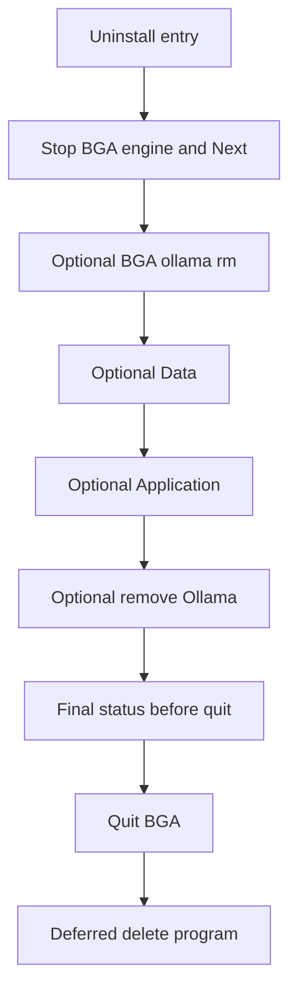

# Stage 3H — Uninstall and remove what the app downloaded

> **For agentic workers:** Use superpowers:subagent-driven-development or executing-plans. No agent-initiated commits (`no-auto-commit`).
>
> Premortem tigers are **required mitigations inside the same task**, not a hold before coding. Implementing the task *is* implementing the Fix (same rule as Stage 3D).

**Goal:** A player can remove BGA and, with clear choices, only the extras they pick — no terminal, same choices on Windows and Mac.

**Architecture:** One `runUninstall(selection)` in Electron main. Mac in-app / `BGA Uninstall.app` and Windows (NSIS → same UI) call it. The BGA **program** always goes; four checkboxes default **off**. Linux keeps types/IPC/UI skeleton only.

**Tech stack:** Electron main/preload (`apps/desktop`), Next uninstall route + `@bga/components` panel, i18n `en`/`pl`, electron-builder DMG + NSIS, Vitest, `pnpm verify`.

**Working copy:** also keep [`docs/superpowers/plans/stage-3h-uninstall.md`](docs/superpowers/plans/stage-3h-uninstall.md) in sync with this plan; after ship → `docs/archive/`.

---

## What the premortem review changed

These replace earlier plan wording. Do not reopen without a new decision.

1. **Data vs Application must not fight over chat.** Chat lives in Chromium `localStorage` under `userData`. Application wipe must **preserve** Chromium origin storage (`Local Storage`, `Session Storage`, `IndexedDB`) when Data is off. Data wipe clears `bga.thread.v1.*` via `session` APIs (or deletes those store dirs only when Data is on). Never “delete leftover Electron junk” in a way that silently deletes chats.

2. **Windows = same UI, not a second NSIS checkbox dialect.** NSIS does **not** reimplement the four checkboxes in `.nsh`. Flow: Apps & features → copy uninstall helper to `%TEMP%` → run `--bga-uninstall` → user confirms in app UI → extras deleted → process exits → NSIS removes the install directory. Locale stays `en`/`pl` like Mac.

3. **Cannot delete the running app from inside itself.** After extras + confirm, spawn a **detached** post-quit deleter (Mac helper or TEMP copy on Windows) that waits for BGA PID exit, then removes `BGA.app` / coordinates with NSIS. In-process `rm` of the running bundle is not the design.

4. **`--bga-uninstall` bypasses single-instance “focus other window”.** If a normal BGA instance holds the lock, uninstall mode must quit that instance (or use a separate helper `appId`) before showing the remover — otherwise the player only gets the main window focused and no uninstall UI.

5. **Gate navigation allowlist includes `/uninstall`.** Today [`installNavigationLock`](apps/desktop/src/main/main.ts) only allows `/{locale}/setup` when the gate is closed. Uninstall must be reachable from Setup (and Home when gated open) without trapping the player on setup forever.

6. **Ollama model allowlist = union of all profile Ollama tags**, not only the current profile (player may have upgraded). Tags from [`PROFILES`](services/rag-engine/rag_engine/settings.py) (`llm`, `llm_arbiter`, `embedding`, `vision` when set). Maintain a desktop allowlist with a **parity test** against Python (or a generated JSON both sides read). Never `rm -rf ~/.ollama`.

7. **HF_HOME under `userData/hf-cache` going forward**; Application also attempts **legacy** cleanup of the known hub snapshot for `BAAI/bge-reranker-v2-m3` (and profile `stt` repo if present) under the default Hugging Face cache — scoped to those repo dirs only.

8. **Mac Uninstall helper is a visible app**, not [`mac_hidden_app`](apps/desktop/src/system/mac_hidden_app.ts) (`LSUIElement`). That module is for Dock-less CLI wrappers only.

9. **First-launch copy to `/Applications` is best-effort.** Permission failure must not break launch; DMG still carries the helper; in-app remover remains supported.

10. **Delete order:** stop BGA engine/Next → (optional) ensure Ollama API for `rm` → **models** → **Data** / **Application** paths → **Ollama app** → quit → deferred **program** delete. Models before removing Ollama.

---

## Locked decisions (product)

- **Always remove:** BGA program (Windows install dir via NSIS after UI; Mac `BGA.app` + Uninstall helper via deferred delete).
- **Checkboxes (all default off):**
  - **Data** — `userData/storage`, `userData/player` (reserved), chat keys `bga.thread.v1.*`.
  - **Application** — `python-env`, `logs`, `setup-complete`, `downloads`, `diagnostics`, `helpers`, `hf-cache`, other Electron support dirs **excluding** Chromium site storage when Data is off; legacy HF hub dirs for BGA-owned repos.
  - **Both** — entire BGA `userData` (including Chromium storage).
  - **LLM models** — `ollama rm` only for allowlisted BGA tags.
  - **Ollama** — remove Ollama with plain warning; never silent.
- **Mac:** in-app + `BGA Uninstall.app` (first-launch copy + DMG). Trash-drag is not a cleanup hook.
- **Linux:** skeleton only; no packaged acceptance.
- **Player-first:** `uninstall.*` in `en`/`pl` only; no terminal; no path treasure hunts.

---

## File map

| Area | Path |
| --- | --- |
| Selection + paths | Create `apps/desktop/src/uninstall/selection.ts`, `paths.ts`, `owned-models.ts`, tests |
| Runner + deferred delete | Create `apps/desktop/src/uninstall/run-uninstall.ts`, `deferred-delete.ts` |
| IPC / preload / bridge | Modify [`desktop-api.ts`](apps/desktop/src/ipc/desktop-api.ts), [`preload.ts`](apps/desktop/src/preload/preload.ts), [`desktop-bridge.ts`](packages/utils/src/desktop-bridge/desktop-bridge.ts), [`main.ts`](apps/desktop/src/main/main.ts), [`gate.ts`](apps/desktop/src/setup/gate.ts) |
| HF_HOME | Engine + `pull_models` env in [`main.ts`](apps/desktop/src/main/main.ts) |
| Mac helper | Create `apps/desktop/src/system/mac_uninstall_helper.ts` (visible app); packaging under `apps/desktop/packaging/` |
| UI | `UninstallPanel` in `@bga/components`; page in `@bga/pages`; `apps/web/.../uninstall/page.tsx`; desktop links on Home **and** Setup |
| NSIS | [`electron-builder.yml`](apps/desktop/electron-builder.yml) + `packaging/uninstall.nsh` (TEMP copy → `--bga-uninstall` → then remove install dir) |
| i18n | `uninstall.*` in en+pl |
| Docs | [`docs/ROADMAP.md`](docs/ROADMAP.md) Stage 3H; `docs/superpowers/plans/stage-3h-uninstall.md` |

---

## Task breakdown

### Task 1 — Selection model and path inventory (TDD)

Types: `{ removeData, removeApplication, removeLlmModels, removeOllama }` all default `false`.

Pure `pathsForSelection(userData, selection)`:

- Data → `storage`, `player`
- Application → runtime dirs listed above; **exclude** Chromium storage dirs when `!removeData`
- Both → `[userData]` root
- Plus `chromiumChatClear: boolean` when Data (for session API in Task 2)
- `ownedOllamaTags(): string[]` union from profile allowlist; parity test vs Python `PROFILES`

#### Premortem

**Mode**: quick

##### Tigers

- **Application wipe deletes chats while Data is unchecked.**  
  **Where:** Electron `userData` / Chromium storage layout; plan’s old “other Electron junk”.  
  **Severity:** high  
  **Mitigation checked:** No existing uninstall code; `THREAD_STORAGE_PREFIX` in [`thread-store.ts`](packages/utils/src/conversation-thread/thread-store.ts) is localStorage-only.  
  **Fix:** Path inventory explicitly preserves Chromium storage unless Data (or both). Tests assert `Local Storage` path not in Application-only list.

- **Model allowlist drifts from `settings.py`.**  
  **Where:** [`PROFILES`](services/rag-engine/rag_engine/settings.py)  
  **Severity:** medium  
  **Mitigation checked:** Desktop has no generated profile mirror today.  
  **Fix:** `owned-models` module + parity test (parse Python or shared JSON generated in CI/dev). Prefer shared JSON checked into repo if parsing is fragile.

##### Elephants

- Moving chat to `userData/player` later would simplify wipes — out of scope for 3H; document ROADMAP tradeoff only.

##### Paper tigers

- Accidental wipe of entire `~/.ollama`: allowlist + no directory delete of Ollama blobs.

---

### Task 2 — `runUninstall` core

- Stop Next + engine; stop owned `ollama serve` only if `ollamaServeOwned` (3B rule).
- If models selected: resolve `ollama` binary; `ollama rm` each allowlisted tag that exists (ignore missing tags); do not fail the whole uninstall if one tag fails — record step result.
- Apply Data (dirs + session chat clear) / Application (dirs + scoped legacy HF).
- If Ollama selected: platform uninstall (`Ollama.app` / Windows uninstaller path); warn already shown in UI.
- Emit structured `UninstallReport` `{ steps: { id, ok, code? }[] }` for UI status.
- Schedule **deferred** program delete; then `app.quit()`.
- Never claim full success if any selected step failed.

#### Premortem

**Mode**: quick

##### Tigers

- **`rm` of running `BGA.app` / install dir fails or corrupts.**  
  **Where:** in-process delete after confirm.  
  **Severity:** high  
  **Mitigation checked:** No deferred-delete helper exists.  
  **Fix:** `deferred-delete.ts` — detach, wait for PID, then delete; Windows: NSIS owns install-dir delete after exit.

- **`ollama rm` while API down.**  
  **Severity:** medium  
  **Mitigation checked:** 3B only starts serve when owned and API down during setup.  
  **Fix:** Best-effort start/wait briefly for API; on failure mark models step failed and continue; do not delete `~/.ollama` as fallback.

- **Removing Ollama that other apps use.**  
  **Severity:** medium (product)  
  **Fix:** Checkbox default off + `uninstall.ollama.warning` copy; never auto-check.

##### Elephants

- Admin/UAC for Ollama uninstall on some Windows installs — surface in-app error code, no terminal instructions.

##### Paper tigers

- Killing system Ollama that we did not spawn: existing `ollamaServeOwned` gate on stop.

---

### Task 3 — IPC + `--bga-uninstall` mode

- Handlers: `desktop:get-uninstall-preview`, `desktop:run-uninstall(selection)`.
- `--bga-uninstall`: skip uv sync / engine / Next warm as much as possible; still need web UI — start Next only (or load packaged standalone) enough to show uninstall page; **no** retrieval warm.
- Single-instance: uninstall mode quits the other instance or uses helper appId so the remover always appears.
- Extend navigation lock: allow `/{locale}/setup` **or** `/{locale}/uninstall` when gate closed.
- Mirror types in `@bga/utils` desktop-bridge (no drift from `ipc/desktop-api.ts`).

#### Premortem

**Mode**: quick

##### Tigers

- **Second-instance lock swallows uninstall.**  
  **Where:** [`app.requestSingleInstanceLock`](apps/desktop/src/main/main.ts) ~728.  
  **Severity:** high  
  **Mitigation checked:** `second-instance` only focuses mainWindow.  
  **Fix:** On `--bga-uninstall`, if lock fails, signal first instance to quit-and-relaunch uninstall, **or** run helper with distinct `appId` / userDataName for the remover process only.

- **Gate lock blocks `/uninstall`.**  
  **Where:** `installNavigationLock` setupPrefix-only.  
  **Severity:** high  
  **Mitigation checked:** Confirmed in main.ts — non-setup URLs rewrite to setup.  
  **Fix:** Allow uninstall prefix; add tests for `isAllowedWhenGated(url)`.

##### Elephants

- Uninstall-only process still needs a web port — reuse `ports.ts`; document that uninstall mode must not leave orphan Next after quit (`shutdown()`).

##### Paper tigers

- Browser `getDesktopApi() === null`: UI shows desktop-only copy; no IPC.

---

### Task 4 — UI + i18n

- `UninstallPanel`: four checkboxes (default off), confirm step, progress, per-step status, final “left on purpose” line.
- Confirm copy always states **the BGA program will be removed**.
- Entry: desktop-only control on [`HomePage`](packages/pages/src/home/HomePage.tsx) **and** [`SetupPanel`](packages/components/src/setup-panel/SetupPanel.tsx) (gated players).
- Route `apps/web/src/app/[locale]/uninstall/page.tsx`.
- Mac-only note: Trash does not remove data — use this screen or BGA Uninstall.
- All strings under `uninstall.*` in en+pl; locale tests must pass.

#### Premortem

**Mode**: quick

##### Tigers

- **Hardcoded English in NSIS or helper plist shown to players.**  
  **Severity:** medium  
  **Fix:** Player-visible strings only via web UI + i18n; helper can be bilingual name “BGA Uninstall” / keep Info.plist non-sentence; NSIS has no checkbox copy.

- **Player thinks unchecking Data keeps the app.**  
  **Severity:** medium  
  **Fix:** Confirm dialog always lists “BGA will be removed” as non-optional.

##### Elephants

- No Settings app yet — Home + Setup links are intentional until a settings stage exists.

##### Paper tigers

- Accidental browser wipe: no desktop API → no run button.

---

### Task 5 — Mac Uninstall helper

- Visible `BGA Uninstall.app` that launches packaged BGA with `--bga-uninstall` (absolute path to sibling or `/Applications/BGA.app`).
- Ship on DMG next to BGA.
- First packaged launch: best-effort copy to `/Applications`; log failure; never block Ask.
- Deferred delete removes both `BGA.app` and Uninstall helper when program removal runs.
- Version stamp / replace if helper outdated.

#### Premortem

**Mode**: quick

##### Tigers

- **Reusing `mac_hidden_app` makes Uninstall invisible / Dock-less.**  
  **Where:** [`mac_hidden_app.ts`](apps/desktop/src/system/mac_hidden_app.ts) `LSUIElement`.  
  **Severity:** high  
  **Mitigation checked:** Module always sets LSUIElement/LSBackgroundOnly.  
  **Fix:** Separate `mac_uninstall_helper.ts` without those keys.

- **Helper points at missing `BGA.app` after user moved it.**  
  **Severity:** medium  
  **Fix:** Resolve BGA via bundle id / `process.execPath` parent; show in-app error if missing.

- **Copy to `/Applications` fails (managed Mac).**  
  **Severity:** medium  
  **Fix:** Best-effort; DMG + in-app path remain valid; optional one-line status in diagnostics only (not a player blocker).

##### Paper tigers

- Trash-drag cleanup: explicitly out of scope; copy documents in-app remover.

---

### Task 6 — Windows NSIS

- `oneClick: false` already — add `uninstall.nsh`:
  1. Copy uninstall-capable binary (or full app resources needed for `--bga-uninstall`) to `%TEMP%\bga-uninstall\`.
  2. Run it wait; pass no duplicate checkbox UI in NSIS.
  3. After exit, NSIS deletes install directory as today.
- If player cancels UI, abort uninstall (do not delete Program Files).
- Smoke checklist on owner Windows machine (parity with 3B).

#### Premortem

**Mode**: quick

##### Tigers

- **Running uninstall UI from `Program Files` while NSIS is deleting it.**  
  **Severity:** high  
  **Mitigation checked:** Stock electron-builder NSIS has no TEMP-copy pattern in this repo yet.  
  **Fix:** Mandatory TEMP (or `%LOCALAPPDATA%`) copy before UI; NSIS deletes install dir only after UI exits successfully.

- **Cancel in UI still wipes install dir.**  
  **Severity:** high  
  **Fix:** NSIS checks exit code; non-zero / cancel → `Abort` uninstall.

##### Elephants

- Code-signing / SmartScreen on TEMP copy — same cert as installer; note in packaging docs if signing already required.

##### Paper tigers

- Duplicate Polish NSIS pages: avoided by using app UI.

---

### Task 7 — HF_HOME + ROADMAP + verify

- Set `HF_HOME` (and clear conflicting cache env if set) to `join(userData, 'hf-cache')` for engine and `pull_models`.
- Application deletion includes `hf-cache` + scoped legacy hub dirs for owned HF repos.
- Rewrite [`docs/ROADMAP.md`](docs/ROADMAP.md) Stage 3H: Data vs Application split, Windows same-UI flow, Mac helper best-effort copy, Linux skeleton, acceptance bullets.
- Sync `docs/superpowers/plans/stage-3h-uninstall.md`.
- `pnpm verify`.
- Smoke: Mac in-app + helper launch; Windows Apps & features cancel vs full remove permutations.

#### Premortem

**Mode**: quick

##### Tigers

- **HF_HOME change leaves old `~/.cache/huggingface` orphans and Application checkbox misses them.**  
  **Severity:** medium  
  **Mitigation checked:** `pull_huggingface_snapshot` uses default hub location today ([`pull_models.py`](services/rag-engine/rag_engine/pull_models.py)).  
  **Fix:** New env + legacy scoped delete for known repo ids in Application path list / runner.

- **ROADMAP still says three checkboxes / NSIS-native prompts.**  
  **Severity:** low (docs drift)  
  **Fix:** Rewrite Stage 3H in the same PR as behavior.

##### Elephants

- STT/TTS assets outside HF/Ollama (Piper voices etc.) if ever downloaded — if present under userData, Application owns them; if under home cache, add to owned-legacy list when introduced (YAGNI until they ship on desktop).

##### Paper tigers

- Linux acceptance: explicitly not required for 3H ✅.

---

## Critical-review lock-ins (do not reopen)

| Topic | Locked decision |
| --- | --- |
| Checkbox set | Data, Application, LLM models, Ollama — all default off |
| Program removal | Always; stated on confirm |
| Chat vs Application | Preserve Chromium storage unless Data or both |
| Windows UI | Same Electron uninstall UI via TEMP copy; NSIS only removes install dir after success |
| Self-delete | Deferred after quit; never in-process rm of running bundle |
| Single-instance | Uninstall mode must still show remover |
| Gate | `/uninstall` allowed when gated |
| Models | Allowlist = union of all profile Ollama tags + parity test |
| HF | `userData/hf-cache` + legacy scoped hub cleanup |
| Mac helper | Visible app; best-effort Applications copy |
| Linux | Skeleton only |
| Premortem | Fixes are part of each task |

---

## Out of scope

- Trash-drag as uninstall hook on Mac.
- Deleting non-allowlisted Ollama models; silent Ollama removal.
- Full Linux package / Linux ROADMAP acceptance.
- Migrating chat from localStorage to `userData/player` (optional later).
- Real settings UI beyond reserved `player/` path.

## Global constraints

- Player-first; dual-locale; no hardcoded player-facing strings.
- No auto-commit.
- `pnpm verify` before claiming done; Mac + Windows smoke before release ✅ on Stage 3H.
