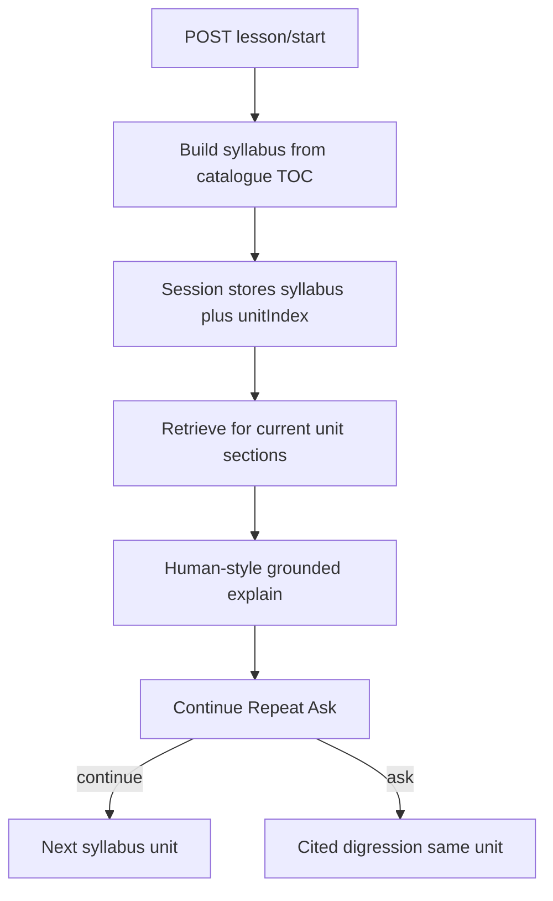

# Stage 4 — Teaching mode (implementation plan)

> **For agentic workers:** Prefer `superpowers:subagent-driven-development` or `superpowers:executing-plans`. Premortem **tigers are required mitigations inside the same task**. `pnpm verify` before closing. No auto-commit.

**Goal:** On **Learn**, teach this game **like a good human teacher** — efficient, reordered when it helps — from the player’s rulebooks. **Questions** stays table-side rulings (3D). Never invent rules; never mix the two UIs.

**Architecture:** Server owns `LessonSession`. **Start** first builds a **syllabus** (from section catalogue / TOC-like structure, soft pedagogical spine, optional related-section hooks), then teaches **one syllabus unit at a time** with grounded retrieval. Digressions on Learn only. Style exemplars + local archive = *how* to teach, not *what* the rules are.

**Tech stack:** Next.js, Mantine, `@bga/*`, FastAPI, SSE/`AssistantEvent`, shared Ollama generation lock.

---

## Pedagogy (locked — replaces “five fixed cards 1:1”)

**What we want the product to feel like**

- Not reading the rulebook page 1 → page 2 → page 3 aloud.
- First **understand the shape of this game’s docs** (spis treści / section catalogue, and where callouts / examples / annexes sit in the index we already have from Stage 3G).
- Build a **lesson plan** (syllabus): usually close to book order, but **may pull a late idea earlier** when it is tightly linked (e.g. scoring hook right after the goal) — only when those sections exist in the materials.
- Soft spine as **guidance**, not a prison: *goal → theme → mechanics → turn → sample move* may appear as labels or merge/split into more/fewer **teaching units**.
- Teach **in the teacher’s own words** (style exemplars + archive), still **every rule claim grounded** in retrieved passages.
- Ideal “the model truly understands the game” is aspirational; Stage 4 **aims at** outline + grounded units + human tone. It must not fake understanding by inventing rules.

**Plain picture**

1. **Plan** — look at the table of contents / section list; optionally note related sections; write an ordered list of teaching units (titles + which section ids / headings to lean on).
2. **Teach** — for each unit: retrieve those passages (and tight neighbours if linked), explain like a person, cite pages.
3. **Continue / Repeat / Ask** — same controls as before, but cursor walks the **syllabus**, not a hard-coded 5-slot enum.

**What “one grounded generation” means now**

- **One teaching unit (or one planning pass) = one generation** that may only use retrieved / catalogue evidence for that step.
- Not “one physical PDF page = one turn.”
- Not “dump the whole book into one answer.”

---

## What the premortem review changed

1. **`lesson/*` → `routeKind: stream`** or 10 s kill ([`engine-proxy.ts`](packages/utils/src/engine-proxy/engine-proxy.ts)).
2. **Shared generation semaphore** with `/ask`.
3. **Server stores turns + syllabus** for Continuie.
4. **One active session per `gameId`**; reject client-invented `sessionId`.
5. **Auto-advance** only after unit `done`; single-flight; clear on leave.
6. **Nav away** aborts; does not advance unit.
7. **No full prior unit bodies in the next prompt** — only syllabus titles “already covered” + current unit (Stage 9 later).
8. **Style ≠ rules** (D14-style wrappers); archive never indexed.
9. **`insufficient_evidence`** → honest notice + Powtórz; no invented unit.
10. **Questions = arbitrate only.**
11. **TTL 72 h** from last activity.
12. **Learn behind Ask-ready gate.**
13. Paths under `storage/player/lessons/…`.
14. Roadmap: separate Learn vs Questions; **not** rulebook read-aloud; syllabus-first pedagogy.
15. **NEW:** Syllabus may **reorder / merge** only using section catalogue (and related headings in the index). Inventing a unit with no backing sections is a tiger — reject or fall back to catalogue order.
16. **NEW:** Planning pass is its own step (may be a short non-player or player-visible “Preparing your lesson…” status, then first unit). Do not teach unit 1 before syllabus exists on the session.

---

## Locked product decisions

- Nav: **Learn** | **Questions** | **Rulebooks**.
- Digression UI only on Learn.
- Controls after each **teaching unit**: Continue / Repeat / I have a question + **8 s** auto-Continue.
- Mid-lesson ask: pause → cited answer on Learn → same unit index.
- Style exemplars + local archive for *manner*; rules only from documents.
- Continuie within TTL.
- Soft spine guides planning; syllabus is per-game and stored on the session.

## Global constraints

- No hardcoded player strings; engine `code`s only.
- Active-game-set filter before search.
- No path leaks; figures only from `sources`.
- `insufficient_evidence` valid; no knowledge fallback.
- `/api/engine/*` only; `127.0.0.1`.
- `pnpm verify`; no auto-commit.

## Architecture



### API

| Method | Path | Kind | Role |
| --- | --- | --- | --- |
| POST | `/lesson/start` | stream | New session → **plan syllabus** → stream **first teaching unit** (status may include `planning`) |
| POST | `/lesson/continue` | stream | Next syllabus unit (or complete) |
| POST | `/lesson/repeat` | stream | Regenerate **current** unit (same syllabus slot) |
| POST | `/lesson/ask` | stream | Pause; cited digression; **unitIndex unchanged** |
| GET | `/lesson/active?gameId=` | api | Session + syllabus + turns for Continuie |

Notice codes: `lesson_expired`, `lesson_game_mismatch`, `lesson_busy`, `lesson_complete`, `lesson_plan_failed` (catalogue empty / cannot plan) — all in `en`/`pl`.

### Session shape (locked)

```text
sessionId
gameId, expansionIds[]
syllabus: [ { unitId, title, sectionRefs[], spineHint? } ]  // planned order
unitIndex: number
status: planning | active | paused | completed | expired
updatedAt, expiresAt
turns[]: { id, kind: plan|unit|digression, unitId?, question?, text, sources, groundedness }
```

`plan` turn optional for UI (“Here’s how we’ll learn…”) — short; must not invent sections not in catalogue.

---

### Task 1: Three-way AppNav + Teach page shell

Same as before: `/teach`, nav Learn/Questions/Rulebooks, readiness banner, i18n.

#### Premortem

**Mode:** deep

##### Tigers

- Learn without Ask-ready → dead Start. **Fix:** same readiness gate as Questions.
- Vague nav labels. **Fix:** Nauka / Pytania / Instrukcje.

##### Elephants

- Home stays `/` for Questions.

##### Paper tigers

- Locale `[locale]` pattern.

---

### Task 2: Contract + storage helpers + LessonSession store

Types include **syllabus** + `unitIndex` (not fixed 0..4 enum as the only cursor). Paths under `storage/player/lessons/`. One active session per `gameId`. TTL 72 h.

#### Premortem

**Mode:** deep

##### Tigers

- Client-invented `sessionId`. **Fix:** server issue only.
- Lessons under `assets/`. **Fix:** `player/lessons` helpers.
- Orphan sessions. **Fix:** supersede per gameId.
- Never expire. **Fix:** touch + 72 h.

##### Elephants

- Uninstall wipes `storage` including lessons.

##### Paper tigers

- Questions thread keys untouched.

---

### Task 3: Proxy stream + shared semaphore

Identical mitigations: `lesson` → `stream`; shared lock with `/ask`.

#### Premortem

**Mode:** deep

##### Tigers

- 10 s timeout; dual Ollama jobs; lock leak on abort — same fixes as prior plan.

##### Paper tigers

- GET `active` stays `api`.

---

### Task 4: Syllabus planner (TOC / catalogue first)

**Files:**
- Create: `services/rag-engine/rag_engine/lesson/syllabus.py` (+ tests)
- Use Stage 3G catalogue / section map already in the index (section names + pages); do **not** re-parse PDF in Stage 4 unless catalogue missing → `lesson_plan_failed` with in-app recovery (re-import / catch-up), not a terminal.

**Produces:** Ordered `syllabus[]` from book structure + soft spine hints; may **reorder/merge** when section titles/relations justify it; every unit has `sectionRefs` pointing at real catalogue/section ids.

#### Premortem

**Mode:** deep (highest product risk)

##### Tigers

- **Risk:** Planner invents topics not in the book (“advanced variants” nobody indexed).  
  **Fix:** Unit invalid without ≥1 real `sectionRef`; tests with fixture catalogue; fallback = catalogue order mapped onto spine hints.

- **Risk:** Reorder hides mandatory setup and player loses.  
  **Fix:** Spine hint `goal` / setup-like sections prefer early slots; test that setup/goal-labelled sections are not pushed last when present.

- **Risk:** No catalogue (old ingest).  
  **Fix:** `lesson_plan_failed` + player copy; do not teach from raw model memory.

##### Elephants

- Full “read every callout/illustration” vision pass is Stage 7-ish; Stage 4 uses **indexed** section/catalogue/layout metadata we already store — not a new vision model.

##### Paper tigers

- Player never edits the syllabus JSON by hand.

---

### Task 5: Human-style teach + digression prompts + unit SSE

**Files:** prompts, exemplars, generate helper, router registration.

**Produces:** Teach prompt: explain this **unit** from sources, teacher voice, may briefly foreshadow a linked section **only if that section’s text is in the retrieved set**; never read the PDF verbatim end-to-end. Digression = short cited ruling.

#### Premortem

**Mode:** deep (RAG)

##### Tigers

- Invented rules / thin retrieval. **Fix:** `insufficient_evidence` path.
- Style as rules. **Fix:** `<style_example>` wrappers.
- Cross-game leak. **Fix:** active set filter.
- Whole syllabus in one prompt. **Fix:** one unit (or plan) per generation.
- Digression too chatty. **Fix:** arbitrate-family prompt.
- **Foreshadow without evidence** (“we’ll cover X later” inventing X). **Fix:** only name sections present in syllabus/refs; no ungounded future rules.

##### Elephants

- Retrieval query = unit title + section headings from `sectionRefs`, not a single global seed.

##### Paper tigers

- Unused `llm_arbiter` field — ignore.

---

### Task 6: Lesson actions API

`start` = create session → run planner → stream first unit (status `planning` then generating). `continue` / `repeat` / `ask` / `active` as table above; cursor = `unitIndex` into syllabus.

#### Premortem

**Mode:** deep

##### Tigers

- Busy double-continue. **Fix:** `lesson_busy`.
- Ask bumps `unitIndex`. **Fix:** pin in tests.
- Actions on completed/expired. **Fix:** start only.
- Expansion forgery. **Fix:** validate at start; store on session.
- Start streams teaching before syllabus saved. **Fix:** persist syllabus before first unit tokens (or fail closed).

##### Elephants

- After `completed`, Continuie hidden; archive keeps style material.

##### Paper tigers

- `/ask` only shares semaphore.

---

### Task 7: Learn UI

Log shows plan blurb (optional) + units + digressions; controls; 8 s auto-advance; no `bga.thread.v1`; restore via `active`.

#### Premortem

**Mode:** deep

##### Tigers

- Timer races; double continue; thread leakage; wrong game Continuie; client-only resume — same fixes; say **unit** not module in copy where player-facing.

##### Elephants

- Progress = “step N of syllabus length”, not fixed “5 of 5” unless syllabus happens to be 5.

##### Paper tigers

- Voice later reads Learn log.

---

### Task 8: Local lesson archive + style reuse

Unchanged intent: manner only; never FAQ/index; caps.

#### Premortem

**Mode:** deep

##### Tigers

- Index poison; prompt blow; wrong game — same fixes.

##### Elephants

- No player “training stats” UI.

##### Paper tigers

- Offline local only.

---

### Task 9: Questions = arbitrate only

Hardcode `arbitrate`; remove teach radio.

#### Premortem

**Mode:** quick

##### Tigers

- Default `teach` left in payload. **Fix:** hardcode + tests.

##### Paper tigers

- Engine previously ignored mode.

---

### Task 10: Docs

ROADMAP Stage 4: separate pages; **syllabus-first human teaching**; not same thread as 3D; not read-aloud. README checkbox. Prefer ROADMAP tweak early in the PR series.

#### Premortem

**Mode:** quick

##### Tigers

- Docs still say fixed five modules same as thread. **Fix:** rewrite to this pedagogy.

##### Paper tigers

- Stage 5 “thread” = Learn surface for lesson audio.

---

## Critical verification

| Spec | Task |
| --- | --- |
| Separate Learn / Questions / Rulebooks | 1, 7, 9, 10 |
| Syllabus from catalogue; reorder only with refs | 4, 6 |
| Human teach ≠ read-aloud; still grounded | 5, 7 |
| One unit/plan = one grounded generation | 5, 6 |
| Digression pause/resume | 6, 7 |
| Continuie + TTL 72 h | 2, 6, 7 |
| Proxy stream + shared lock | 3 |
| Style archive ≠ FAQ | 5, 8 |
| `pnpm verify` | every task |

**Still out of scope:** voice; weight fine-tuning; off-machine data; Stage 9 full history in prompt; vision re-read of every illustration (use indexed metadata); player-edited syllabus.

## Acceptance

- Three nav pages; Learn ⟂ `bga.thread.v1.*`.
- Start builds a syllabus from this game’s section catalogue; units usually follow book order but may group/reorder with real `sectionRefs`.
- Teaching sounds like explanation, not page-by-page readout; claims cite pages; thin evidence → notice + Powtórz.
- Digression stays on Learn; `unitIndex` unchanged.
- Continuie restores syllabus + turns within 72 h.
- Ask + lesson share one generation slot; lesson SSE not cut at 10 s.
- `pnpm verify` passes.

## Plain recap (for humans)

- **start** — ułóż plan lekcji z treści gry, potem naucz **pierwszy punkt planu**.
- **continue** — następny punkt planu.
- **repeat** — ten sam punkt od nowa.
- **ask** — pytanie w trakcie; plan się nie przesuwa.
- **active** — czy jest niedokończona lekcja + jej plan i tekst.
- **72 h** — bez ruchu sesja wygasa.
- **Jedno generowanie** — albo sam plan, albo **jeden** punkt nauczania naraz, zawsze oparte o znalezione fragmenty — nie cała książka na raz i nie zmyślanie.
